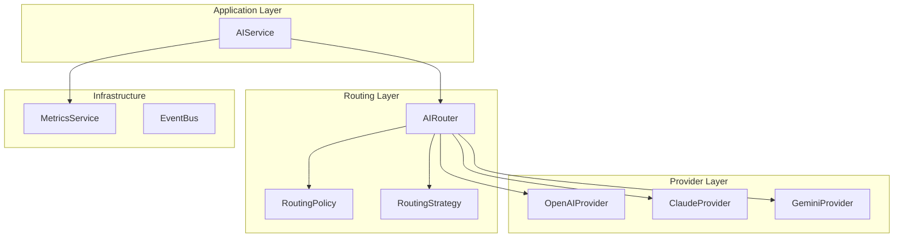
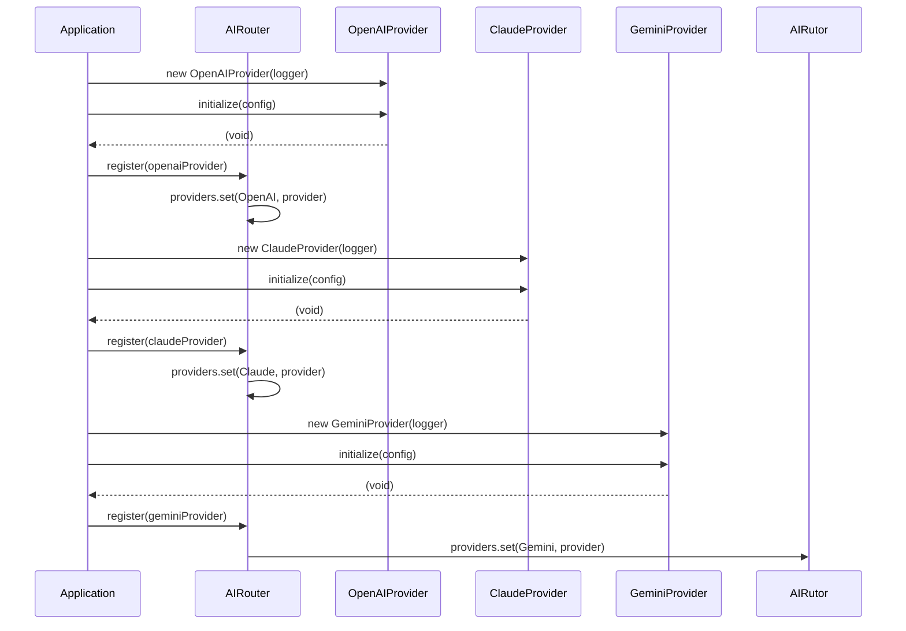
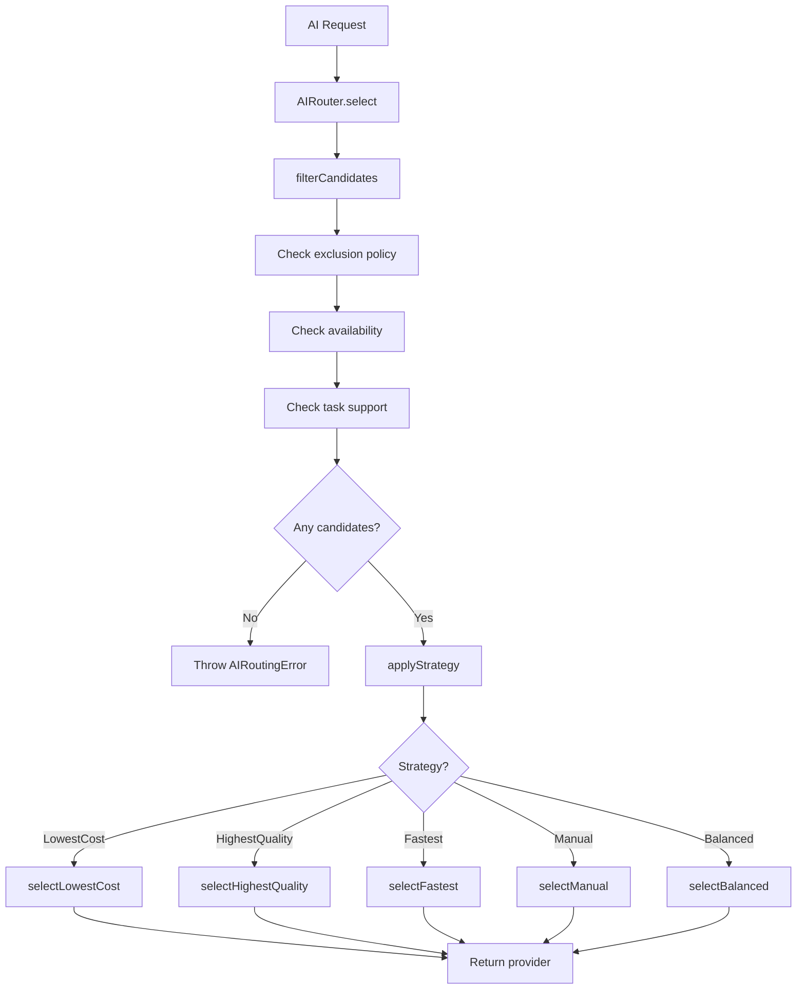
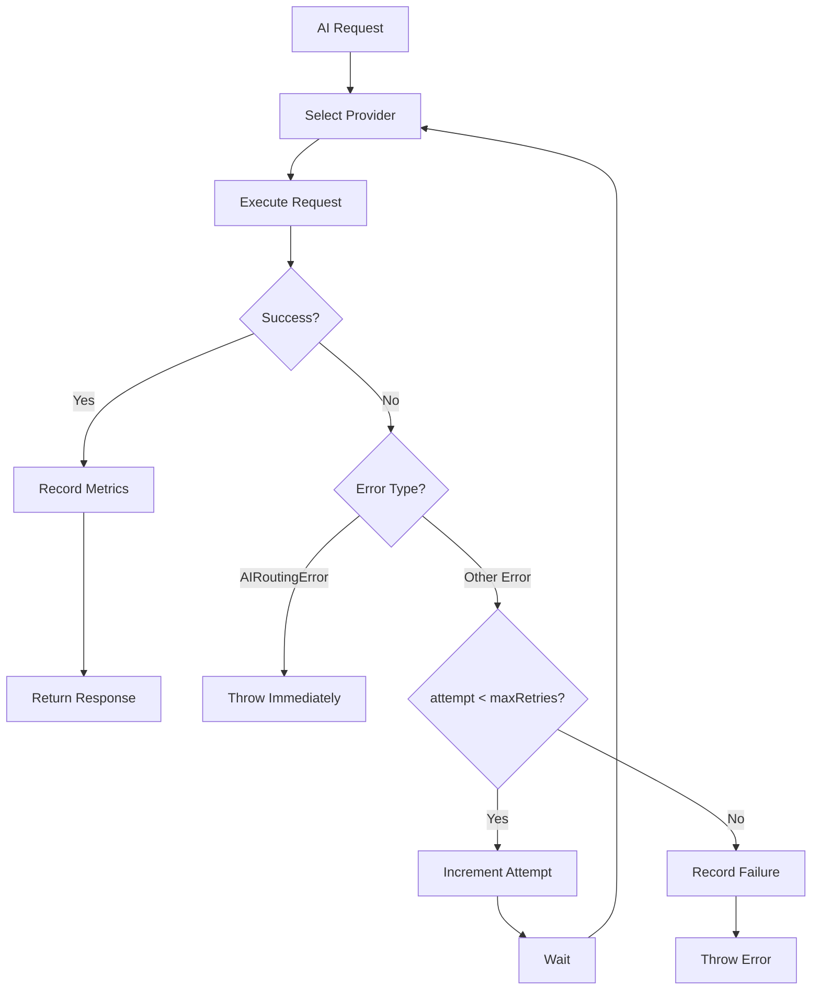

# AI Routing

## Overview

The AI routing system provides intelligent provider selection for AI requests across multiple providers (OpenAI, Claude, Gemini). The router supports multiple routing strategies based on cost, quality, latency, or manual selection, with automatic retry logic and observability.

## Architecture



## Provider Registration



## Provider Selection Flow



## Routing Strategies

### LowestCost

**Purpose**: Select provider with lowest estimated cost

**Algorithm**:
```typescript
candidates.reduce((best, p) => {
  const cost = p.estimateCost(request).estimatedTotal;
  const bestCost = best.estimateCost(request).estimatedTotal;
  return cost < bestCost ? p : best;
});
```

**Factors**:
- Input token cost per token
- Output token cost per token
- Estimated input tokens
- Estimated output tokens

**Use Case**: Cost-sensitive operations, batch processing

### HighestQuality

**Purpose**: Select provider with highest quality score

**Algorithm**:
```typescript
candidates.reduce((best, p) => {
  const score = QUALITY_SCORES[p.type] ?? 0;
  const bestScore = QUALITY_SCORES[best.type] ?? 0;
  return score > bestScore ? p : best;
});
```

**Quality Scores** (hardcoded):
- Claude: 1.0
- OpenAI: 0.9
- Gemini: 0.8

**Limitation**: Quality scores are hardcoded and not based on actual performance metrics

**Use Case**: Critical operations where quality is paramount

### Fastest

**Purpose**: Select provider with lowest estimated latency

**Algorithm**:
```typescript
candidates.reduce((best, p) => {
  return p.estimateLatency(request) < best.estimateLatency(request) ? p : best;
});
```

**Latency Estimation**:
- OpenAI: `800 + ceil(inputTokens / 100) * 10` ms
- Claude: `1000 + ceil(inputTokens / 100) * 12` ms
- Gemini: `1200 + ceil(inputTokens / 100) * 15` ms

**Use Case**: Real-time interactions, low-latency requirements

### Manual

**Purpose**: Select preferred provider if available

**Algorithm**:
```typescript
if (preferredProvider !== undefined) {
  const found = candidates.find(p => p.type === preferredProvider);
  if (found !== undefined) return found;
}
return candidates[0];
```

**Configuration**:
```typescript
const policy: RoutingPolicy = {
  strategy: RoutingStrategy.Manual,
  preferredProvider: ProviderType.OpenAI
};
```

**Use Case**: Testing, provider-specific features, compliance requirements

### Balanced

**Purpose**: Weighted score combining cost, quality, and latency

**Algorithm**:
```typescript
const costs = candidates.map(p => p.estimateCost(request).estimatedTotal);
const latencies = candidates.map(p => p.estimateLatency(request));
const maxCost = Math.max(...costs, 1);
const maxLatency = Math.max(...latencies, 1);

let bestScore = -Infinity;
let best = candidates[0];

for (let i = 0; i < candidates.length; i++) {
  const p = candidates[i];
  const costScore = 1 - (costs[i] ?? 0) / maxCost;
  const qualityScore = QUALITY_SCORES[p.type] ?? 0;
  const latencyScore = 1 - (latencies[i] ?? 0) / maxLatency;
  const score = 0.4 * costScore + 0.3 * qualityScore + 0.3 * latencyScore;

  if (score > bestScore) {
    bestScore = score;
    best = p;
  }
}

return best;
```

**Weights**:
- Cost: 40%
- Quality: 30%
- Latency: 30%

**Use Case**: General-purpose routing with balanced priorities

## Candidate Filtering

### Filter Criteria

```mermaid
flowchart TD
    A[All Registered Providers] --> B{Excluded in policy?}
    B -->|Yes| C[Exclude]
    B -->|No| D{isAvailable()?}
    D -->|No| C
    D -->|Yes| E{supports(taskType)?}
    E -->|No| C
    E -->|Yes| F[Include as candidate]
```

**Filter Steps**:
1. **Exclusion Policy**: Remove providers in `policy.excludeProviders`
2. **Availability**: Remove providers where `isAvailable()` returns false
3. **Task Support**: Remove providers where `supports(taskType)` returns false

**Exclusion Policy Example**:
```typescript
const policy: RoutingPolicy = {
  strategy: RoutingStrategy.LowestCost,
  excludeProviders: [ProviderType.Gemini] // Exclude Gemini
};
```

## Provider Capabilities

### Task Type Support

| Task Type | OpenAI | Claude | Gemini |
|-----------|--------|--------|--------|
| Discovery | ✓ | ✓ | ✓ |
| Scoring | ✓ | ✓ | ✓ |
| Script | ✓ | ✓ | ✓ |
| ImagePrompt | ✓ | ✓ | ✓ |
| VideoPrompt | ✓ | ✓ | ✓ |
| Voice | ✓ | ✓ | ✓ |
| Summarization | ✓ | ✓ | ✓ |
| Classification | ✓ | ✓ | ✓ |
| Embeddings | ✓ | ✓ | ✓ |
| Chat | ✓ | ✓ | ✓ |
| Translation | ✓ | ✓ | ✓ |
| Analytics | ✓ | ✓ | ✓ |

### Model Selection

**OpenAIProvider**:
- `gpt-4o`: Primary chat model
- `gpt-4o-mini`: Fast tasks (Classification, Scoring, Analytics)
- `text-embedding-3-small`: Embeddings

**ClaudeProvider** (intended):
- `claude-3-opus`: Primary chat model
- `claude-3-haiku`: Fast tasks
- `claude-3-sonnet`: Balanced tasks

**GeminiProvider** (intended):
- `gemini-1.5-pro`: Primary model
- `gemini-1.5-flash`: Fast tasks
- `text-embedding-004`: Embeddings

### Token Limits

| Provider | Max Input Tokens | Max Output Tokens |
|----------|------------------|-------------------|
| OpenAI | 128,000 | 16,384 |
| Claude | 200,000 | 8,192 |
| Gemini | 1,000,000 | 8,192 |

### Rate Limits

| Provider | Requests/Minute | Tokens/Minute | Requests/Day |
|----------|-----------------|---------------|--------------|
| OpenAI | 500 | 150,000 | 10,000 |
| Claude | (not specified) | (not specified) | (not specified) |
| Gemini | (not specified) | (not specified) | (not specified) |

## Cost Estimation

### Cost Estimator

**Purpose**: Estimate token counts from text

**Algorithm**:
```
tokenCount = ceil(characterCount / 4)
```

**Limitation**: Fixed 4 characters per token ratio varies by actual tokenizer

### Provider Cost Calculation

**OpenAI Pricing** (per 1K tokens):
- `gpt-4o`: $0.005 input, $0.015 output
- `gpt-4o-mini`: $0.00000015 input, $0.0000006 output
- `text-embedding-3-small`: $0.00000002 input, $0 output

**Cost Estimation**:
```typescript
const cost = {
  provider: ProviderType.OpenAI,
  inputCostPerToken: 0.000005,
  outputCostPerToken: 0.000015,
  estimatedInputTokens: 1000,
  estimatedOutputTokens: 500,
  estimatedTotal: 1000 * 0.000005 + 500 * 0.000015
};
```

## Latency Estimation

**OpenAI**: `800 + ceil(inputTokens / 100) * 10` ms
**Claude**: `1000 + ceil(inputTokens / 100) * 12` ms
**Gemini**: `1200 + ceil(inputTokens / 100) * 15` ms

**Example**:
- 1000 input tokens
- OpenAI: 800 + 10 * 10 = 900 ms
- Claude: 1000 + 10 * 12 = 1120 ms
- Gemini: 1200 + 10 * 15 = 1350 ms

## Retry Logic

### Retry Flow



**Retry Configuration**:
- Default max retries: 2
- Retry delay: None (immediate retry)
- Backoff strategy: None (linear retry)

**Non-Retryable Errors**:
- `AIRoutingError`: No available provider - thrown immediately

**Retryable Errors**:
- `AIProviderError`: Provider execution failure - triggers retry

## Observability

### Request Traces

**Trace Fields**:
```typescript
interface RequestTrace {
  requestId: string;
  provider: ProviderType;
  taskType: TaskType;
  latencyMs: number;
  inputTokens: number;
  outputTokens: number;
  estimatedCostUsd: number;
  error: string | null;
  retryCount: number;
  timestamp: Date;
}
```

### Metrics Collected

**MetricsService**:
- `jobsExecuted`: Incremented on success
- `jobsFailed`: Incremented on final failure
- `executionTimeMs`: Average execution time
- `providerLatency`: Average latency per provider

**Example**:
```typescript
metricsService.incrementJobsExecuted();
metricsService.recordExecutionTime(900);
metricsService.recordProviderLatency(ProviderType.OpenAI, 900);
```

## Provider Health

### Health Check

```typescript
const health = await provider.health();
```

**Health Response**:
```typescript
interface ProviderHealth {
  provider: ProviderType;
  status: ProviderStatus;
  latencyMs: number;
  errorRate: number;
  lastCheckedAt: Date;
  message: string | null;
}
```

**Status Values**:
- `Available`: Provider is healthy and responsive
- `Degraded`: Provider is responsive but with issues
- `Unavailable`: Provider is unreachable or not initialized

**Health Check Implementation**:
- **OpenAI**: Fetches `https://api.openai.com/v1/models`
- **Claude**: (intended) Health endpoint
- **Gemini**: (intended) Health endpoint

## Configuration

### Routing Policy

```typescript
interface RoutingPolicy {
  strategy: RoutingStrategy;
  excludeProviders?: ProviderType[];
  preferredProvider?: ProviderType;
}
```

**Default Policy**:
```typescript
const DEFAULT_ROUTING_POLICY: RoutingPolicy = {
  strategy: RoutingStrategy.Balanced
};
```

### Policy Examples

**Cost-Optimized**:
```typescript
const policy: RoutingPolicy = {
  strategy: RoutingStrategy.LowestCost,
  excludeProviders: [ProviderType.Claude] // Claude is expensive
};
```

**Quality-Optimized**:
```typescript
const policy: RoutingPolicy = {
  strategy: RoutingStrategy.HighestQuality
};
```

**Latency-Optimized**:
```typescript
const policy: RoutingPolicy = {
  strategy: RoutingStrategy.Fastest
};
```

**Manual Selection**:
```typescript
const policy: RoutingPolicy = {
  strategy: RoutingStrategy.Manual,
  preferredProvider: ProviderType.OpenAI
};
```

## Current Limitations

1. **Hardcoded Quality Scores**: Quality scores are not based on actual performance metrics
2. **Incomplete Provider Implementations**: Claude and Gemini providers throw errors on execute
3. **No Adaptive Routing**: Routing does not learn from historical performance
4. **No Circuit Breaker**: No automatic provider disabling on repeated failures
5. **No Cost Budgeting**: No enforcement of cost limits
6. **Simple Retry Logic**: No exponential backoff or jitter
7. **No Provider Pooling**: No connection pooling or rate limiting
8. **Fixed Token Estimation**: 4 characters per token is inaccurate for many models

## Future Enhancements

### Adaptive Routing
- Learn from historical performance metrics
- Adjust quality scores based on actual outcomes
- Implement A/B testing for routing strategies

### Circuit Breaker
- Automatically disable failing providers
- Re-enable providers after cooldown period
- Health-based provider exclusion

### Cost Budgeting
- Per-request cost limits
- Daily/monthly cost caps
- Cost-aware routing strategies

### Advanced Retry Logic
- Exponential backoff with jitter
- Provider fallback on retry
- Retry-specific error classification

### Connection Pooling
- HTTP connection reuse
- Rate limiting per provider
- Request queuing

### Accurate Token Estimation
- Model-specific tokenizers
- Actual token counting for common models
- Cache token counts for repeated prompts

## Cross-References

- [Components](COMPONENTS.md) - Detailed component documentation
- [Data Flow](DATA_FLOW.md) - AI request data flow
- [Request Flow](REQUEST_FLOW.md) - Detailed AI request flow
