# Architecture Overview

## System Purpose

Eunoia Media OS is a TypeScript library providing core infrastructure for AI-powered content discovery, multi-provider AI routing, and an extensible plugin system. The codebase implements Domain-Driven Design (DDD) principles with Clean Architecture patterns, serving as the foundational library layer for video production management systems.

## Architectural Disconnect

**Important Note:** There is a documented architectural disconnect between the repository's stated purpose and its actual implementation:

- **Documented Purpose** (README.md, docs/ARCHITECTURE.md): A Supabase + n8n video production management system with database tables for clients, projects, assets, jobs, and workflows
- **Actual Implementation** (src/): A standalone TypeScript library implementing AI routing, content discovery, and plugin infrastructure with no database integration

The TypeScript code in `src/` provides the foundational capabilities that would be used by a production system, but there is currently no integration between the library layer and the Supabase database schema defined in `sql/001_schema.sql`.

## High-Level Architecture

```mermaid
graph TB
    subgraph "Application Layer"
        AIService[AIService]
        DiscoveryService[DiscoveryService]
        PluginLifecycleManager[PluginLifecycleManager]
    end
    
    subgraph "Domain Layer"
        AIRouter[AIRouter]
        ProviderRegistry[ProviderRegistry]
        PluginRegistry[PluginRegistry]
    end
    
    subgraph "Infrastructure Layer"
        OpenAIProvider[OpenAIProvider]
        ClaudeProvider[ClaudeProvider]
        GeminiProvider[GeminiProvider]
        RssProvider[RssProvider]
        RedditProvider[RedditProvider]
        YouTubeProvider[YouTubeProvider]
        GoogleTrendsProvider[GoogleTrendsProvider]
        WhopProvider[WhopProvider]
    end
    
    subgraph "Core Infrastructure"
        JobQueue[JobQueue]
        SchedulerService[SchedulerService]
        InMemoryEventBus[InMemoryEventBus]
        MetricsService[MetricsService]
        HealthService[HealthService]
        Engine[Engine]
    end
    
    subgraph "Storage"
        LocalStorageProvider[LocalStorageProvider]
        GoogleDriveProvider[GoogleDriveProvider]
    end
    
    AIService --> AIRouter
    AIService --> MetricsService
    DiscoveryService --> ProviderRegistry
    DiscoveryService --> OpportunityScoringService[OpportunityScoringService]
    PluginLifecycleManager --> PluginRegistry
    PluginLifecycleManager --> InMemoryEventBus
    PluginLifecycleManager --> PluginMetrics[PluginMetrics]
    
    AIRouter --> OpenAIProvider
    AIRouter --> ClaudeProvider
    AIRouter --> GeminiProvider
    
    ProviderRegistry --> RssProvider
    ProviderRegistry --> RedditProvider
    ProviderRegistry --> YouTubeProvider
    ProviderRegistry --> GoogleTrendsProvider
    ProviderRegistry --> WhopProvider
    
    Engine --> JobQueue
    Engine --> SchedulerService
    Engine --> HealthService
    Engine --> LocalStorageProvider
    Engine --> GoogleDriveProvider
```

## Architectural Patterns

### Domain-Driven Design (DDD)

The codebase follows DDD principles with clear separation between:

- **Domain Layer**: Core business logic and domain models (e.g., `Opportunity`, `AIRequest`, `PluginManifest`)
- **Application Layer**: Use cases and orchestration (e.g., `AIService`, `DiscoveryService`, `PluginLifecycleManager`)
- **Infrastructure Layer**: External integrations (e.g., AI providers, discovery providers, storage)
- **Shared Kernel**: Common utilities (e.g., logging, errors)

### Clean Architecture

The project implements Clean Architecture through:

- **Interface-based design**: All major components depend on interfaces (`IAIProvider`, `IDiscoveryProvider`, `IEventBus`, etc.)
- **Dependency injection**: Components receive dependencies through constructors
- **Inversion of control**: Higher-level modules define interfaces that lower-level modules implement

### Immutable Domain Models

Domain models use factory methods and immutability:

- `Opportunity.create()` and `Opportunity.reconstitute()` for creation
- `createAIRequest()` factory function for AI requests
- `createAIResponse()` factory function for AI responses
- Readonly interfaces and frozen objects where appropriate

## Module Organization

### AI Module (`src/ai/`)

Multi-provider AI routing with intelligent provider selection:

- **Application**: `AIService` (orchestration with retry logic), `CostEstimator`
- **Routing**: `AIRouter` (provider selection strategies), `RoutingPolicy`, `RoutingStrategy`
- **Infrastructure**: `OpenAIProvider`, `ClaudeProvider`, `GeminiProvider`
- **Memory**: `ConversationMemory`, `AgentMemory`, `InMemoryMemoryStore`
- **Prompts**: `PromptTemplate`, `PromptRenderer`, `PromptRegistry`
- **Observability**: `RequestTrace`

### Discovery Module (`src/discovery/`)

Content opportunity aggregation from multiple sources:

- **Application**: `DiscoveryService` (orchestration), `OpportunityScoringService`
- **Domain**: `Opportunity`, `OpportunityScore`
- **Infrastructure**: `RssProvider`, `RedditProvider`, `YouTubeProvider`, `GoogleTrendsProvider`, `WhopProvider`
- **Registry**: `ProviderRegistry`
- **Repository**: `SupabaseOpportunityRepository` (not connected to actual database)

### Plugin Module (`src/plugins/`)

Extensible plugin system with lifecycle management:

- **Contracts**: `IPlugin`, `PluginManifest`, `PluginContext`, `PluginPermission`
- **Lifecycle**: `PluginLifecycleManager` (install, configure, start, stop, uninstall)
- **Registry**: `PluginRegistry` (plugin metadata and instances)
- **Loader**: `PluginLoader` (manifest discovery and validation)
- **Validation**: `ManifestValidator`, `PluginConfigValidator`, `DependencyResolver`
- **Events**: Plugin-specific domain events
- **Observability**: `PluginMetrics`
- **Marketplace**: `MarketplaceModels` (for future marketplace implementation)

### Core Module (`src/core/`)

Foundational infrastructure components:

- **Engine**: `Engine` (application orchestration), `HealthService`
- **Queue**: `JobQueue` (in-memory job queue with retry policies)
- **Scheduler**: `SchedulerService` (cron and interval-based task scheduling)
- **Events**: `InMemoryEventBus`, `DomainEvent`
- **Metrics**: `MetricsService` (execution metrics and provider latency)
- **Storage**: `IStorageProvider`, `LocalStorageProvider`, `GoogleDriveProvider`
- **Config**: `AppConfig` (environment-based configuration with Zod validation)

### Shared Module (`src/shared/`)

Common utilities:

- **Errors**: `AppError`, `ConfigurationError`, `ProviderError`, `RepositoryError`, `NotFoundError`, `DuplicateError`
- **Logger**: `ILogger` interface

## Key Design Decisions

### In-Memory Infrastructure

Core infrastructure components use in-memory implementations:

- **JobQueue**: Uses `Map` for job storage (no persistence)
- **InMemoryEventBus**: Single-process event bus (no distributed support)
- **MetricsService**: In-memory metrics aggregation (no persistence)
- **PluginRegistry**: In-memory plugin metadata (no persistence)

**Implication**: These components are suitable for single-process applications but cannot survive process restarts or scale horizontally.

### Interface-Based Provider System

Both AI and discovery providers implement interfaces:

- `IAIProvider`: Standard contract for AI providers (OpenAI, Claude, Gemini)
- `IDiscoveryProvider`: Standard contract for discovery providers (RSS, Reddit, YouTube, etc.)

**Implication**: New providers can be added without modifying core routing logic.

### Plugin Permission System (Not Enforced)

The plugin system defines permissions (`PluginPermission`) but does not enforce them at runtime:

- Permissions are declared in `PluginManifest`
- `PluginContext` includes permissions but provides no access control
- No sandboxing or capability limiting exists

**Implication**: This is a security gap identified in architectural reviews.

### AI Routing Strategies

The `AIRouter` implements multiple routing strategies:

- **LowestCost**: Selects provider with lowest estimated cost
- **HighestQuality**: Selects provider based on hardcoded quality scores
- **Fastest**: Selects provider with lowest estimated latency
- **Manual**: Selects preferred provider if available
- **Balanced**: Weighted score combining cost, quality, and latency

**Implication**: Quality scores are hardcoded and not based on actual performance metrics.

## Technology Stack

- **Language**: TypeScript 5.8+ (ES2022 target)
- **Runtime**: Node.js 20+
- **Dependencies**:
  - `@supabase/supabase-js`: Supabase client (not currently used in library)
  - `pino`: Structured logging
  - `rss-parser`: RSS feed parsing
  - `zod`: Schema validation
- **Testing**: Jest with ts-jest
- **Build**: tsc (CommonJS modules)

## Current Limitations

1. **No Runtime Entry Point**: The library has no main application entry point or CLI
2. **No Database Integration**: Discovery repository exists but no `opportunities` table in schema
3. **Incomplete Provider Implementations**: ClaudeProvider and GeminiProvider `execute()` methods throw errors
4. **Skeleton Discovery Providers**: Reddit, YouTube, GoogleTrends, Whop providers return empty arrays
5. **In-Memory State**: All state is lost on process restart
6. **No Plugin Permission Enforcement**: Security gap in plugin system
7. **Architectural Disconnect**: Library layer not integrated with documented Supabase + n8n architecture

## Related Documentation

- [EES Specifications](../EES/INDEX.md) - Engineering specifications for future capabilities
- [Database Schema](DATABASE.md) - PostgreSQL schema details
- [Component Details](COMPONENTS.md) - Detailed component documentation
- [Data Flow](DATA_FLOW.md) - System data flow diagrams
