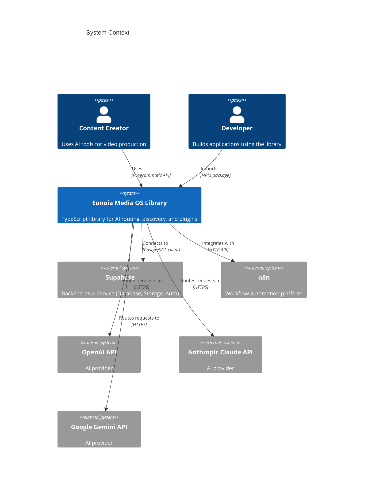
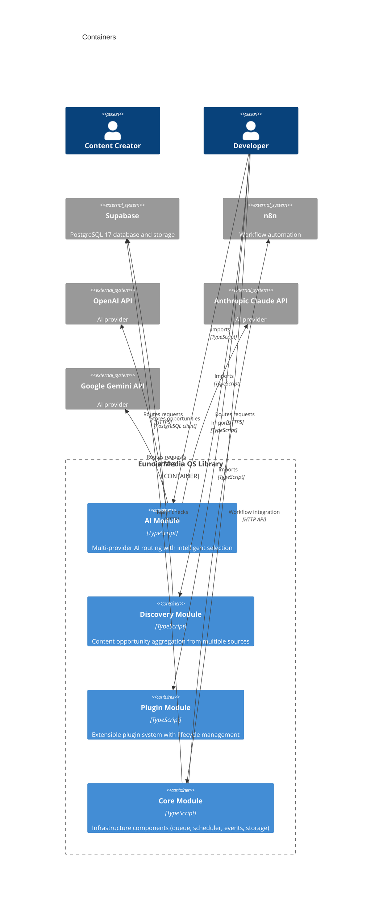
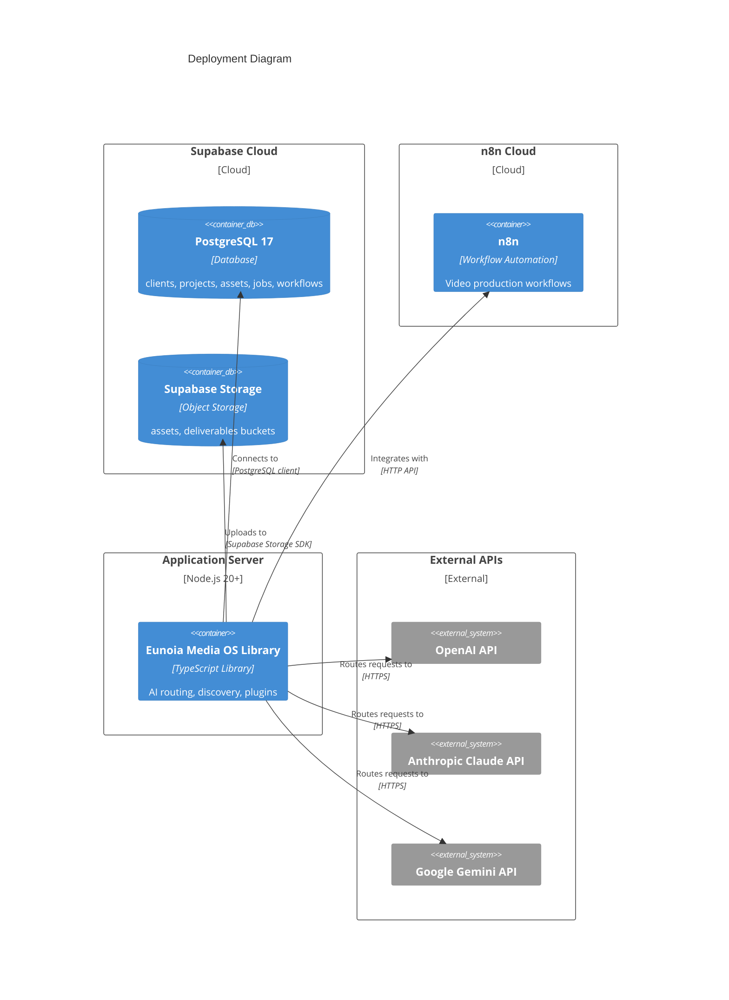

# C4 Model

## Overview

This document presents the C4 model for the Eunoia Media OS TypeScript library. The C4 model provides a hierarchical view of the software architecture across multiple levels of abstraction.

## Level 1: System Context



**Description**: The Eunoia Media OS Library is a TypeScript library that provides AI routing, content discovery, and plugin infrastructure. It is used by content creators and developers, and integrates with Supabase, n8n, and multiple AI providers.

## Level 2: Containers



**Description**: The library is organized into four main containers: AI Module, Discovery Module, Plugin Module, and Core Module. Each container is a TypeScript module that can be imported independently.

## Level 3: Components - AI Module

```mermaid
C4Component
    title AI Module Components
    Container(ai_module, "AI Module") {
        Component(ai_service, "AIService", "Application Service", "Orchestrates AI requests with retry logic")
        Component(ai_router, "AIRouter", "Routing", "Selects optimal AI provider based on strategy")
        Component(openai_provider, "OpenAIProvider", "Infrastructure", "OpenAI API integration")
        Component(claude_provider, "ClaudeProvider", "Infrastructure", "Anthropic Claude API integration (skeleton)")
        Component(gemini_provider, "GeminiProvider", "Infrastructure", "Google Gemini API integration (skeleton)")
        Component(cost_estimator, "CostEstimator", "Domain", "Estimates token counts and costs")
        Component(conversation_memory, "ConversationMemory", "Domain", "Manages conversation history")
        Component(prompt_registry, "PromptRegistry", "Domain", "Manages prompt templates")
    }
    
    System_Ext(openai, "OpenAI API")
    System_Ext(claude, "Anthropic Claude API")
    System_Ext(gemini, "Google Gemini API")
    
    Rel(ai_service, ai_router, "Uses", "Selects provider")
    Rel(ai_service, cost_estimator, "Uses", "Estimates costs")
    Rel(ai_router, openai_provider, "Selects", "Based on strategy")
    Rel(ai_router, claude_provider, "Selects", "Based on strategy")
    Rel(ai_router, gemini_provider, "Selects", "Based on strategy")
    
    Rel(openai_provider, openai, "Calls", "HTTPS")
    Rel(claude_provider, claude, "Calls", "HTTPS (not implemented)")
    Rel(gemini_provider, gemini, "Calls", "HTTPS (not implemented)")
```

**Description**: The AI Module consists of the AIService for orchestration, AIRouter for provider selection, multiple provider implementations, and supporting components for cost estimation, memory, and prompts.

## Level 3: Components - Discovery Module

```mermaid
C4Component
    title Discovery Module Components
    Container(discovery_module, "Discovery Module") {
        Component(discovery_service, "DiscoveryService", "Application Service", "Orchestrates content discovery")
        Component(provider_registry, "ProviderRegistry", "Infrastructure", "Registry for discovery providers")
        Component(rss_provider, "RssProvider", "Infrastructure", "RSS feed integration")
        Component(reddit_provider, "RedditProvider", "Infrastructure", "Reddit API integration (skeleton)")
        Component(youtube_provider, "YouTubeProvider", "Infrastructure", "YouTube API integration (skeleton)")
        Component(google_trends_provider, "GoogleTrendsProvider", "Infrastructure", "Google Trends API integration (skeleton)")
        Component(whop_provider, "WhopProvider", "Infrastructure", "Whop API integration (skeleton)")
        Component(scoring_service, "OpportunityScoringService", "Domain", "Scores content opportunities")
        Component(opportunity_repository, "SupabaseOpportunityRepository", "Infrastructure", "Persists opportunities to Supabase")
    }
    
    System_Ext(supabase, "Supabase")
    
    Rel(discovery_service, provider_registry, "Uses", "Resolves providers")
    Rel(discovery_service, scoring_service, "Uses", "Scores opportunities")
    Rel(discovery_service, opportunity_repository, "Uses", "Persists opportunities")
    
    Rel(provider_registry, rss_provider, "Manages", "Registration")
    Rel(provider_registry, reddit_provider, "Manages", "Registration")
    Rel(provider_registry, youtube_provider, "Manages", "Registration")
    Rel(provider_registry, google_trends_provider, "Manages", "Registration")
    Rel(provider_registry, whop_provider, "Manages", "Registration")
    
    Rel(opportunity_repository, supabase, "Queries", "PostgreSQL client")
```

**Description**: The Discovery Module consists of the DiscoveryService for orchestration, a ProviderRegistry for managing discovery sources, multiple provider implementations (only RSS is fully implemented), a scoring service, and a repository for persistence.

## Level 3: Components - Plugin Module

```mermaid
C4Component
    title Plugin Module Components
    Container(plugin_module, "Plugin Module") {
        Component(lifecycle_manager, "PluginLifecycleManager", "Application Service", "Manages plugin lifecycle")
        Component(plugin_registry, "PluginRegistry", "Infrastructure", "In-memory plugin registry")
        Component(plugin_loader, "PluginLoader", "Infrastructure", "Discovers and loads plugins")
        Component(manifest_validator, "ManifestValidator", "Domain", "Validates plugin manifests")
        Component(dependency_resolver, "DependencyResolver", "Domain", "Resolves plugin load order")
        Component(config_validator, "PluginConfigValidator", "Domain", "Validates plugin configuration")
        Component(plugin_metrics, "PluginMetrics", "Observability", "Collects plugin metrics")
    }
    
    Rel(lifecycle_manager, plugin_registry, "Uses", "Manages metadata")
    Rel(lifecycle_manager, plugin_metrics, "Uses", "Records metrics")
    Rel(plugin_loader, manifest_validator, "Uses", "Validates manifests")
    Rel(plugin_loader, dependency_resolver, "Uses", "Resolves load order")
    Rel(plugin_loader, config_validator, "Uses", "Validates configuration")
```

**Description**: The Plugin Module consists of the PluginLifecycleManager for lifecycle management, a PluginRegistry for metadata storage, a PluginLoader for discovery and loading, and supporting components for validation, dependency resolution, and metrics.

## Level 3: Components - Core Module

```mermaid
C4Component
    title Core Module Components
    Container(core_module, "Core Module") {
        Component(engine, "Engine", "Application", "Application orchestration")
        Component(health_service, "HealthService", "Infrastructure", "Health checks")
        Component(job_queue, "JobQueue", "Infrastructure", "In-memory job queue")
        Component(scheduler, "SchedulerService", "Infrastructure", "Cron/interval scheduling")
        Component(event_bus, "InMemoryEventBus", "Infrastructure", "Event bus")
        Component(metrics_service, "MetricsService", "Observability", "Metrics aggregation")
        Component(local_storage_provider, "LocalStorageProvider", "Infrastructure", "Filesystem storage")
        Component(google_drive_provider, "GoogleDriveProvider", "Infrastructure", "Google Drive storage (skeleton)")
        Component(app_config, "AppConfig", "Configuration", "Environment configuration")
    }
    
    System_Ext(supabase, "Supabase")
    System_Ext(n8n, "n8n")
    
    Rel(engine, health_service, "Uses", "Health checks")
    Rel(engine, job_queue, "Registers", "Job queue")
    Rel(engine, scheduler, "Registers", "Scheduler")
    Rel(engine, local_storage_provider, "Registers", "Storage provider")
    
    Rel(health_service, supabase, "Checks", "HTTP")
    
    Rel(event_bus, plugin_module, "Publishes to", "Plugin events")
```

**Description**: The Core Module consists of the Engine for orchestration, infrastructure components for queue, scheduler, events, metrics, storage, and configuration, and a HealthService for monitoring.

## Level 4: Code - AI Routing Flow

```mermaid
C4Code
    title AI Routing Flow
    Component(ai_service, "AIService")
    Component(ai_router, "AIRouter")
    Component(openai_provider, "OpenAIProvider")
    
    Rel(ai_service, ai_router, "select(request, policy)", "Returns IAIProvider")
    Rel(ai_service, openai_provider, "execute(request)", "Returns AIResponse")
    Rel(ai_router, openai_provider, "supports(taskType)", "Returns boolean")
    Rel(ai_router, openai_provider, "estimateCost(request)", "Returns ProviderCost")
    Rel(ai_router, openai_provider, "estimateLatency(request)", "Returns number")
```

**Description**: Detailed code-level view of the AI routing flow showing method calls between AIService, AIRouter, and OpenAIProvider.

## Level 4: Code - Plugin Installation Flow

```mermaid
C4Code
    title Plugin Installation Flow
    Component(lifecycle_manager, "PluginLifecycleManager")
    Component(plugin_registry, "PluginRegistry")
    Component(plugin, "IPlugin")
    Component(event_bus, "InMemoryEventBus")
    
    Rel(lifecycle_manager, plugin_registry, "register(plugin, directory)", "Returns PluginMetadata")
    Rel(lifecycle_manager, plugin, "install(context)", "Returns void")
    Rel(lifecycle_manager, event_bus, "publish(plugin.installed)", "Returns void")
    Rel(plugin_registry, plugin, "Stores", "Plugin instance")
```

**Description**: Detailed code-level view of the plugin installation flow showing method calls between PluginLifecycleManager, PluginRegistry, IPlugin, and InMemoryEventBus.

## Deployment Diagram



**Description**: The deployment diagram shows the physical deployment of components across Supabase Cloud, n8n Cloud, an Application Server hosting the library, and external AI provider APIs.

## Current Limitations in C4 Model

1. **No Application Container**: The library has no application container (no main entry point)
2. **No User Interface**: No UI components or web interfaces
3. **No External Integrations**: Many provider integrations are skeletons
4. **No Database Connection**: Discovery repository assumes table that doesn't exist
5. **No n8n Integration**: n8n integration is defined but not implemented in code

## Cross-References

- [Architecture Overview](ARCHITECTURE_OVERVIEW.md) - High-level system overview
- [Components](COMPONENTS.md) - Detailed component descriptions
- [Class Relationships](CLASS_RELATIONSHIPS.md) - Class-level relationships
- [Deployment](DEPLOYMENT.md) - Deployment procedures
