# Class Relationships

## Overview

This document describes the key class relationships and dependencies within the Eunoia Media OS TypeScript library. Relationships are organized by module and layer.

## AI Module Relationships

### AIService

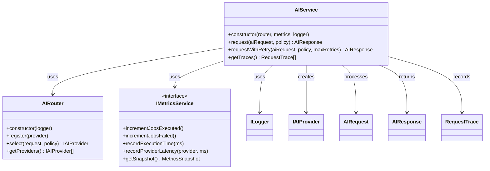

### AIRouter

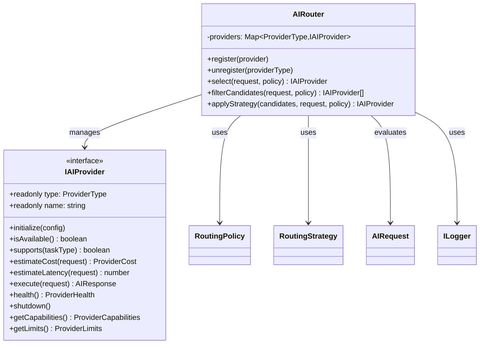

### OpenAIProvider

```mermaid
classDiagram
    OpenAIProvider ..| IAIProvider : implements
    OpenAIProvider --> ILogger : uses
    OpenAIProvider --> CostEstimator : uses
    OpenAIProvider --> AIRequest : processes
    OpenAIProvider --> AIResponse : creates
    OpenAIProvider --> AIUsage : creates
    
    class OpenAIProvider {
      +readonly type: ProviderType
      +readonly name: string
      -apiKey: string | null
      -available: boolean
      -estimator: CostEstimator
      +initialize(config)
      +isAvailable() boolean
      +supports(taskType) boolean
      +estimateCost(request) ProviderCost
      +estimateLatency(request) number
      +execute(request) AIResponse
      +health() ProviderHealth
      +shutdown()
      +getCapabilities() ProviderCapabilities
      +getLimits() ProviderLimits
    }
    
    class CostEstimator {
      +estimateRequestTokens(request) {input, output}
      +estimateTokenCount(text) number
    }
```

### ConversationMemory

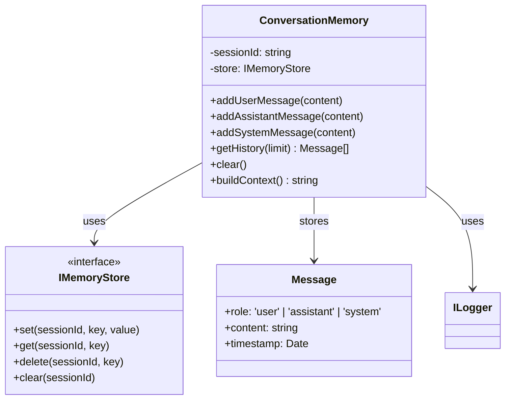

## Discovery Module Relationships

### DiscoveryService

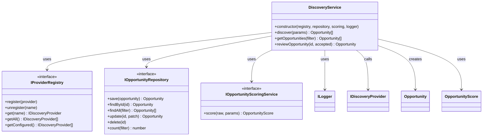

### OpportunityScoringService

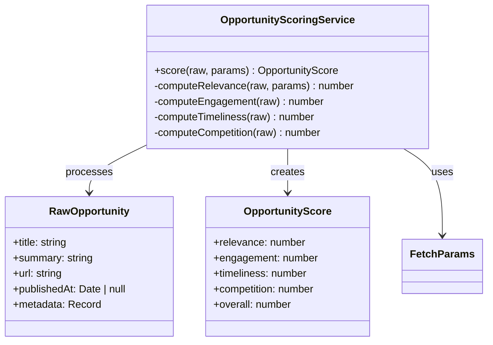

### RssProvider

```mermaid
classDiagram
    RssProvider ..| IDiscoveryProvider : implements
    RssProvider --> ILogger : uses
    RssProvider --> RawOpportunity : creates
    
    class RssProvider {
      +readonly name: string
      +readonly source: DiscoverySource
      -feedUrl: string
      +isConfigured() boolean
      +fetchOpportunities(params) RawOpportunity[]
    }
    
    class IDiscoveryProvider {
      <<interface>>
      +readonly name: string
      +readonly source: DiscoverySource
      +isConfigured() boolean
      +fetchOpportunities(params) RawOpportunity[]
    }
```

## Plugin Module Relationships

### PluginLifecycleManager

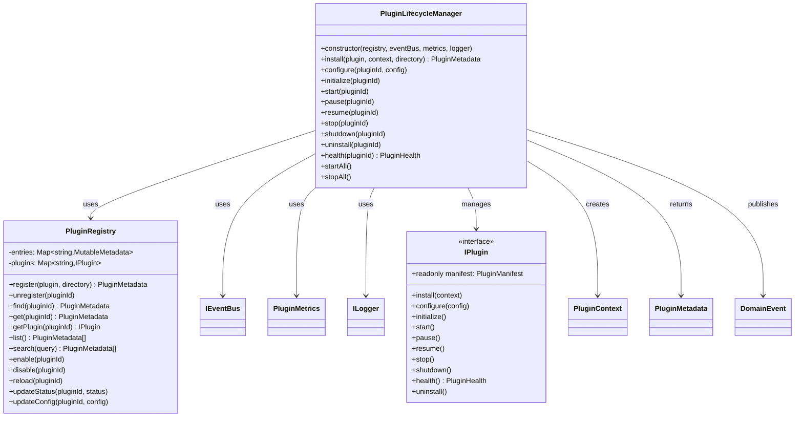

### PluginLoader

```mermaid
classDiagram
    PluginLoader --> ILogger : uses
    PluginLoader --> PluginManifest : validates
    PluginLoader --> PluginManifest : returns
    PluginLoader --> DependencyResolver : uses
    PluginLoader --> ManifestValidator : uses
    PluginLoader --> IPlugin : creates
    
    class PluginLoader {
      -baseDir: string
      +loadManifestFromDirectory(dir) PluginManifest
      +discoverManifests() {manifest, directory}[]
      +resolveLoadOrder(manifests) PluginManifest[]
      +validateManifest(raw) PluginManifest
      +createPluginFromFactory(factory, manifest) IPlugin
    }
    
    class DependencyResolver {
      +resolveLoadOrder(manifests) PluginManifest[]
      -satisfyVersionConstraint(version, constraint) boolean
      -compareVersions(v1, v2) number
      -detectCircularDependencies(manifests)
      -topologicalSort(manifests) PluginManifest[]
    }
    
    class ManifestValidator {
      +validate(raw) PluginManifest
      -validateRequiredFields(manifest)
      -validateSemver(version)
      -validatePermissions(permissions)
      -validateConfigSchema(schema)
    }
```

## Core Module Relationships

### Engine

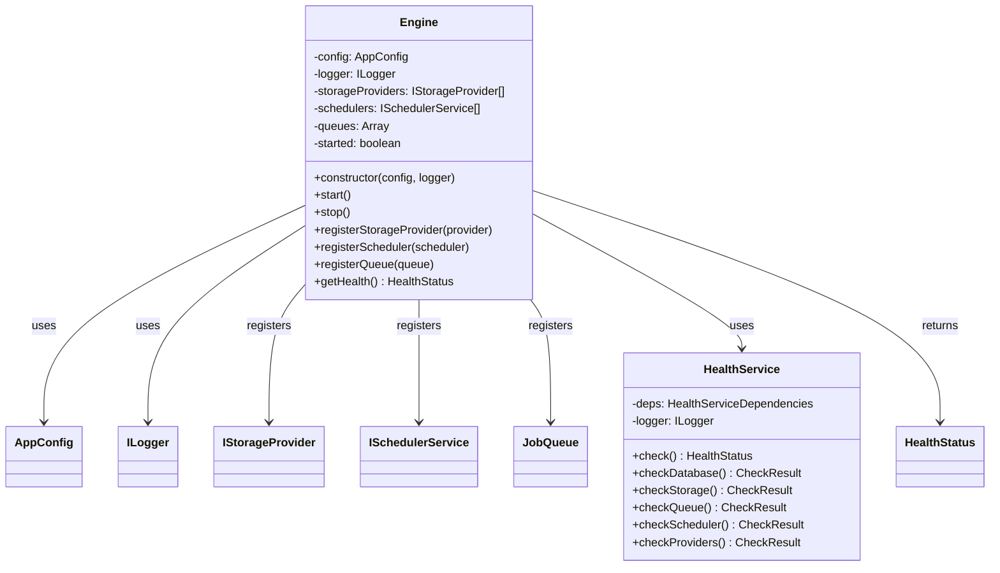

### JobQueue

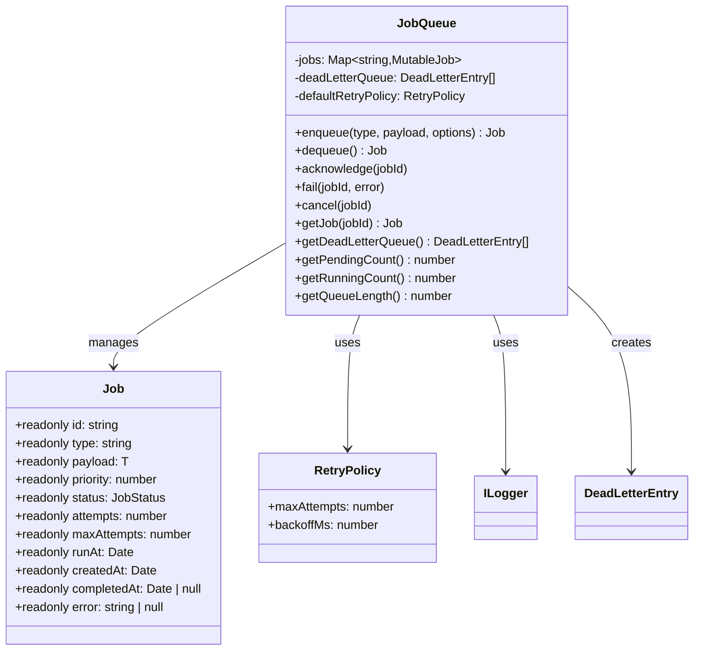

### SchedulerService

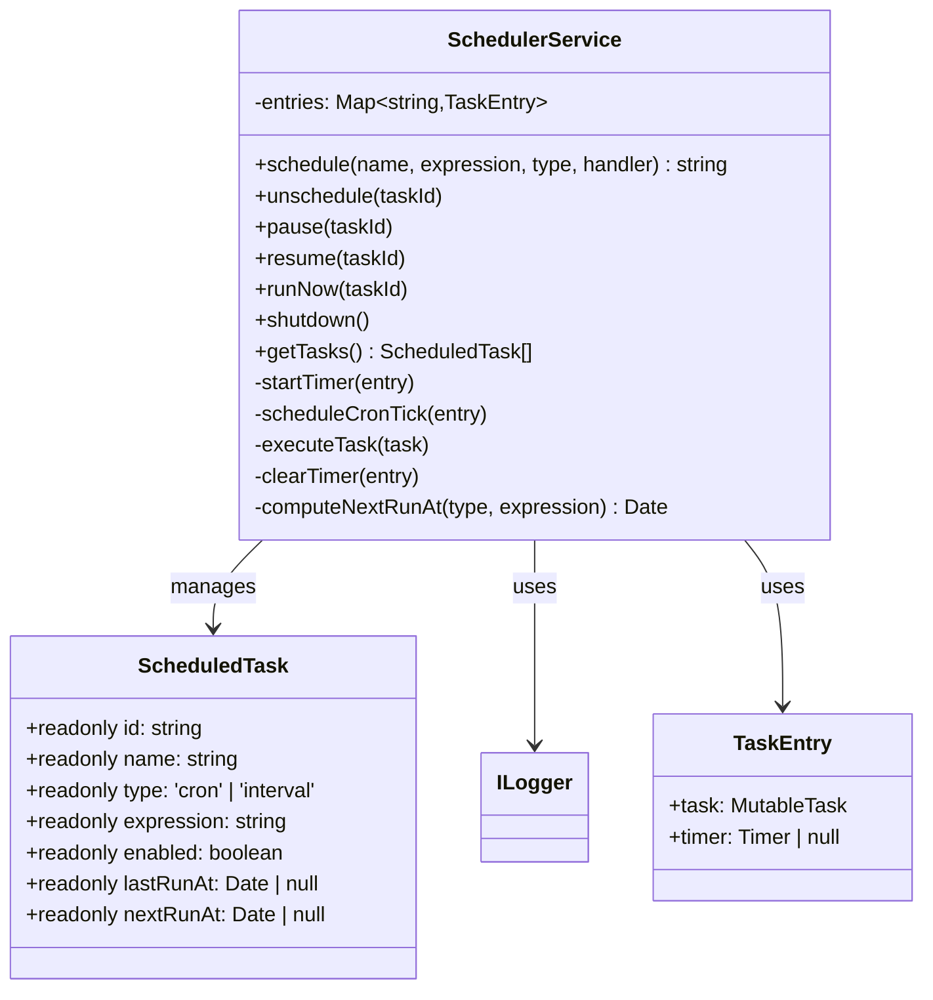

### InMemoryEventBus

```mermaid
classDiagram
    InMemoryEventBus ..| IEventBus : implements
    InMemoryEventBus --> ILogger : uses
    InMemoryEventBus --> DomainEvent : publishes
    InMemoryEventBus --> EventHandler : calls
    
    class InMemoryEventBus {
      -handlers: Map~string,Set~EventHandler~~
      +publish(event)
      +subscribe(eventType, handler)
      +unsubscribe(eventType, handler)
    }
    
    class IEventBus {
      <<interface>>
      +publish(event)
      +subscribe(eventType, handler)
      +unsubscribe(eventType, handler)
    }
    
    class DomainEvent {
      +eventType: string
      +eventId: string
      +timestamp: Date
      +payload: unknown
    }
    
    class EventHandler {
      <<type>>
      (event: T) => Promise | void
    }
```

### MetricsService

```mermaid
classDiagram
    MetricsService ..| IMetricsService : implements
    MetricsService --> MetricsSnapshot : creates
    
    class MetricsService {
      -jobsExecuted: number
      -jobsFailed: number
      -executionTimeMs: number
      -executionCount: number
      -providerLatencies: Map~ProviderType,number[]
      +incrementJobsExecuted()
      +incrementJobsFailed()
      +recordExecutionTime(ms)
      +recordProviderLatency(provider, ms)
      +getSnapshot() MetricsSnapshot
    }
    
    class MetricsSnapshot {
      +jobsExecuted: number
      +jobsFailed: number
      +averageExecutionTimeMs: number
      +queueLength: number
      +averageProviderLatency: Map
    }
```

### LocalStorageProvider

```mermaid
classDiagram
    LocalStorageProvider ..| IStorageProvider : implements
    LocalStorageProvider --> StorageObject : creates
    LocalStorageProvider --> AppError : throws
    
    class LocalStorageProvider {
      +readonly name: string
      -baseDirectory: string
      +upload(key, data, contentType) StorageObject
      +download(key) Buffer
      +delete(key)
      +exists(key) boolean
      +list(prefix) StorageObject[]
      -resolvePath(key) string
      -listRecursive(dir, prefix) StorageObject[]
    }
    
    class IStorageProvider {
      <<interface>>
      +readonly name: string
      +upload(key, data, contentType) StorageObject
      +download(key) Buffer
      +delete(key)
      +exists(key) boolean
      +list(prefix) StorageObject[]
    }
    
    class StorageObject {
      +key: string
      +size: number
      +lastModified: Date
      +contentType: string
    }
```

## Shared Module Relationships

### Error Hierarchy

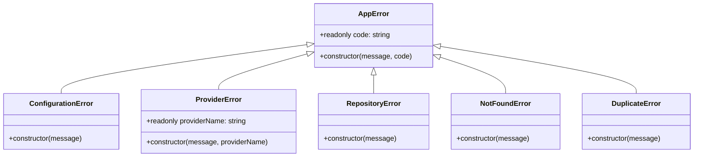

### Plugin Error Hierarchy

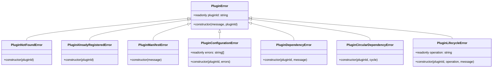

### AI Error Hierarchy

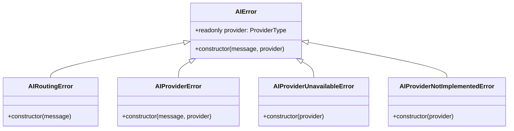

## Cross-Module Relationships

### Engine Integration

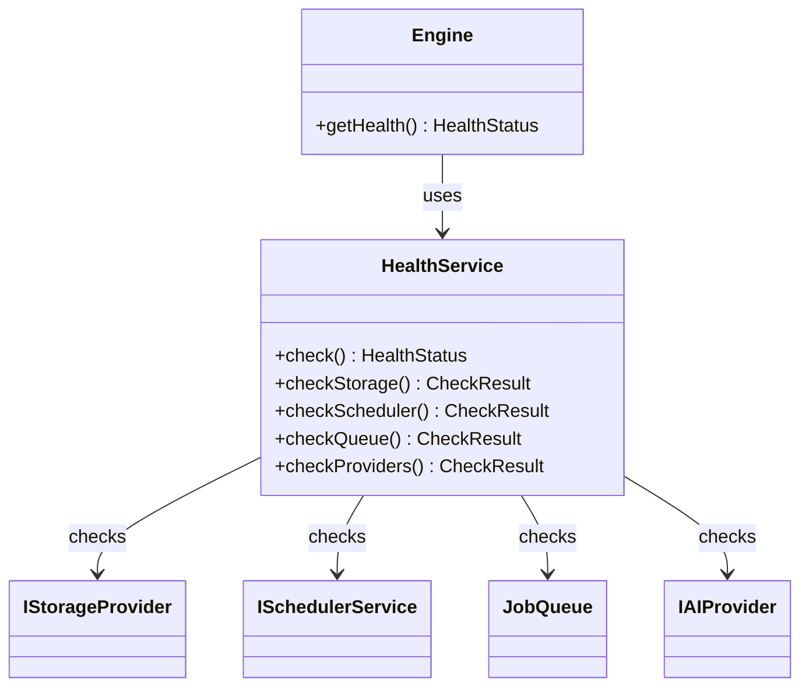

### Plugin System Integration

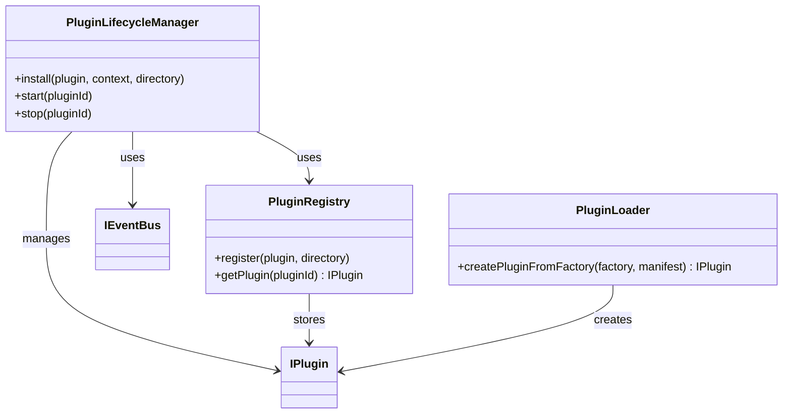

## Dependency Injection Patterns

### Constructor Injection

Most classes use constructor injection for dependencies:

```typescript
class AIService {
  constructor(
    private readonly router: AIRouter,
    private readonly metrics: IMetricsService,
    private readonly logger: ILogger
  ) {}
}
```

### Interface-Based Dependencies

All major dependencies are interfaces:

```typescript
interface IEventBus {
  publish(event: T): Promise;
  subscribe(eventType: string, handler: EventHandler): void;
}
```

### Factory Methods

Domain objects use factory methods:

```typescript
class Opportunity {
  static create(props: CreateOpportunityProps): Opportunity;
  static reconstitute(props: OpportunityProps): Opportunity;
}
```

## Cross-References

- [Components](COMPONENTS.md) - Detailed component documentation
- [Folder Structure](FOLDER_STRUCTURE.md) - File organization
- [Architecture Overview](ARCHITECTURE_OVERVIEW.md) - Module organization
