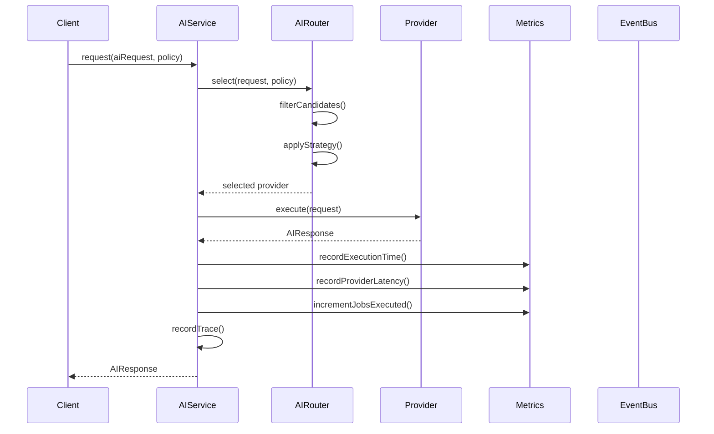
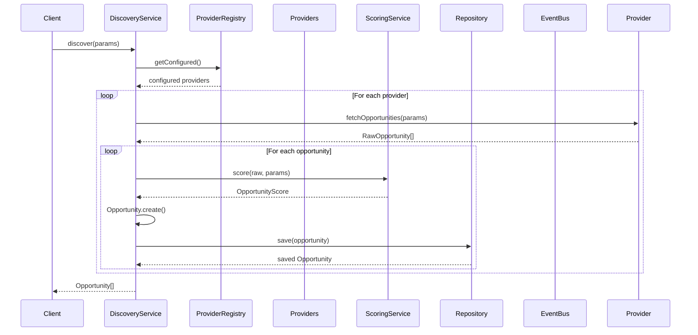
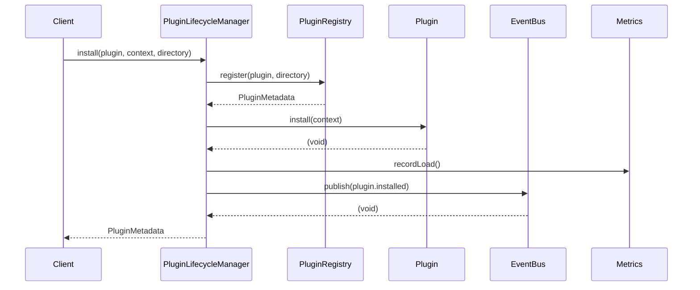
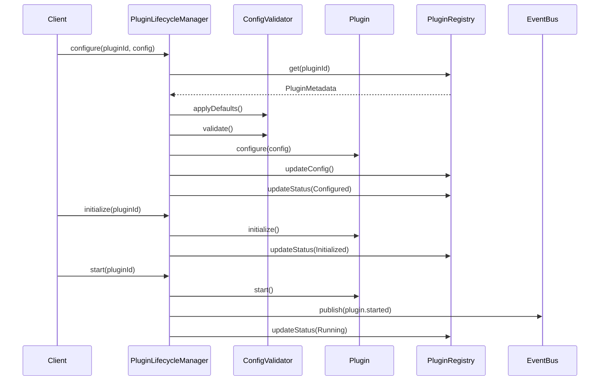
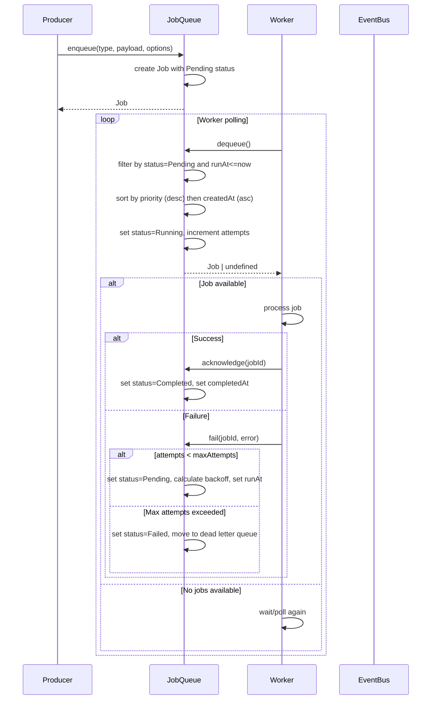
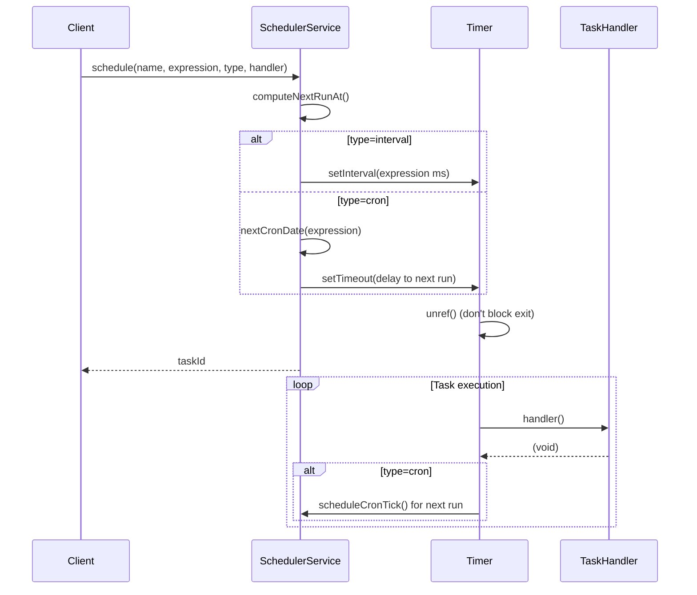
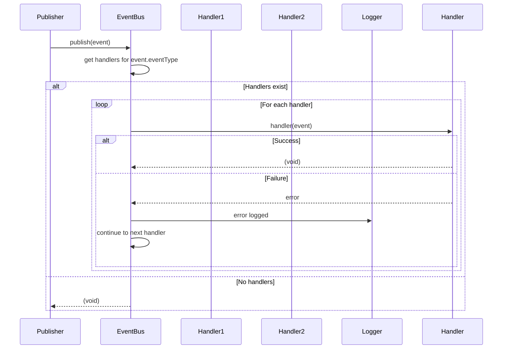
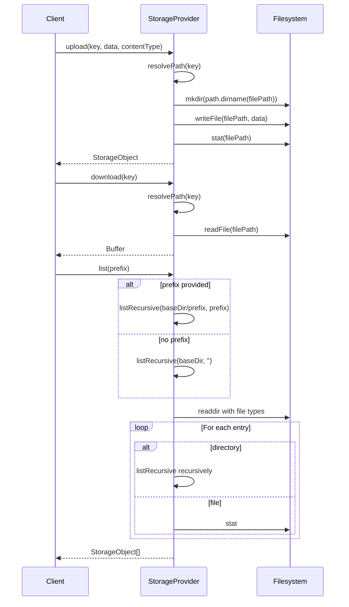
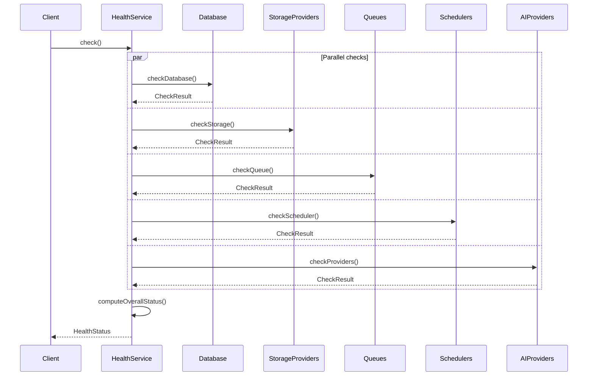
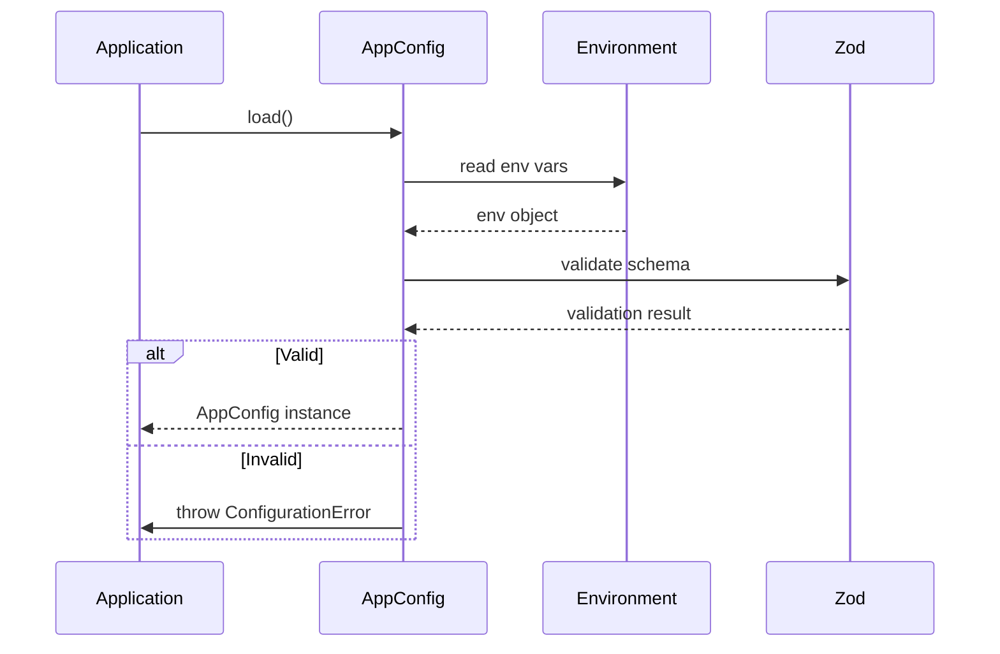

# Data Flow

This document describes how data flows through the Eunoia Media OS TypeScript library across its major subsystems.

## AI Request Flow

**Flow Description**:

1. Client creates an `AIRequest` with task type, prompt, and optional parameters
2. `AIService.request()` is called with the request and routing policy
3. `AIRouter.select()` filters available providers by:
   - Exclusion policy
   - Availability status
   - Task type support
4. Router applies the selected strategy (LowestCost, HighestQuality, Fastest, Manual, Balanced)
5. Selected provider executes the request
6. On success:
   - Metrics are recorded (execution time, provider latency, jobs executed)
   - Request trace is recorded
   - Response is returned to client
7. On failure:
   - Retry logic is triggered (if within max retries)
   - Metrics record job failure
   - Error trace is recorded

**Error Handling**:
- `AIRoutingError`: No available provider supports the task type - thrown immediately
- `AIProviderError`: Provider execution failure - triggers retry logic
- After max retries: Error is thrown to client

---

## Discovery Pipeline Flow

**Flow Description**:

1. Client calls `DiscoveryService.discover()` with parameters (keywords, limit, since, providerNames)
2. Service resolves providers from registry:
   - If providerNames specified: only those providers
   - Otherwise: all configured providers
3. For each provider:
   - Fetch raw opportunities via provider's `fetchOpportunities()`
   - For each raw opportunity:
     - Score using `OpportunityScoringService` (relevance, engagement, timeliness, competition)
     - Create `Opportunity` domain object
     - Save to repository
     - Add to results array
4. Provider failures are logged but do not stop the overall discovery run
5. All opportunities are returned to client

**Error Handling**:
- Provider fetch failures: Logged and skipped, do not fail the entire run
- Repository save failures: Propagate to client (could lose data)

---

## Plugin Installation Flow

**Flow Description**:

1. Client provides plugin instance, context, and directory
2. `PluginLifecycleManager.install()`:
   - Registers plugin in registry with metadata
   - Calls plugin's `install()` method
   - Records load time in metrics
   - Emits `plugin.installed` event
3. On success: Returns `PluginMetadata` to client
4. On failure:
   - Records failure in metrics
   - Emits `plugin.failed` event
   - Throws error to client

**Subsequent Flows** (configure → initialize → start):

---

## Job Queue Processing Flow

**Flow Description**:

1. Producer enqueues job with type, payload, and optional priority/runAt/retryPolicy
2. Job is created with:
   - Unique ID
   - Pending status
   - Priority (default 0)
   - Max attempts from retry policy
   - Run time (default now)
3. Worker polls queue for available jobs
4. Queue selects next job:
   - Filter: status=Pending AND runAt <= now
   - Sort: priority DESC, createdAt ASC (FIFO within same priority)
   - Set status=Running, increment attempts
5. Worker processes job
6. On success:
   - Worker calls `acknowledge()`
   - Job status set to Completed
   - completedAt timestamp set
7. On failure:
   - Worker calls `fail()` with error message
   - If attempts < maxAttempts:
     - Status set to Pending
     - Run time set to now + exponential backoff
   - If attempts >= maxAttempts:
     - Status set to Failed
     - Job moved to dead letter queue

**Retry Backoff Formula**: `backoffMs * 2^(attempt - 1)`

---

## Scheduler Task Execution Flow

**Flow Description**:

1. Client schedules task with name, expression, type (cron/interval), and handler
2. Scheduler computes next run time:
   - Interval: now + expression (milliseconds)
   - Cron: parsed via custom `nextCronDate()` function
3. Timer is set:
   - Interval: `setInterval(expression)`
   - Cron: `setTimeout(delay to next run)`
4. Timer is unref'd to not block process exit
5. On timer fire:
   - Handler is executed
   - Errors are logged but do not stop scheduler
   - For cron: next run is scheduled recursively
6. Client can pause/resume/unschedule tasks

---

## Event Bus Flow

**Flow Description**:

1. Publisher publishes domain event to event bus
2. Event bus retrieves all handlers subscribed to event type
3. For each handler:
   - Handler is called with event
   - On success: Continue to next handler
   - On failure: Error is logged, but other handlers still execute
4. Event bus never throws to publisher (errors are isolated)

**Event Isolation**: Handler errors do not stop other handlers from executing

---

## Storage Provider Flow

**Flow Description**:

1. Upload:
   - Resolve full path from base directory and key
   - Create parent directories if needed
   - Write file data
   - Get file stats for size and modification time
   - Return `StorageObject` metadata

2. Download:
   - Resolve full path
   - Read file contents
   - Return buffer

3. List:
   - Determine search directory (base or with prefix)
   - Recursively traverse directory tree
   - For each file: get stats, create `StorageObject`
   - Return array of objects

---

## Health Check Flow

**Flow Description**:

1. Client requests health check
2. All checks run in parallel:
   - **Database**: HTTP request to Supabase health endpoint
   - **Storage**: `exists()` check on each provider
   - **Queue**: Aggregate queue length
   - **Scheduler**: Count enabled/total tasks
   - **AI Providers**: List available providers
3. Overall status computed:
   - Any fail → unhealthy
   - Any warn (no fail) → degraded
   - All pass → healthy
4. Health status returned with all check results

---

## Configuration Loading Flow

**Flow Description**:

1. Application requests configuration
2. `AppConfig` reads environment variables
3. Zod schema validates:
   - Required fields present
   - Correct data types
   - Valid values
4. On validation success: Returns typed `AppConfig` instance
5. On validation failure: Throws `ConfigurationError` with details
