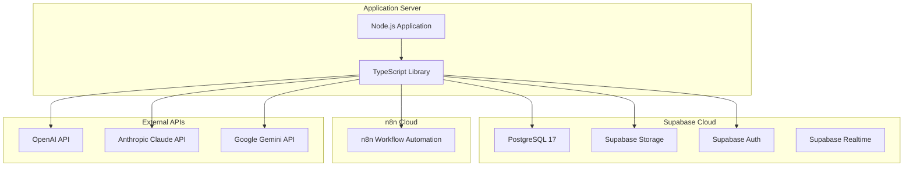
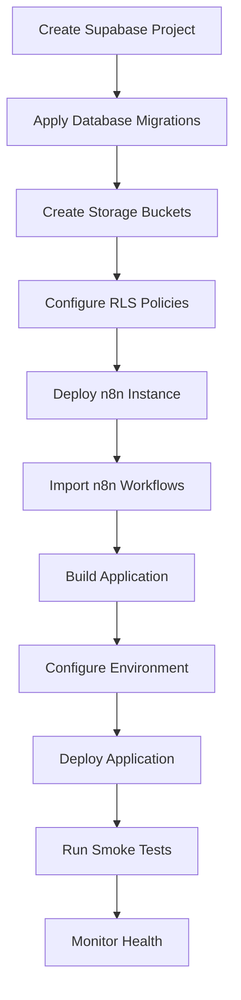
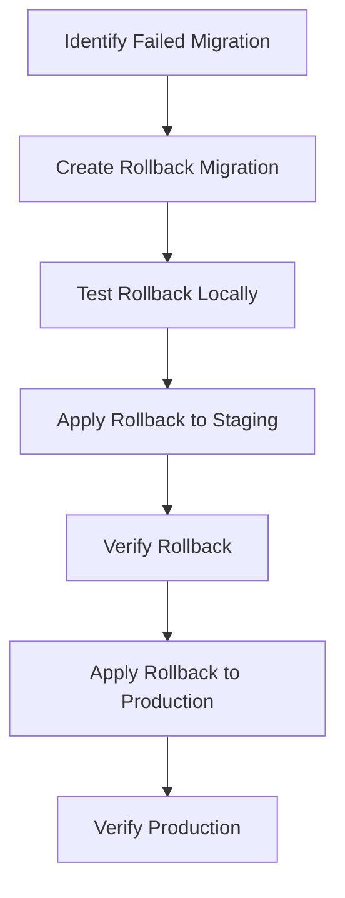

# Deployment

## Overview

**Important Note**: The Eunoia Media OS TypeScript library currently has no deployment configuration or procedures. It is a library without a main entry point, runtime application, or deployment target. This document describes the intended deployment architecture based on the documented system design and database schema.

## Intended Deployment Architecture



## Deployment Components

### Supabase

**Purpose**: Backend-as-a-Service providing database, storage, authentication, and realtime.

**Components**:
- PostgreSQL 17 database
- Supabase Storage (assets, deliverables buckets)
- Supabase Auth (user authentication)
- Supabase Realtime (optional for real-time features)

**Deployment**:
- Managed by Supabase Cloud
- Database migrations applied via Supabase CLI or dashboard
- Storage buckets created via Supabase dashboard
- RLS policies applied via migration scripts

**Migration Procedure**:
```bash
# Install Supabase CLI
npm install -g supabase

# Link to project
supabase link --project-ref <project-id>

# Apply migrations
supabase db push

# Verify migration
supabase db remote changes
```

### n8n

**Purpose**: Workflow automation for video production pipelines.

**Deployment Options**:
- **Self-hosted**: Docker container on own infrastructure
- **n8n Cloud**: Managed service (n8n.cloud)

**Configuration**:
- Base URL: `N8N_BASE_URL` environment variable
- API Key: `N8N_API_KEY` environment variable

**Integration**:
- n8n workflows triggered via HTTP API
- Workflow definitions stored in `workflow_definitions` table
- Workflow executions logged in `workflow_executions` table

### Application Server

**Purpose**: Hosts the Node.js application that uses the TypeScript library.

**Current Status**: No application server exists - only the library code.

**Intended Deployment**:
- Node.js 20+ runtime
- TypeScript compiled to CommonJS
- Environment-based configuration
- Process manager (PM2, systemd)

**Build Process**:
```bash
# Install dependencies
npm install

# Build TypeScript
npm run build

# Run tests
npm test

# Check coverage
npm run test:coverage
```

**Environment Variables**:
```bash
# Supabase
SUPABASE_URL=https://<project>.supabase.co
SUPABASE_ANON_KEY=<anon-key>
SUPABASE_SERVICE_ROLE_KEY=<service-role-key>

# AI Providers
OPENAI_API_KEY=<openai-key>
# CLAUDE_API_KEY=<claude-key>
# GEMINI_API_KEY=<gemini-key>

# Storage
GOOGLE_DRIVE_FOLDER=<folder-id>

# n8n
N8N_BASE_URL=https://n8n.example.com
N8N_API_KEY=<n8n-key>

# Application
LOG_LEVEL=info
NODE_ENV=production
```

## Deployment Environments

### Development

**Purpose**: Local development and testing.

**Setup**:
```bash
# Install dependencies
npm install

# Run in watch mode
npm run dev

# Run tests
npm test
```

**Database**: Local Supabase local development container or remote dev instance.

**Configuration**: `.env` file with development keys.

### Staging

**Purpose**: Pre-production testing environment.

**Setup**:
- Separate Supabase project for staging
- Separate n8n instance for staging
- Test AI provider keys (or mock providers)

**Configuration**: Environment variables for staging environment.

### Production

**Purpose**: Live production environment.

**Setup**:
- Production Supabase project
- Production n8n instance
- Production AI provider keys
- Process manager for uptime
- Monitoring and alerting

**Configuration**: Environment variables for production environment.

## Deployment Procedures

### Initial Deployment



**Steps**:
1. Create Supabase project
2. Apply database migrations (`sql/000_extensions.sql`, `sql/001_schema.sql`)
3. Create storage buckets (`assets`, `deliverables`)
4. Configure RLS policies
5. Deploy n8n instance (self-hosted or cloud)
6. Import n8n workflows
7. Build TypeScript application
8. Configure environment variables
9. Deploy application to server
10. Run smoke tests
11. Monitor health checks

### Database Migration Deployment

**Apply New Migration**:
```bash
# Create new migration file
touch sql/002_new_feature.sql

# Apply to local
supabase db reset

# Test migration
npm test

# Apply to staging
supabase db push --linked

# Apply to production
supabase db push --linked
```

**Rollback Procedure**:


**Note**: Current migrations are idempotent but no automated rollback mechanism exists.

### Application Deployment

**Build**:
```bash
npm run build
```

**Deploy** (example with PM2):
```bash
# Build
npm run build

# Deploy to server
scp -r dist/ user@server:/app/

# Restart process
pm2 restart eunoia-app

# Check logs
pm2 logs eunoia-app
```

**Health Check**:
```bash
# Check application health
curl http://localhost:3000/health

# Check database health
curl https://<project>.supabase.co/health

# Check n8n health
curl https://n8n.example.com/healthz
```

## Monitoring

### Health Checks

**Application Health** (intended):
```typescript
const health = await engine.getHealth();
// Returns: { status: 'healthy' | 'degraded' | 'unhealthy', checks: [...] }
```

**Database Health**:
- Supabase provides health endpoint
- Connection pool monitoring

**AI Provider Health**:
- Provider health checks via `provider.health()`
- Rate limit monitoring
- Error rate tracking

### Logging

**Structured Logging**:
- Uses `pino` for structured logging
- Log levels: debug, info, warn, error
- Contextual logging with child loggers

**Log Destinations** (intended):
- Console output (development)
- File output (production)
- Log aggregation service (e.g., Datadog, Sentry)

### Metrics

**Metrics Collected**:
- Jobs executed/failed
- Execution time
- Queue length
- Provider latency
- Plugin load time/failures

**Metrics Export** (intended):
- Prometheus format
- StatsD format
- Custom dashboard

## Security

### Environment Variables

**Secrets Management**:
- All secrets in environment variables
- No hardcoded secrets in code
- Use secret management service (e.g., AWS Secrets Manager, HashiCorp Vault)

**Required Secrets**:
- `SUPABASE_URL`
- `SUPABASE_ANON_KEY`
- `SUPABASE_SERVICE_ROLE_KEY`
- `OPENAI_API_KEY`
- `N8N_API_KEY`

### Database Security

**Row Level Security**:
- All tables have RLS enabled
- Authenticated users have full access
- Service role bypasses RLS

**Connection Security**:
- Use Supabase connection pooling
- SSL/TLS required
- IP whitelisting (optional)

### API Security

**AI Provider Keys**:
- Rotate keys regularly
- Monitor usage and costs
- Implement rate limiting
- Use separate keys per environment

**n8n API**:
- API key authentication
- HTTPS required
- IP whitelisting (optional)

## Current Limitations

1. **No Application**: No main application to deploy
2. **No Deployment Scripts**: No deployment automation
3. **No CI/CD**: No continuous integration/deployment pipeline
4. **No Docker**: No containerization
5. **No Kubernetes**: No orchestration
6. **No Monitoring**: No monitoring setup
7. **No Alerting**: No alerting configuration
8. **No Backup Strategy**: No backup/restore procedures
9. **No Disaster Recovery**: No DR plan
10. **No Load Balancing**: No load balancer configuration

## Future Enhancements

### Containerization
- Dockerfile for application
- Docker Compose for local development
- Multi-stage builds for optimization

### Orchestration
- Kubernetes manifests
- Helm charts
- Deployment strategies (rolling, blue-green)

### CI/CD Pipeline
- GitHub Actions
- Automated testing
- Automated deployment
- Rollback automation

### Monitoring
- Prometheus metrics
- Grafana dashboards
- Log aggregation (ELK, Loki)
- APM (Datadog, New Relic)

### Alerting
- PagerDuty integration
- Slack notifications
- Email alerts
- Custom alert rules

### Backup Strategy
- Automated database backups
- Point-in-time recovery
- Storage bucket replication
- Backup verification

### Disaster Recovery
- Multi-region deployment
- Failover procedures
- Recovery time objectives (RTO)
- Recovery point objectives (RPO)

## Cross-References

- [Database](DATABASE.md) - Database schema and migrations
- [Startup Flow](STARTUP_FLOW.md) - Application startup sequence
- [Components](COMPONENTS.md) - Component configuration
