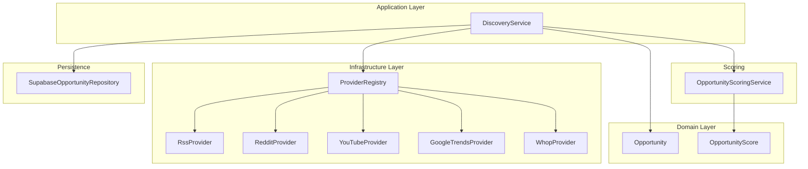
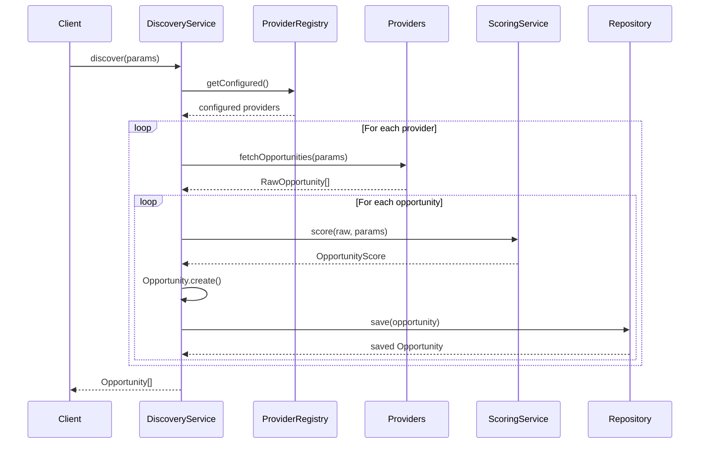
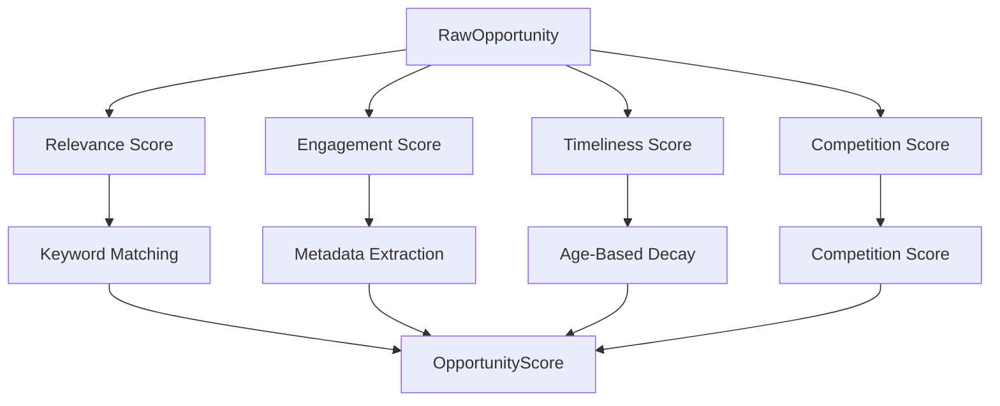

# Discovery Pipeline

## Overview

The discovery pipeline aggregates content opportunities from multiple sources (RSS feeds, social media platforms, trend APIs) and scores them based on relevance, engagement, timeliness, and competition. The system is designed to help creators identify trending content opportunities for video production.

## Architecture



## Discovery Flow



## Discovery Sources

### RSS Provider

**Status**: Fully Implemented

**Purpose**: Fetches content from RSS feeds

**Configuration**:
```typescript
interface RssProviderConfig {
  feedUrl: string;
}
```

**Implementation Details**:
- Uses `rss-parser` library to parse feeds
- Filters items by publication date (since parameter)
- Limits results (default 50)
- Converts RSS items to `RawOpportunity` format

**RawOpportunity Mapping**:
- `title`: RSS item title
- `summary`: RSS item description/content
- `url`: RSS item link
- `publishedAt`: RSS item pubDate
- `metadata`: Contains original RSS fields

### Reddit Provider

**Status**: Skeleton (returns empty array)

**Purpose**: Fetches trending posts from Reddit

**Configuration** (intended):
```typescript
interface RedditProviderConfig {
  subreddit?: string;
  clientId?: string;
  clientSecret?: string;
}
```

**Current Behavior**: Returns empty array with warning log

**Intended Behavior**:
- Fetch posts from Reddit API
- Filter by subreddit
- Convert to `RawOpportunity` format
- Extract engagement metrics (upvotes, comments)

### YouTube Provider

**Status**: Skeleton (returns empty array)

**Purpose**: Fetches trending videos from YouTube

**Configuration** (intended):
```typescript
interface YouTubeProviderConfig {
  apiKey: string;
  channelId?: string;
  categoryId?: string;
}
```

**Current Behavior**: Returns empty array with warning log

**Intended Behavior**:
- Fetch videos from YouTube Data API
- Filter by channel or category
- Convert to `RawOpportunity` format
- Extract engagement metrics (views, likes, comments)

### Google Trends Provider

**Status**: Skeleton (returns empty array, isConfigured always false)

**Purpose**: Fetches trending topics from Google Trends

**Configuration** (intended):
```typescript
interface GoogleTrendsProviderConfig {
  geo?: string;
  category?: string;
}
```

**Current Behavior**: Returns empty array, `isConfigured()` always returns false

**Intended Behavior**:
- Fetch trending topics from Google Trends API
- Filter by geography and category
- Convert to `RawOpportunity` format
- Extract trend scores and search volume

### Whop Provider

**Status**: Skeleton (returns empty array)

**Purpose**: Fetches content from Whop platform

**Configuration** (intended):
```typescript
interface WhopProviderConfig {
  apiKey: string;
}
```

**Current Behavior**: Returns empty array with warning log

**Intended Behavior**:
- Fetch content from Whop API
- Convert to `RawOpportunity` format
- Extract platform-specific metadata

## Scoring System

### Scoring Components



### Relevance Score (0-100)

**Purpose**: Measures how well the opportunity matches search keywords

**Calculation**:
```
matchCount = count of keywords found in title + summary
score = (matchCount / keywordCount) * 100
```

**Special Cases**:
- No keywords provided: Score = 50 (neutral)
- No matches: Score = 0

**Example**:
- Keywords: ["video", "content", "trending"]
- Title: "Top Video Content Trends in 2024"
- Summary: "Analysis of trending content..."
- Matches: "video", "content", "trending" (3 matches)
- Score: (3/3) * 100 = 100

### Engagement Score (0-100)

**Purpose**: Measures audience engagement based on platform metrics

**Calculation**:
```
signal = views * 0.001 + likes * 0.01 + comments * 0.05 + upvotes * 0.02
score = min(100, round(signal))
```

**Metadata Fields Used**:
- `views`: View count
- `likes`: Like count
- `comments`: Comment count
- `upvotes`: Upvote count (Reddit-specific)

**Example**:
- Views: 10,000
- Likes: 500
- Comments: 100
- Signal: 10,000 * 0.001 + 500 * 0.01 + 100 * 0.05 = 10 + 5 + 5 = 20
- Score: 20

### Timeliness Score (0-100)

**Purpose**: Measures how recent the opportunity is

**Calculation**:
```
ageDays = (now - publishedAt) / 86,400,000

if ageDays <= 1: score = 100
if ageDays <= 7: score = 90 - (ageDays - 1) * 5
if ageDays <= 30: score = 60 - (ageDays - 7) * 1.5
if ageDays > 30: score = 30 - ageDays * 0.5
if no publishedAt: score = 30
```

**Score Table**:
| Age | Score |
|-----|-------|
| ≤1 day | 100 |
| 2 days | 95 |
| 3 days | 90 |
| 7 days | 70 |
| 14 days | 60 |
| 30 days | 38 |
| 60 days | 0 |

### Competition Score (0-100)

**Purpose**: Measures how competitive the opportunity is

**Calculation**:
```
if metadata.competitionScore exists:
  score = min(100, round(metadata.competitionScore))
else:
  score = 50 (neutral)
```

**Interpretation**:
- Higher score = more competitive (harder to succeed)
- Lower score = less competitive (easier to succeed)

### Overall Score

The overall score is the average of the four component scores:
```
overallScore = (relevance + engagement + timeliness + competition) / 4
```

**Note**: The current implementation stores individual component scores but the overall score is not explicitly calculated. The `OpportunityScore` interface includes all component scores separately.

## Domain Models

### Opportunity

```typescript
interface Opportunity {
  readonly id: string;
  readonly title: string;
  readonly summary: string;
  readonly source: DiscoverySource;
  readonly sourceUrl: string;
  readonly score: OpportunityScore;
  readonly keywords: ReadonlyArray<string>;
  readonly metadata: Readonly<Record<string, unknown>>;
  readonly publishedAt: Date | null;
  readonly status: OpportunityStatus;
  readonly createdAt: Date;
  readonly updatedAt: Date;
}
```

**Status Values**:
- `DISCOVERED`: Newly discovered
- `ACCEPTED`: Accepted for production
- `REJECTED`: Rejected as not suitable
- `IN_PROGRESS`: Being produced
- `COMPLETED`: Production completed

**Factory Methods**:
- `Opportunity.create(props)`: Create new opportunity
- `Opportunity.reconstitute(props)`: Reconstruct from persistence

### OpportunityScore

```typescript
interface OpportunityScore {
  readonly relevance: number;
  readonly engagement: number;
  readonly timeliness: number;
  readonly competition: number;
  readonly overall: number;
}
```

### RawOpportunity

```typescript
interface RawOpportunity {
  title: string;
  summary: string;
  url: string;
  publishedAt: Date | null;
  metadata: Record<string, unknown>;
}
```

### DiscoverySource

```typescript
enum DiscoverySource {
  RSS = 'rss',
  Reddit = 'reddit',
  YouTube = 'youtube',
  GoogleTrends = 'google_trends',
  Whop = 'whop',
  Custom = 'custom'
}
```

## Provider Interface

### IDiscoveryProvider

```typescript
interface IDiscoveryProvider {
  readonly name: string;
  readonly source: DiscoverySource;
  isConfigured(): boolean;
  fetchOpportunities(params: FetchParams): Promise<RawOpportunity[]>;
}
```

### FetchParams

```typescript
interface FetchParams {
  keywords?: string[];
  limit?: number;
  since?: Date;
}
```

## Provider Registry

### Registration

```typescript
const registry = new ProviderRegistry();
registry.register(new RssProvider({ feedUrl: 'https://example.com/feed' }));
registry.register(new RedditProvider({ subreddit: 'videos' }));
```

### Resolution

```typescript
// Get all providers
const allProviders = registry.getAll();

// Get only configured providers
const configuredProviders = registry.getConfigured();

// Get specific provider
const rssProvider = registry.get('rss');
```

### Configuration Check

Each provider implements `isConfigured()` to return true if it has valid configuration:
- RssProvider: Requires feedUrl
- RedditProvider: (intended) Requires API credentials
- YouTubeProvider: (intended) Requires API key
- GoogleTrendsProvider: (intended) Requires API credentials
- WhopProvider: (intended) Requires API key

## Discovery Service

### Discover Method

```typescript
async discover(params: DiscoverParams): Promise<Opportunity[]>
```

**Parameters**:
```typescript
interface DiscoverParams extends FetchParams {
  providerNames?: string[]; // Specific providers to use
}
```

**Behavior**:
1. Resolve providers from registry
2. If providerNames specified, use only those
3. Otherwise, use all configured providers
4. For each provider:
   - Fetch raw opportunities
   - Score each opportunity
   - Create Opportunity domain object
   - Save to repository
5. Return all discovered opportunities

**Error Handling**:
- Provider failures are logged but do not stop the overall run
- Repository failures propagate to client

### Get Opportunities

```typescript
async getOpportunities(filter?: OpportunityFilter): Promise<Opportunity[]>
```

**Filter Options**:
```typescript
interface OpportunityFilter {
  status?: OpportunityStatus;
  source?: DiscoverySource;
  minScore?: number;
  since?: Date;
  limit?: number;
  offset?: number;
}
```

### Review Opportunity

```typescript
async reviewOpportunity(id: string, accepted: boolean): Promise<Opportunity>
```

**Behavior**:
- Sets status to `ACCEPTED` or `REJECTED`
- Updates opportunity in repository
- Returns updated opportunity

## Repository

### SupabaseOpportunityRepository

**Status**: Implemented but not connected to database

**Assumed Schema** (not in current database):
```sql
CREATE TABLE opportunities (
  id uuid PRIMARY KEY,
  title text NOT NULL,
  summary text,
  source discovery_source NOT NULL,
  source_url text,
  score jsonb NOT NULL,
  keywords jsonb,
  metadata jsonb,
  published_at timestamptz,
  status opportunity_status DEFAULT 'discovered',
  created_at timestamptz DEFAULT now(),
  updated_at timestamptz DEFAULT now()
);
```

**Methods**:
- `save(opportunity)`: Upsert opportunity
- `findById(id)`: Get by ID
- `findAll(filter)`: Get with filters
- `update(id, patch)`: Update fields
- `delete(id)`: Delete opportunity
- `count(filter)`: Count with filters

**Limitation**: The `opportunities` table does not exist in the current schema (`sql/001_schema.sql`).

## Current Limitations

1. **Incomplete Provider Implementations**: Only RssProvider is fully implemented
2. **No Database Integration**: Repository assumes table that doesn't exist
3. **No Scheduling**: Discovery runs are not scheduled automatically
4. **No Deduplication**: Same opportunity can be discovered multiple times
5. **No Source-Specific Scoring**: All sources use the same scoring logic
6. **No Historical Tracking**: No tracking of score changes over time
7. **No Notification System**: No alerts for high-scoring opportunities

## Future Enhancements

### Provider Implementations
- Complete RedditProvider with Reddit API integration
- Complete YouTubeProvider with YouTube Data API integration
- Complete GoogleTrendsProvider with Google Trends API integration
- Complete WhopProvider with Whop API integration

### Deduplication
- Hash-based deduplication by source URL
- Fuzzy matching for similar titles
- Update existing opportunities instead of creating duplicates

### Scheduling
- Automatic periodic discovery runs
- Configurable intervals per source
- Backoff for failed sources

### Advanced Scoring
- Source-specific scoring weights
- Machine learning for relevance prediction
- Historical performance tracking
- Custom scoring rules per creator

### Notification System
- Real-time alerts for high-scoring opportunities
- Digest emails for daily opportunities
- Integration with plugin system for custom notifications

## Cross-References

- [Components](COMPONENTS.md) - Detailed component documentation
- [Data Flow](DATA_FLOW.md) - Discovery data flow diagrams
- [Request Flow](REQUEST_FLOW.md) - Detailed request flows
- [Database](DATABASE.md) - Database schema details
