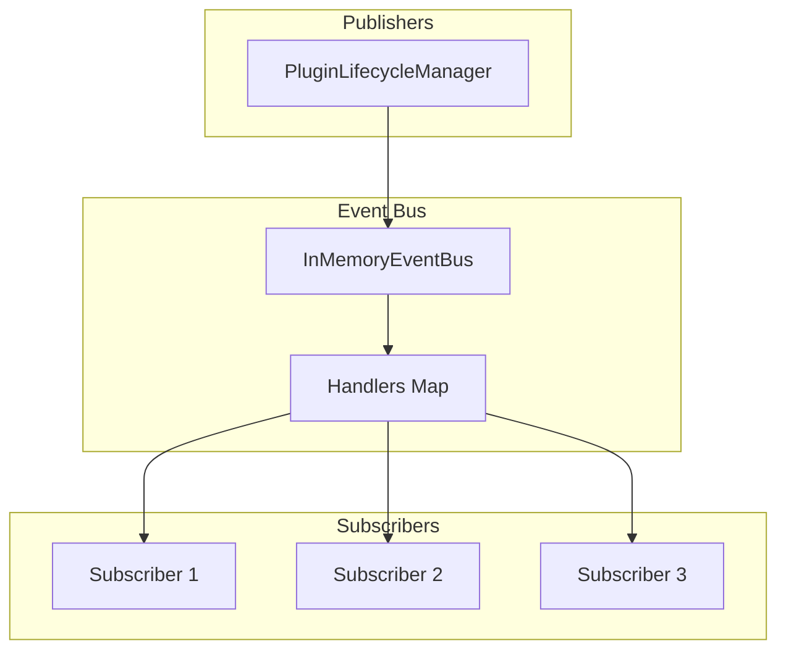
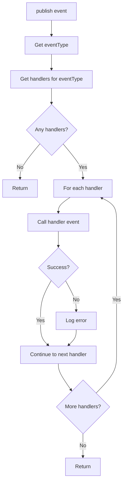
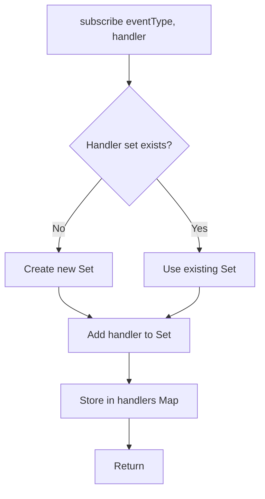
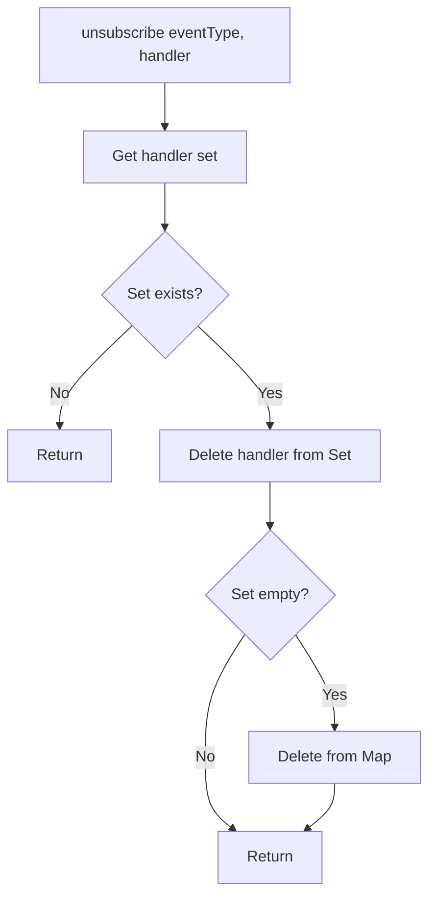

# Event Inventory

## Overview

The Eunoia Media OS uses an in-memory event bus for decoupled communication between components. Events are primarily used for plugin lifecycle notifications. The event system is single-process only and does not support distributed scenarios.

## Event Bus Architecture



## Event Bus Interface

### IEventBus

```typescript
interface IEventBus {
  publish<T extends DomainEvent>(event: T): Promise<void>;
  subscribe<T extends DomainEvent>(
    eventType: string,
    handler: EventHandler<T>
  ): void;
  unsubscribe(eventType: string, handler: EventHandler<DomainEvent>): void;
}

type EventHandler<T> = (event: T) => Promise<void> | void;
```

### DomainEvent

```typescript
interface DomainEvent {
  eventType: string;
  eventId: string;
  timestamp: Date;
  payload: unknown;
}
```

## Plugin Events

### Event Types

| Event Type | Trigger | Payload | Emitted By |
|------------|---------|---------|------------|
| `plugin.installed` | Plugin successfully installed | `{ pluginId, version, directory }` | PluginLifecycleManager |
| `plugin.started` | Plugin successfully started | `{ pluginId, version }` | PluginLifecycleManager |
| `plugin.stopped` | Plugin successfully stopped | `{ pluginId, version }` | PluginLifecycleManager |
| `plugin.removed` | Plugin successfully uninstalled | `{ pluginId, version }` | PluginLifecycleManager |
| `plugin.failed` | Plugin lifecycle step failed | `{ pluginId, version, error, operation }` | PluginLifecycleManager |

### Event Payloads

#### plugin.installed

```typescript
{
  eventType: 'plugin.installed',
  eventId: string (uuid),
  timestamp: Date,
  payload: {
    pluginId: string,
    version: string,
    directory: string
  }
}
```

**Trigger**: After successful plugin installation and registration

**Use Cases**:
- Notify other systems that a new plugin is available
- Trigger plugin-specific initialization
- Update plugin inventory

#### plugin.started

```typescript
{
  eventType: 'plugin.started',
  eventId: string (uuid),
  timestamp: Date,
  payload: {
    pluginId: string,
    version: string
  }
}
```

**Trigger**: After successful plugin start

**Use Cases**:
- Notify that plugin is actively running
- Enable plugin-dependent features
- Update plugin status dashboards

#### plugin.stopped

```typescript
{
  eventType: 'plugin.stopped',
  eventId: string (uuid),
  timestamp: Date,
  payload: {
    pluginId: string,
    version: string
  }
}
```

**Trigger**: After successful plugin stop

**Use Cases**:
- Notify that plugin is no longer running
- Disable plugin-dependent features
- Update plugin status dashboards

#### plugin.removed

```typescript
{
  eventType: 'plugin.removed',
  eventId: string (uuid),
  timestamp: Date,
  payload: {
    pluginId: string,
    version: string
  }
}
```

**Trigger**: After successful plugin uninstall

**Use Cases**:
- Notify that plugin is no longer available
- Clean up plugin-specific resources
- Update plugin inventory

#### plugin.failed

```typescript
{
  eventType: 'plugin.failed',
  eventId: string (uuid),
  timestamp: Date,
  payload: {
    pluginId: string,
    version: string,
    error: string,
    operation: 'install' | 'configure' | 'initialize' | 'start' | 'pause' | 'resume' | 'stop' | 'shutdown' | 'uninstall'
  }
}
```

**Trigger**: When any plugin lifecycle operation fails

**Use Cases**:
- Alert on plugin failures
- Trigger automatic recovery
- Update plugin health status

**Operation Values**:
- `install`: Plugin installation failed
- `configure`: Plugin configuration failed
- `initialize`: Plugin initialization failed
- `start`: Plugin start failed
- `pause`: Plugin pause failed
- `resume`: Plugin resume failed
- `stop`: Plugin stop failed
- `shutdown`: Plugin shutdown failed
- `uninstall`: Plugin uninstall failed

## Event Factory Functions

```typescript
function createPluginInstalledEvent(
  pluginId: string,
  payload: { pluginId: string; version: string; directory: string }
): DomainEvent;

function createPluginStartedEvent(
  pluginId: string,
  payload: { pluginId: string; version: string }
): DomainEvent;

function createPluginStoppedEvent(
  pluginId: string,
  payload: { pluginId: string; version: string }
): DomainEvent;

function createPluginRemovedEvent(
  pluginId: string,
  payload: { pluginId: string; version: string }
): DomainEvent;

function createPluginFailedEvent(
  pluginId: string,
  payload: {
    pluginId: string;
    version: string;
    error: string;
    operation: string;
  }
): DomainEvent;
```

## Event Bus Behavior

### Publish Flow



**Error Isolation**:
- Handler errors do not stop other handlers
- Errors are logged but not propagated
- Publisher never receives errors from handlers

### Subscribe Flow



### Unsubscribe Flow



## Event Handler Examples

### Basic Handler

```typescript
eventBus.subscribe('plugin.installed', async (event) => {
  const { pluginId, version, directory } = event.payload as PluginInstalledPayload;
  console.log(`Plugin ${pluginId} v${version} installed at ${directory}`);
});
```

### Error-Resilient Handler

```typescript
eventBus.subscribe('plugin.started', async (event) => {
  try {
    await onPluginStarted(event.payload);
  } catch (error) {
    logger.error({ error, event }, 'Handler failed');
  }
});
```

### Conditional Handler

```typescript
eventBus.subscribe('plugin.failed', async (event) => {
  const { pluginId, operation } = event.payload as PluginFailedPayload;
  if (operation === 'start') {
    await attemptRecovery(pluginId);
  }
});
```

## Current Limitations

1. **In-Memory Only**: Events are not persisted
2. **Single-Process**: No distributed event bus support
3. **No Event Replay**: Cannot replay past events
4. **No Event Filtering**: No wildcard or pattern-based subscriptions
5. **No Event Ordering**: No guaranteed ordering across event types
6. **No Event Versioning**: No schema versioning for events
7. **No Event Dead Letter Queue**: Failed events are lost
8. **No Event Metrics**: No event publishing/handling metrics
9. **No Event Schemas**: No validation of event payloads
10. **No Event Correlation**: No correlation IDs across related events

## Future Event Types

Based on EES specifications, future events may include:

### Marketplace Events (EES-006)

| Event Type | Trigger |
|------------|---------|
| `marketplace.plugin.submitted` | Developer submits a plugin |
| `marketplace.plugin.validated` | Automated validation complete |
| `marketplace.plugin.approved` | Reviewer approves submission |
| `marketplace.plugin.rejected` | Reviewer rejects submission |
| `marketplace.plugin.published` | Plugin goes live in marketplace |
| `marketplace.plugin.installed` | Creator installs a plugin |
| `marketplace.plugin.uninstalled` | Creator uninstalls a plugin |
| `marketplace.plugin.delisted` | Plugin removed from marketplace |
| `marketplace.plugin.version_updated` | New version published |
| `marketplace.review.submitted` | Creator submits a review |

### Discovery Events (Future)

| Event Type | Trigger |
|------------|---------|
| `discovery.opportunity.found` | New opportunity discovered |
| `discovery.opportunity.accepted` | Opportunity accepted |
| `discovery.opportunity.rejected` | Opportunity rejected |
| `discovery.run.completed` | Discovery run completed |
| `discovery.run.failed` | Discovery run failed |

### AI Events (Future)

| Event Type | Trigger |
|------------|---------|
| `ai.request.started` | AI request started |
| `ai.request.completed` | AI request completed |
| `ai.request.failed` | AI request failed |
| `ai.provider.selected` | Provider selected for request |
| `ai.provider.unavailable` | Provider became unavailable |

## Future Enhancements

### Persistence
- Event persistence to database
- Event replay capability
- Event history retention

### Distributed Event Bus
- Redis pub/sub integration
- Kafka integration
- Multi-process support

### Event Filtering
- Wildcard subscriptions (e.g., `plugin.*`)
- Pattern-based subscriptions
- Content-based routing

### Event Ordering
- Guaranteed ordering within event type
- Causal ordering across event types
- Sequence numbers

### Event Versioning
- Schema versioning
- Backward compatibility
- Migration support

### Event Dead Letter Queue
- Failed event capture
- Retry mechanism
- Manual inspection

### Event Metrics
- Publishing rate metrics
- Handling latency metrics
- Error rate metrics

### Event Validation
- Schema validation
- Type safety
- Payload validation

### Event Correlation
- Correlation IDs
- Causal chains
- Distributed tracing

## Cross-References

- [Components](COMPONENTS.md) - InMemoryEventBus component details
- [Data Flow](DATA_FLOW.md) - Event bus data flow
- [Request Flow](REQUEST_FLOW.md) - Detailed event flows
- [Plugin Lifecycle](PLUGIN_LIFECYCLE.md) - Plugin event triggers
