# Plugin Lifecycle

## Overview

The Eunoia Media OS plugin system provides a comprehensive lifecycle management framework for extensible functionality. Plugins progress through well-defined states from installation to uninstallation, with event emission at each transition.

## Lifecycle States

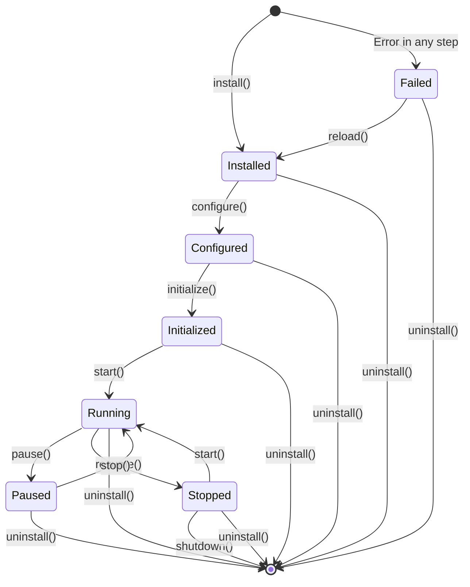

## State Definitions

| State | Description | Can Transition To |
|-------|-------------|-------------------|
| Installed | Plugin registered in registry, install() called | Configured, Uninstalled |
| Configured | Plugin configured with validated config | Initialized, Uninstalled |
| Initialized | Plugin initialize() called, ready to start | Running, Uninstalled |
| Running | Plugin start() called, actively running | Paused, Stopped, Uninstalled |
| Paused | Plugin paused, not executing | Running, Uninstalled |
| Stopped | Plugin stop() called, not running | Running, Uninstalled |
| Failed | Error occurred during lifecycle step | Reloaded, Uninstalled |
| Disabled | Plugin explicitly disabled (manual action) | Enabled (Installed) |

## Lifecycle Methods

### IPlugin Interface

```typescript
interface IPlugin {
  readonly manifest: PluginManifest;
  install(context: PluginContext): Promise<void>;
  configure(config: Record<string, unknown>): Promise<void>;
  initialize(): Promise<void>;
  start(): Promise<void>;
  pause(): Promise<void>;
  resume(): Promise<void>;
  stop(): Promise<void>;
  shutdown(): Promise<void>;
  health(): Promise<PluginHealth>;
  uninstall(): Promise<void>;
}
```

### Method Responsibilities

| Method | Purpose | Expected State Before | Expected State After |
|--------|---------|----------------------|---------------------|
| `install()` | One-time setup, resource allocation | None | Installed |
| `configure()` | Apply configuration with validation | Installed | Configured |
| `initialize()` | Prepare for runtime, load resources | Configured | Initialized |
| `start()` | Begin active operation | Initialized, Paused | Running |
| `pause()` | Temporarily halt operation | Running | Paused |
| `resume()` | Resume from paused state | Paused | Running |
| `stop()` | Gracefully halt operation | Running | Stopped |
| `shutdown()` | Cleanup, release resources | Any | Stopped |
| `health()` | Report current health status | Any | N/A |
| `uninstall()` | Cleanup and remove | Any | Removed from registry |

## Detailed Lifecycle Flow

### Installation

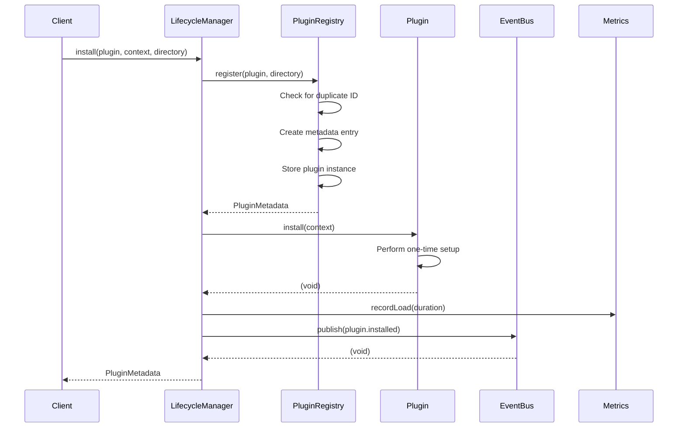

**Installation Steps**:
1. Plugin registered in `PluginRegistry` with metadata
2. Plugin's `install()` method called with `PluginContext`
3. Load time recorded in `PluginMetrics`
4. `plugin.installed` event emitted
5. Metadata returned to client

**PluginContext Provided**:
- `pluginId`: Plugin identifier
- `logger`: Child logger with plugin context
- `eventBus`: Event bus for publishing events
- `config`: Empty config object (initially)
- `permissions`: Declared permissions from manifest

**Error Handling**:
- Duplicate plugin ID: Throws `PluginAlreadyRegisteredError`
- Install failure: Records failure in metrics, emits `plugin.failed` event, throws error

### Configuration

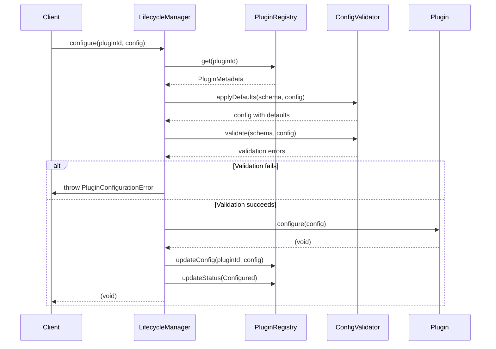

**Configuration Steps**:
1. Retrieve plugin metadata from registry
2. Apply default values from manifest config schema
3. Validate configuration against schema
4. Call plugin's `configure()` method
5. Update config in registry
6. Update status to Configured

**Config Schema Fields**:
- `type`: string, number, boolean, or secret
- `required`: boolean
- `description`: string

**Error Handling**:
- Plugin not found: Throws `PluginNotFoundError`
- Validation failure: Throws `PluginConfigurationError` with errors array

### Initialization

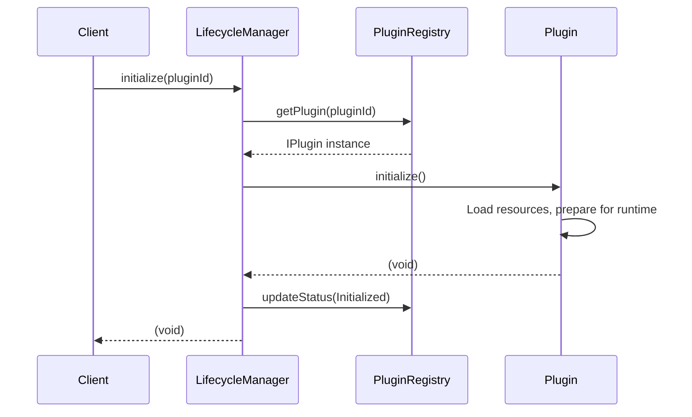

**Initialization Steps**:
1. Retrieve plugin instance from registry
2. Call plugin's `initialize()` method
3. Update status to Initialized
4. Record load timestamp

**Error Handling**:
- Plugin not found: Throws `PluginNotFoundError`
- Initialization failure: Records failure, emits `plugin.failed` event, sets status to Failed

### Start

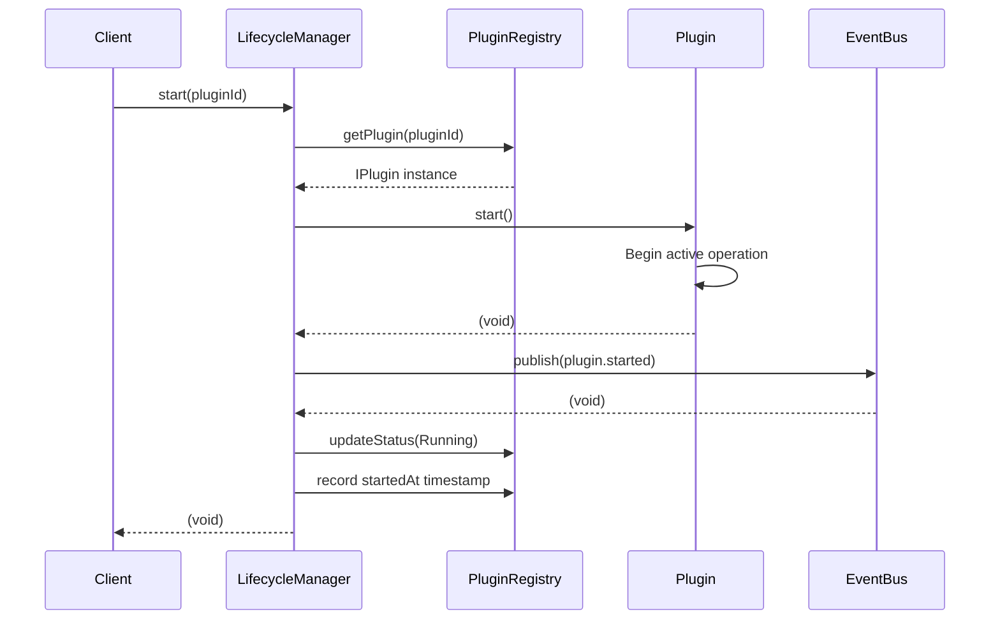

**Start Steps**:
1. Retrieve plugin instance
2. Call plugin's `start()` method
3. Emit `plugin.started` event
4. Update status to Running
5. Record start timestamp

**Error Handling**:
- Plugin not found: Throws `PluginNotFoundError`
- Start failure: Records failure, emits `plugin.failed` event, sets status to Failed

### Pause

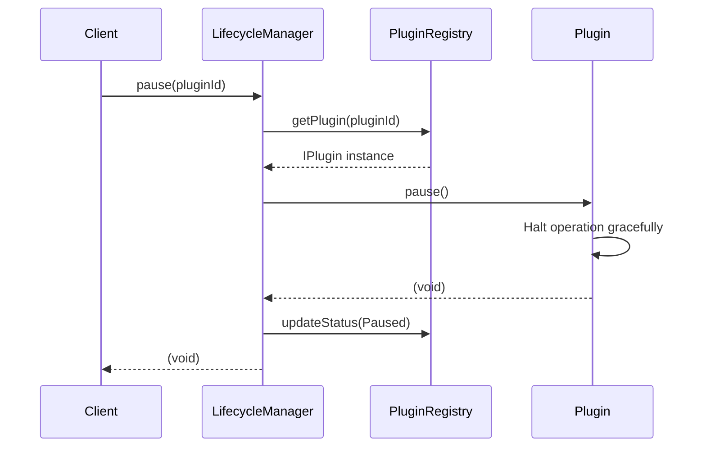

**Pause Steps**:
1. Retrieve plugin instance
2. Call plugin's `pause()` method
3. Update status to Paused

**Error Handling**:
- Plugin not found: Throws `PluginNotFoundError`
- Pause failure: Records failure, sets status to Failed

### Resume

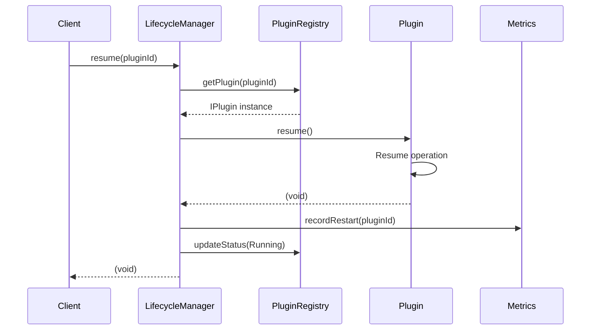

**Resume Steps**:
1. Retrieve plugin instance
2. Call plugin's `resume()` method
3. Record restart in metrics
4. Update status to Running

**Error Handling**:
- Plugin not found: Throws `PluginNotFoundError`
- Resume failure: Records failure, sets status to Failed

### Stop

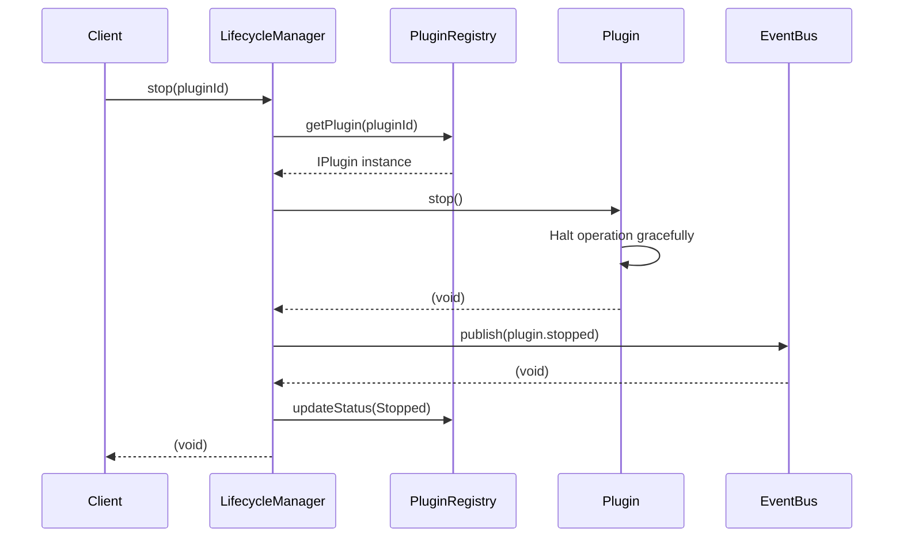

**Stop Steps**:
1. Retrieve plugin instance
2. Call plugin's `stop()` method
3. Emit `plugin.stopped` event
4. Update status to Stopped

**Error Handling**:
- Plugin not found: Throws `PluginNotFoundError`
- Stop failure: Records failure, sets status to Failed

### Shutdown

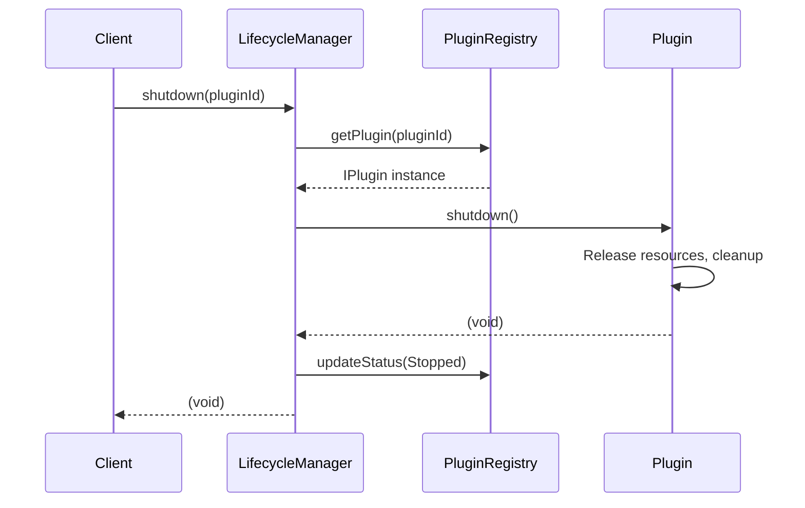

**Shutdown Steps**:
1. Retrieve plugin instance
2. Call plugin's `shutdown()` method
3. Update status to Stopped

**Error Handling**:
- Plugin not found: Throws `PluginNotFoundError`
- Shutdown failure: Records failure, sets status to Failed

### Uninstall

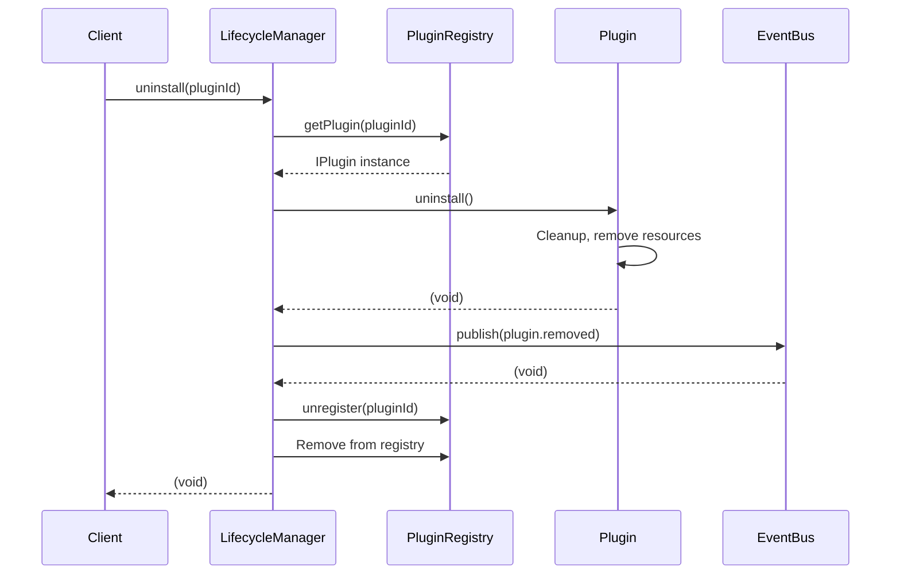

**Uninstall Steps**:
1. Retrieve plugin instance
2. Call plugin's `uninstall()` method
3. Emit `plugin.removed` event
4. Unregister from registry (removes metadata and instance)

**Error Handling**:
- Plugin not found: Throws `PluginNotFoundError`
- Uninstall failure: Records failure, sets status to Failed

## Bulk Operations

### Start All

```typescript
await pluginLifecycleManager.startAll();
```

**Behavior**:
- Finds all plugins in Initialized or Configured status
- Attempts to start each plugin
- Errors are logged but do not stop other plugins
- Continues even if some plugins fail to start

### Stop All

```typescript
await pluginLifecycleManager.stopAll();
```

**Behavior**:
- Finds all plugins in Running status
- Attempts to stop each plugin
- Errors are logged but do not stop other plugins
- Continues even if some plugins fail to stop

## Plugin Events

### Event Types

| Event Type | Trigger | Payload |
|------------|---------|---------|
| `plugin.installed` | Plugin successfully installed | `{ pluginId, version, directory }` |
| `plugin.started` | Plugin successfully started | `{ pluginId, version }` |
| `plugin.stopped` | Plugin successfully stopped | `{ pluginId, version }` |
| `plugin.removed` | Plugin successfully uninstalled | `{ pluginId, version }` |
| `plugin.failed` | Plugin lifecycle step failed | `{ pluginId, version, error, operation }` |

### Event Payloads

```typescript
// plugin.installed
{
  eventType: 'plugin.installed',
  eventId: string (uuid),
  timestamp: Date,
  payload: {
    pluginId: string,
    version: string,
    directory: string
  }
}

// plugin.started
{
  eventType: 'plugin.started',
  eventId: string (uuid),
  timestamp: Date,
  payload: {
    pluginId: string,
    version: string
  }
}

// plugin.failed
{
  eventType: 'plugin.failed',
  eventId: string (uuid),
  timestamp: Date,
  payload: {
    pluginId: string,
    version: string,
    error: string,
    operation: 'install' | 'configure' | 'initialize' | 'start' | 'pause' | 'resume' | 'stop' | 'shutdown' | 'uninstall'
  }
}
```

## Plugin Metrics

### Metrics Collected

| Metric | Description | Trigger |
|--------|-------------|---------|
| Load Time | Time to install plugin | On successful install |
| Failures | Count of plugin failures | On any lifecycle error |
| Restarts | Count of plugin restarts | On resume |

### Metrics Snapshot

```typescript
{
  pluginId: string,
  loadTimeMs: number,
  failureCount: number,
  restartCount: number,
  lastFailureAt: Date | null,
  lastFailureMessage: string | null
}
```

## Health Checks

### Plugin Health Interface

```typescript
interface PluginHealth {
  status: 'healthy' | 'degraded' | 'unhealthy';
  message: string | null;
  lastCheckedAt: Date;
}
```

### Health Check Flow

```typescript
const health = await pluginLifecycleManager.health(pluginId);
```

**Health Status Determination**:
- Plugin implements `health()` method
- Returns current health status
- Used for monitoring and alerting

## Dependency Management

### Load Order Resolution

Plugins are loaded in dependency order using topological sort:

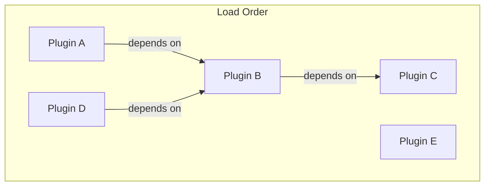

**Dependency Resolution**:
1. Build dependency graph from manifests
2. Detect circular dependencies (error)
3. Perform topological sort
4. Return ordered list for installation

**Version Constraints**:
- `>=1.2.3`: Greater than or equal to
- `>1.2.3`: Greater than
- `<=1.2.3`: Less than or equal to
- `<1.2.3`: Less than
- `^1.2.3`: Compatible with 1.x.x
- `~1.2.3`: Compatible with 1.2.x
- `1.2.3`: Exact version

## Registry Management

### Metadata Tracked

```typescript
interface PluginMetadata {
  manifest: PluginManifest;
  status: PluginStatus;
  installedAt: Date;
  loadedAt: Date | null;
  startedAt: Date | null;
  pluginDirectory: string;
  config: Readonly<Record<string, unknown>>;
}
```

### Registry Operations

| Operation | Description |
|-----------|-------------|
| `register()` | Add plugin to registry |
| `unregister()` | Remove plugin from registry |
| `get()` | Get plugin metadata (throws if not found) |
| `find()` | Get plugin metadata (returns undefined if not found) |
| `list()` | Get all plugin metadata |
| `search()` | Search plugins by query |
| `enable()` | Enable disabled plugin |
| `disable()` | Disable plugin |
| `reload()` | Reset plugin to Installed state |
| `updateStatus()` | Update plugin status |
| `updateConfig()` | Update plugin configuration |

## Security Considerations

### Permission System

**Current State**: Permissions are declared but not enforced.

**Declared Permissions**:
```typescript
enum PluginPermission {
  AI = 'ai',
  Storage = 'storage',
  Network = 'network',
  Filesystem = 'filesystem',
  Database = 'database',
  Publishing = 'publishing',
  Analytics = 'analytics',
  Secrets = 'secrets'
}
```

**Security Gap**: The `PluginContext` includes permissions but provides no access control mechanism. A plugin can access any resource regardless of declared permissions.

**Recommendation**: Implement runtime permission enforcement in `PluginContext` to validate access attempts against declared permissions.

### Capability System

Plugins declare capabilities they implement:

```typescript
interface PluginCapability {
  name: string;
  version: string;
  description: string;
}
```

**Purpose**: Allows the system to discover and organize plugins by their capabilities (e.g., revenue connectors, publishing platforms, analytics sources).

## Error Handling

### Error Types

| Error Type | When Thrown |
|------------|-------------|
| `PluginNotFoundError` | Plugin ID not found in registry |
| `PluginAlreadyRegisteredError` | Attempting to register duplicate plugin ID |
| `PluginManifestError` | Manifest validation fails |
| `PluginConfigurationError` | Configuration validation fails |
| `PluginDependencyError` | Dependency resolution fails |
| `PluginCircularDependencyError` | Circular dependency detected |
| `PluginLifecycleError` | Lifecycle operation fails |

### Error Recovery

**Automatic Recovery**:
- Retry logic is not built into lifecycle manager
- Failed plugins remain in Failed status
- Manual intervention required to reload or reinstall

**Manual Recovery**:
```typescript
// Reload plugin to reset to Installed state
pluginRegistry.reload(pluginId);

// Reconfigure and reinitialize
await pluginLifecycleManager.configure(pluginId, config);
await pluginLifecycleManager.initialize(pluginId);
await pluginLifecycleManager.start(pluginId);
```
