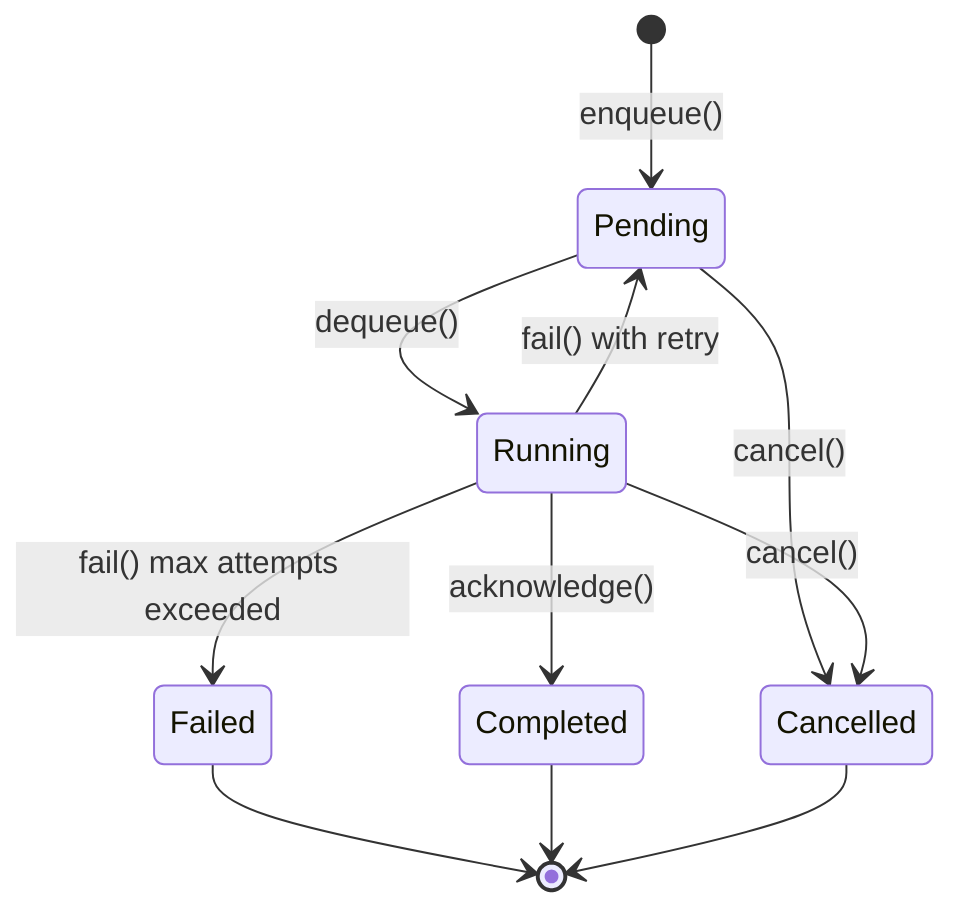
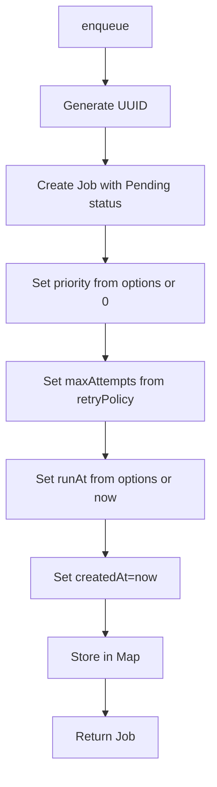
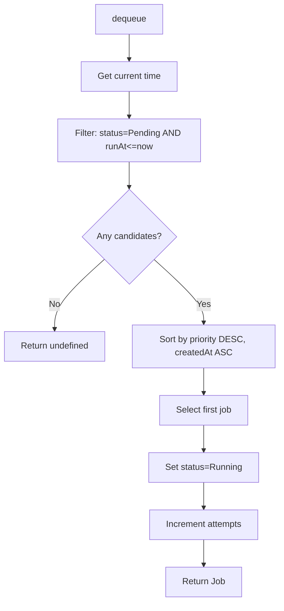
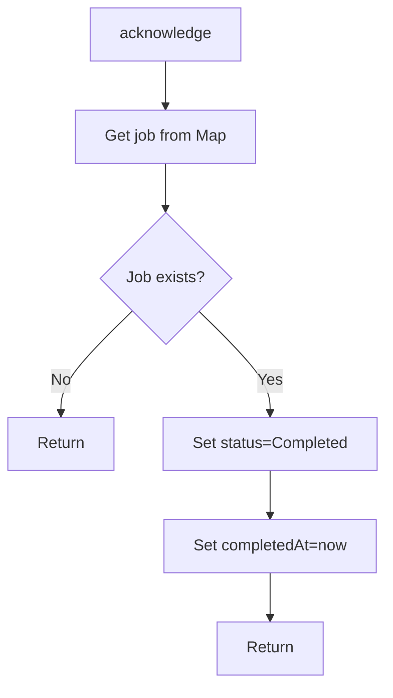
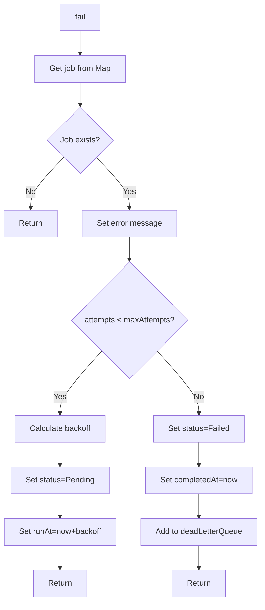
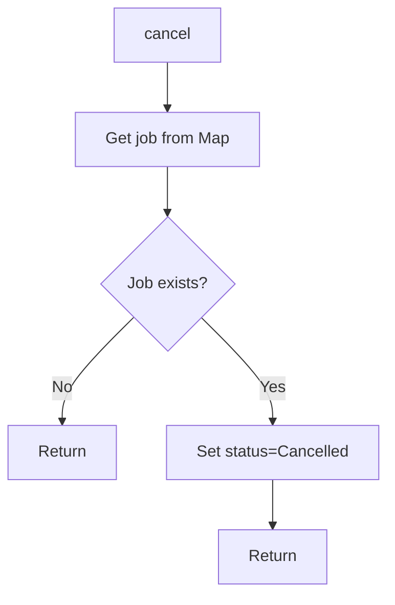

# Queue System

## Overview

The queue system provides in-memory job queuing with priority-based scheduling, retry policies with exponential backoff, and dead letter queue handling. The system is designed for single-process applications where jobs need to be processed asynchronously with reliability guarantees.

## Architecture

```mermaid
flowchart TB
    subgraph "JobQueue"
        JobQueue[JobQueue]
        JobMap[Job Map]
        DeadLetterQueue[Dead Letter Queue]
    end
    
    subgraph "Job States"
        Pending[Pending]
        Running[Running]
        Completed[Completed]
        Failed[Failed]
        Cancelled[Cancelled]
    end
    
    subgraph "Worker"
        Worker[Worker Process]
    end
    
    Worker --> JobQueue
    JobQueue --> JobMap
    JobQueue --> DeadLetterQueue
    JobMap --> Pending
    JobMap --> Running
    JobMap --> Completed
    JobMap --> Failed
    JobMap --> Cancelled
```

## Job Lifecycle



## Job Structure

### Job Interface

```typescript
interface Job<T> {
  readonly id: string;
  readonly type: string;
  readonly payload: T;
  readonly priority: number;
  readonly status: JobStatus;
  readonly attempts: number;
  readonly maxAttempts: number;
  readonly runAt: Date;
  readonly createdAt: Date;
  readonly completedAt: Date | null;
  readonly error: string | null;
}
```

### Job Status

```typescript
enum JobStatus {
  Pending = 'pending',
  Running = 'running',
  Completed = 'completed',
  Failed = 'failed',
  Cancelled = 'cancelled'
}
```

### Retry Policy

```typescript
interface RetryPolicy {
  maxAttempts: number;
  backoffMs: number;
}
```

**Default Retry Policy**:
```typescript
{
  maxAttempts: 3,
  backoffMs: 1000
}
```

## Operations

### Enqueue

```typescript
jobQueue.enqueue(
  type: string,
  payload: T,
  options?: {
    priority?: number;
    runAt?: Date;
    retryPolicy?: RetryPolicy;
  }
): Job<T>
```

**Flow**:


**Example**:
```typescript
const job = jobQueue.enqueue(
  'ai-request',
  { prompt: 'Hello world', taskType: TaskType.Chat },
  {
    priority: 10,
    runAt: new Date(Date.now() + 60000), // Run in 1 minute
    retryPolicy: { maxAttempts: 5, backoffMs: 2000 }
  }
);
```

### Dequeue

```typescript
jobQueue.dequeue(): Job<T> | undefined
```

**Flow**:


**Priority Ordering**:
1. Higher priority jobs first
2. FIFO within same priority (by createdAt)

**Example**:
```typescript
const job = jobQueue.dequeue();
if (job) {
  try {
    await processJob(job);
    jobQueue.acknowledge(job.id);
  } catch (error) {
    jobQueue.fail(job.id, String(error));
  }
}
```

### Acknowledge

```typescript
jobQueue.acknowledge(jobId: string): void
```

**Flow**:


**Purpose**: Marks a job as successfully completed

### Fail

```typescript
jobQueue.fail(jobId: string, error: string): void
```

**Flow**:


**Backoff Calculation**:
```
backoffMs = backoffMs * 2^(attempts - 1)
```

**Example** with backoffMs=1000:
- Attempt 1: 1000ms
- Attempt 2: 2000ms
- Attempt 3: 4000ms

**Dead Letter Queue**:
- Jobs that exceed max attempts are moved here
- Contains job copy with failure metadata
- Can be inspected for manual intervention

### Cancel

```typescript
jobQueue.cancel(jobId: string): void
```

**Flow**:


**Purpose**: Cancels a pending or running job

## Dead Letter Queue

### DeadLetterEntry Interface

```typescript
interface DeadLetterEntry<T> {
  job: Job<T>;
  failedAt: Date;
  lastError: string;
}
```

### Access

```typescript
const deadLetter = jobQueue.getDeadLetterQueue();
```

**Purpose**: Retrieve all failed jobs for inspection and potential retry

## Query Methods

### Get Job

```typescript
jobQueue.getJob(jobId: string): Job<T> | undefined
```

**Purpose**: Retrieve a specific job by ID

### Get Queue Length

```typescript
jobQueue.getQueueLength(): number
```

**Purpose**: Get total pending + running job count

### Get Pending Count

```typescript
jobQueue.getPendingCount(): number
```

**Purpose**: Get count of pending jobs

### Get Running Count

```typescript
jobQueue.getRunningCount(): number
```

**Purpose**: Get count of running jobs

## Worker Pattern

### Basic Worker Loop

```typescript
async function workerLoop() {
  while (true) {
    const job = jobQueue.dequeue();
    if (job) {
      try {
        await processJob(job);
        jobQueue.acknowledge(job.id);
      } catch (error) {
        jobQueue.fail(job.id, String(error));
      }
    } else {
      await sleep(100); // Wait before polling again
    }
  }
}
```

### Advanced Worker with Concurrency

```typescript
async function workerPool(concurrency: number) {
  const workers = Array.from({ length: concurrency }, () => workerLoop());
  await Promise.all(workers);
}
```

### Worker with Shutdown

```typescript
let running = true;

async function workerLoop() {
  while (running) {
    const job = jobQueue.dequeue();
    if (job) {
      try {
        await processJob(job);
        jobQueue.acknowledge(job.id);
      } catch (error) {
        jobQueue.fail(job.id, String(error));
      }
    } else {
      await sleep(100);
    }
  }
}

function shutdown() {
  running = false;
}
```

## Scheduled Jobs

### Delayed Execution

```typescript
const job = jobQueue.enqueue(
  'send-email',
  { to: 'user@example.com', subject: 'Hello' },
  { runAt: new Date(Date.now() + 3600000) } // Run in 1 hour
);
```

**Behavior**: Job will not be dequeued until `runAt` is reached

### Recurring Jobs

Recurring jobs are not built into the queue system. Use the `SchedulerService` for recurring tasks:

```typescript
scheduler.schedule(
  'daily-report',
  '0 9 * * *', // 9 AM daily
  'cron',
  async () => {
    jobQueue.enqueue('generate-report', { date: new Date() });
  }
);
```

## Current Limitations

1. **In-Memory Storage**: Jobs are lost on process restart
2. **No Persistence**: No database or file-based persistence
3. **No Distributed Support**: Cannot be used across multiple processes
4. **No Job Dependencies**: No support for dependent job chains
5. **No Job Expiration**: Jobs never expire
6. **No Priority Inheritance**: Child jobs don't inherit parent priority
7. **No Job Progress Tracking**: No progress updates for long-running jobs
8. **No Job Results**: No mechanism to store job results
9. **Linear Backoff**: Only exponential backoff, no custom backoff strategies
10. **No Job Batching**: No support for batch processing

## Future Enhancements

### Persistence
- Database-backed queue (PostgreSQL, Redis)
- File-based persistence for durability
- Crash recovery on restart

### Distributed Queue
- Redis-based distributed queue
- Multi-process worker support
- Horizontal scaling

### Job Dependencies
- Parent-child job relationships
- Sequential job chains
- Parallel job fan-out/fan-in

### Job Expiration
- TTL for jobs
- Automatic cleanup of old jobs
- Stale job detection

### Progress Tracking
- Progress updates for long-running jobs
- Real-time job status monitoring
- Job cancellation during execution

### Job Results
- Result storage mechanism
- Result retrieval API
- Result expiration

### Advanced Backoff
- Custom backoff strategies
- Jitter for distributed systems
- Circuit breaker integration

### Job Batching
- Batch multiple jobs together
- Bulk processing
- Batch size limits

## Cross-References

- [Components](COMPONENTS.md) - JobQueue component details
- [Data Flow](DATA_FLOW.md) - Job queue data flow
- [Request Flow](REQUEST_FLOW.md) - Detailed job processing flow
- [Scheduler](SCHEDULER.md) - Scheduled task integration
