# Request Flow

This document describes the detailed request flows for each major subsystem in the Eunoia Media OS TypeScript library.

## AI Request Flow

### Request Lifecycle

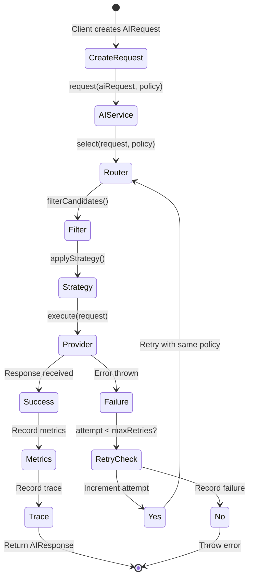

### Detailed Flow

#### 1. Request Creation

```typescript
const request = createAIRequest({
  taskType: TaskType.Script,
  prompt: "Write a script about...",
  systemPrompt: "You are a screenwriter...",
  maxTokens: 2000,
  temperature: 0.7,
  metadata: { projectId: "..." }
});
```

**Input Validation**:
- `taskType`: Required enum value
- `prompt`: Required string
- `systemPrompt`: Optional string
- `context`: Optional string
- `maxTokens`: Optional number (defaults to provider-specific)
- `temperature`: Optional number (0-1)
- `metadata`: Optional record

#### 2. Provider Selection

**Filtering Steps**:
1. **Exclusion Filter**: Remove providers in `policy.excludeProviders`
2. **Availability Filter**: Remove providers where `isAvailable()` returns false
3. **Task Support Filter**: Remove providers where `supports(taskType)` returns false

**Strategy Application**:

| Strategy | Logic |
|----------|-------|
| LowestCost | Select provider with minimum `estimateCost(request).estimatedTotal` |
| HighestQuality | Select provider with maximum hardcoded quality score |
| Fastest | Select provider with minimum `estimateLatency(request)` |
| Manual | Select `policy.preferredProvider` if available, else first candidate |
| Balanced | Weighted score: 40% cost + 30% quality + 30% latency |

#### 3. Provider Execution

**OpenAIProvider Execution Flow**:

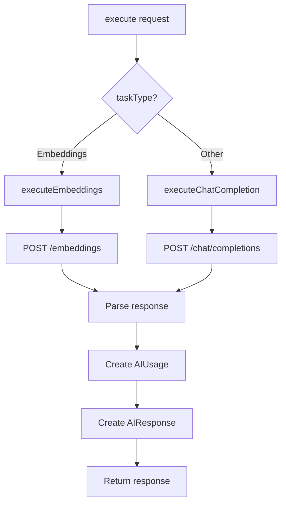

**Chat Completion Steps**:
1. Select model based on task type (gpt-4o, gpt-4o-mini, or text-embedding-3-small)
2. Build messages array (system, context, user)
3. Construct request body with model, messages, maxTokens, temperature
4. POST to OpenAI API
5. Parse response
6. Calculate cost using pricing constants
7. Create `AIUsage` object
8. Create `AIResponse` with content, usage, latency, finishReason

#### 4. Retry Logic

**Retry Conditions**:
- Provider execution throws error (not `AIRoutingError`)
- Attempt count < maxRetries (default 2)

**Backoff Strategy**:
- Linear retry (no exponential backoff currently implemented)
- Immediate retry on failure

**Non-Retryable Errors**:
- `AIRoutingError`: No available provider - thrown immediately

#### 5. Metrics Recording

**Metrics Collected**:
- `jobsExecuted`: Incremented on success
- `jobsFailed`: Incremented on final failure
- `executionTimeMs`: Duration from request start to response
- `providerLatency`: Per-provider average latency

#### 6. Trace Recording

**Trace Fields**:
- `requestId`: Unique request identifier
- `provider`: Selected provider type
- `taskType`: Task type enum
- `latencyMs`: Execution duration
- `inputTokens`: Input token count
- `outputTokens`: Output token count
- `estimatedCostUsd`: Estimated cost in USD
- `error`: Error message if failed
- `retryCount`: Number of retry attempts
- `timestamp`: Request timestamp

---

## Discovery Request Flow

### Discovery Lifecycle

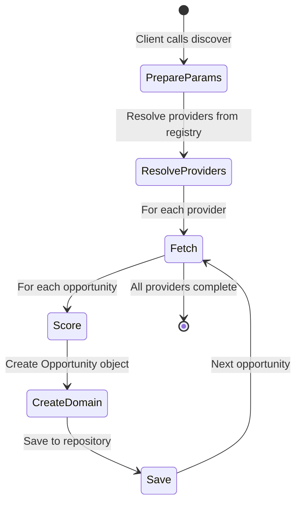

### Detailed Flow

#### 1. Parameter Preparation

**DiscoverParams**:
```typescript
{
  keywords?: string[],      // Search keywords
  limit?: number,           // Max results per provider
  since?: Date,            // Minimum publication date
  providerNames?: string[] // Specific providers to use
}
```

#### 2. Provider Resolution

**Resolution Logic**:
- If `providerNames` specified: Only those providers that are configured
- Otherwise: All configured providers from registry

**Configuration Check**:
- Each provider's `isConfigured()` method called
- Only configured providers participate in discovery

#### 3. Opportunity Fetching

**Per-Provider Flow**:

```mermaid
flowchart TD
    A[Provider.fetchOpportunities] --> B{Provider type?}
    B -->|RSS| C[RssProvider]
    B -->|Reddit| D[RedditProvider - skeleton]
    B -->|YouTube| E[YouTubeProvider - skeleton]
    B -->|GoogleTrends| F[GoogleTrendsProvider - skeleton]
    B -->|Whop| G[WhopProvider - skeleton]
    C --> H[Parse RSS feed]
    D --> I[Return empty array]
    E --> I
    F --> I
    G --> I
    H --> J[Filter by since date]
    J --> K[Apply limit]
    K --> L[Return RawOpportunity[]]
```

**RSS Provider Implementation**:
1. Fetch RSS feed URL
2. Parse using `rss-parser`
3. Filter items by `since` parameter if provided
4. Limit results (default 50)
5. Convert to `RawOpportunity` format

**Skeleton Providers**:
- Reddit, YouTube, GoogleTrends, Whop
- Currently return empty arrays with warning logs
- Intended to fetch from respective APIs

#### 4. Opportunity Scoring

**Scoring Components**:

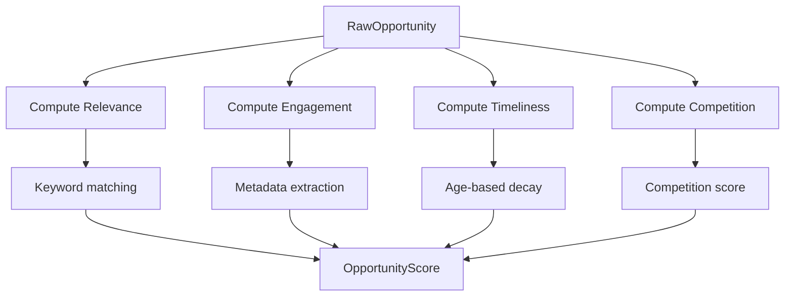

**Relevance Score** (0-100):
- Count keywords matching in title + summary
- Score = (matchCount / keywordCount) * 100
- No keywords = 50 (neutral)

**Engagement Score** (0-100):
- Extract views, likes, comments, upvotes from metadata
- Signal = views*0.001 + likes*0.01 + comments*0.05 + upvotes*0.02
- Score = min(100, round(signal))

**Timeliness Score** (0-100):
- Age in days = (now - publishedAt) / 86,400,000
- ≤1 day: 100
- ≤7 days: 90 - (age-1)*5
- ≤30 days: 60 - (age-7)*1.5
- >30 days: 30 - age*0.5
- No publishedAt: 30

**Competition Score** (0-100):
- Extract competitionScore from metadata
- If present: min(100, round(score))
- Otherwise: 50 (neutral)

#### 5. Domain Object Creation

**Opportunity Creation**:
```typescript
const opportunity = Opportunity.create({
  title: raw.title,
  summary: raw.summary,
  source: provider.source,
  sourceUrl: raw.url,
  score: computedScore,
  keywords: params.keywords ?? [],
  metadata: raw.metadata,
  publishedAt: raw.publishedAt
});
```

**Immutable Properties**:
- All properties are readonly
- Factory method ensures valid state
- Status defaults to `DISCOVERED`

#### 6. Repository Persistence

**Save Operation**:
- Repository `save()` method called
- Upsert operation (insert or update by ID)
- Domain object mapped to database row
- Returns saved `Opportunity` with database-generated fields

**Assumption**: `opportunities` table exists (not in current schema)

---

## Plugin Request Flow

### Installation Flow

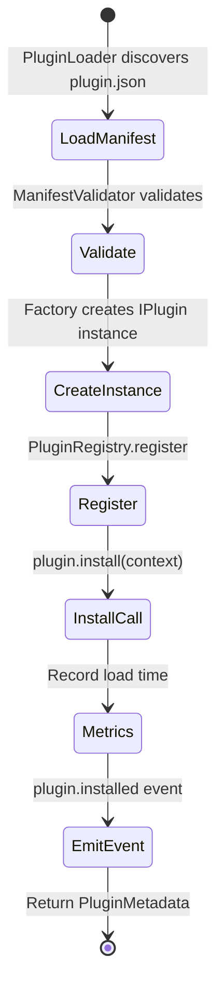

### Configuration Flow

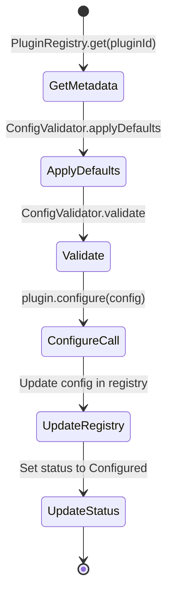

### Initialization Flow

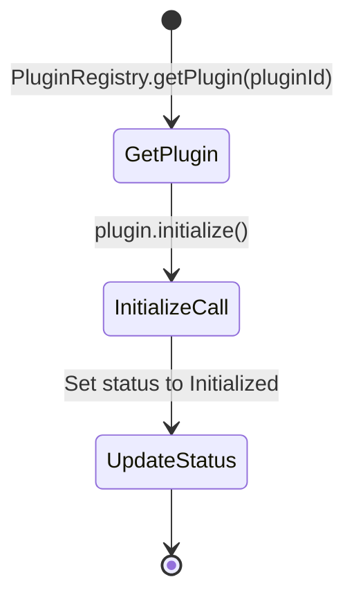

### Start Flow


### Stop Flow

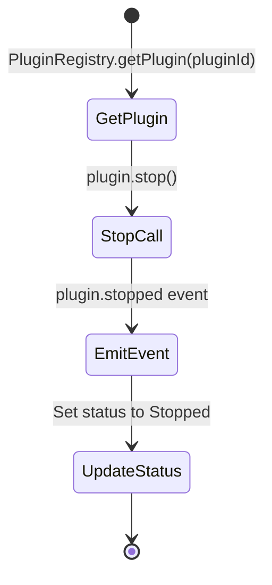

### Uninstall Flow

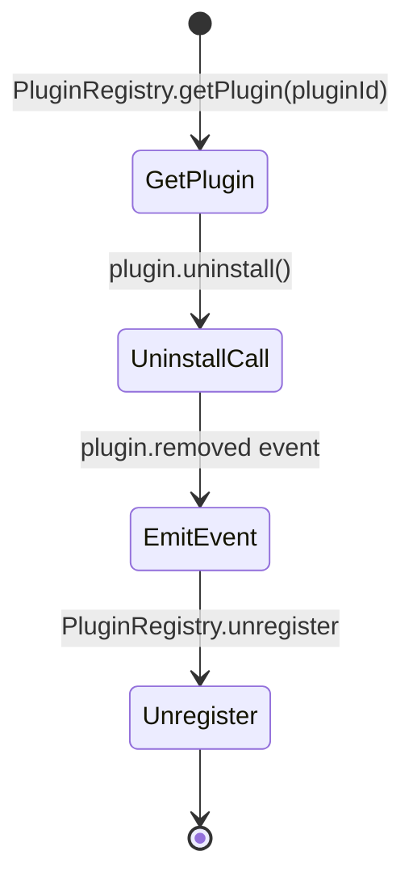

---

## Job Queue Request Flow

### Enqueue Flow

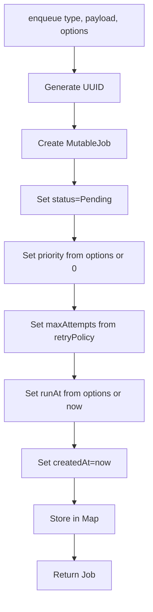

**Job Properties**:
- `id`: UUID
- `type`: Job type identifier
- `payload`: Job data
- `priority`: Higher = processed first (default 0)
- `status`: Pending initially
- `attempts`: Starts at 0
- `maxAttempts`: From retryPolicy (default 3)
- `runAt`: Scheduled execution time
- `createdAt`: Creation timestamp
- `completedAt`: null initially
- `error`: null initially

### Dequeue Flow

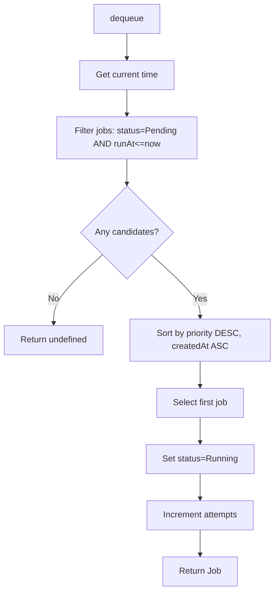

**Priority Ordering**:
1. Higher priority jobs first
2. FIFO within same priority (by createdAt)

### Acknowledge Flow

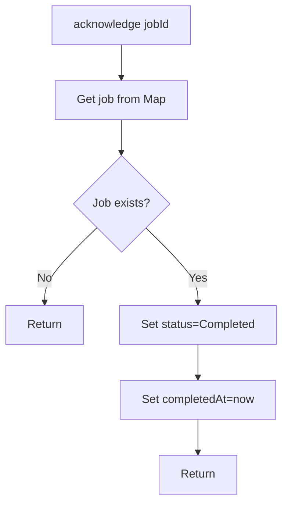

### Fail Flow

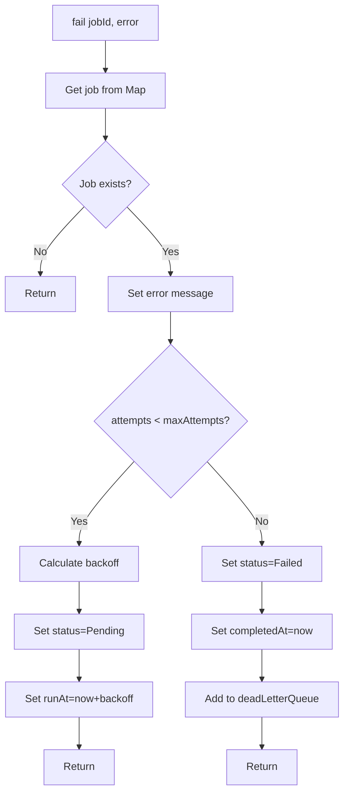

**Backoff Calculation**:
- `backoffMs * 2^(attempts - 1)`
- Example with backoffMs=1000:
  - Attempt 1: 1000ms
  - Attempt 2: 2000ms
  - Attempt 3: 4000ms

---

## Scheduler Request Flow

### Schedule Flow

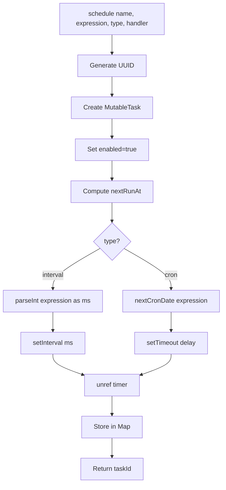

### Cron Calculation Flow

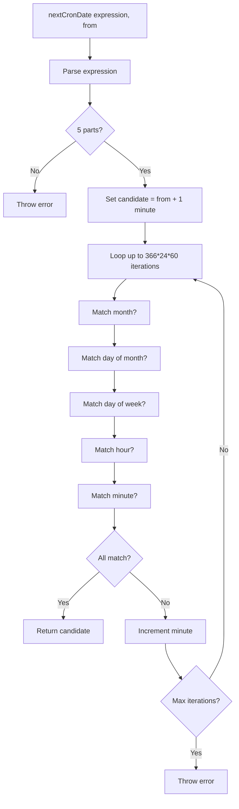

**Cron Expression Format**: `minute hour day-of-month month day-of-week`

**Limitations**:
- Only supports single values and wildcards (*)
- No ranges (1-5)
- No lists (1,3,5)
- No step values (*/5)

### Pause Flow

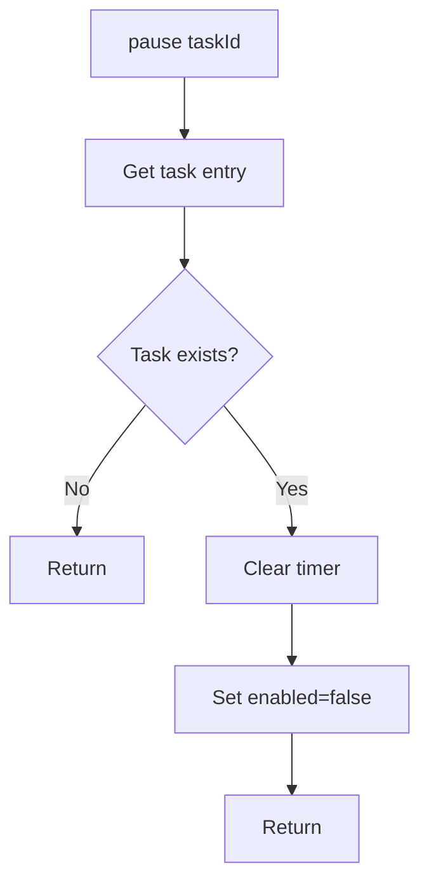

### Resume Flow

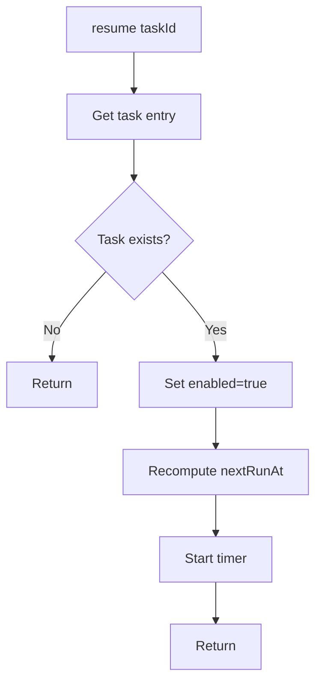

---

## Event Bus Request Flow

### Publish Flow

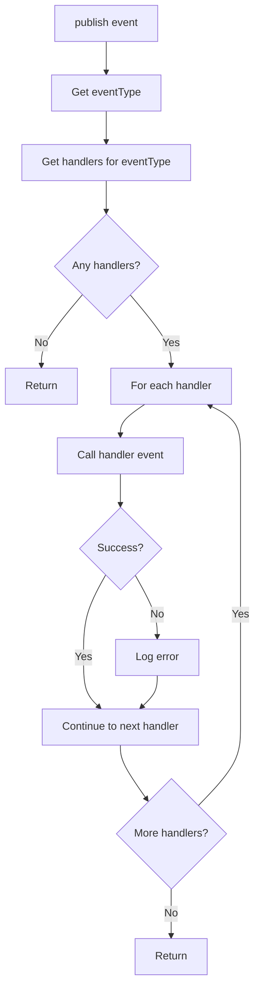

**Error Isolation**:
- Handler errors do not stop other handlers
- Errors are logged but not propagated
- Publisher never receives errors from handlers

### Subscribe Flow

```mermaid
flowchart TD
    A[subscribe eventType, handler] --> B{Handler set exists?}
    B -->|No| C[Create new Set]
    B -->|Yes| D[Use existing Set]
    C --> E[Add handler to Set]
    D --> E
    E --> F[Store in handlers Map]
    F --> G[Return]
```

---

## Storage Provider Request Flow

### Upload Flow

```mermaid
flowchart TD
    A[upload key, data, contentType] --> B[Resolve full path]
    B --> C[Create parent directories]
    C --> D[Write file]
    D --> E[Get file stats]
    E --> F[Return StorageObject]
```

### Download Flow

```mermaid
flowchart TD
    A[download key] --> B[Resolve full path]
    B --> C[Read file]
    C --> D{Success?}
    D -->|Yes| E[Return Buffer]
    D -->|No| F[Throw AppError NOT_FOUND]
```

### List Flow

```mermaid
flowchart TD
    A[list prefix] --> B{prefix provided?}
    B -->|Yes| C[SearchDir = baseDir/prefix]
    B -->|No| D[SearchDir = baseDir]
    C --> E[Recursive directory listing]
    D --> E
    E --> F[For each entry]
    F --> G{Directory?}
    G -->|Yes| H[Recurse]
    G -->|No| I[Get stats]
    I --> J[Create StorageObject]
    H --> K[Add to results]
    J --> K
    K --> L[Return results array]
```

---

## Health Check Request Flow

### Check Flow

```mermaid
flowchart TD
    A[check] --> B[Execute all checks in parallel]
    B --> C[checkDatabase]
    B --> D[checkStorage]
    B --> E[checkQueue]
    B --> F[checkScheduler]
    B --> G[checkProviders]
    C --> H[Collect results]
    D --> H
    E --> H
    F --> H
    G --> H
    H --> I[Compute overall status]
    I --> J{Any fail?}
    J -->|Yes| K[unhealthy]
    J -->|No| L{Any warn?}
    L -->|Yes| M[degraded]
    L -->|No| N[healthy]
    K --> O[Return HealthStatus]
    M --> O
    N --> O
```

### Database Check Flow

```mermaid
flowchart TD
    A[checkDatabase] --> B{supabaseUrl configured?}
    B -->|No| C[Return warn]
    B -->|Yes| D[Fetch health endpoint]
    D --> E{Response ok?}
    E -->|Yes| F[Return pass]
    E -->|No| G[Return fail]
```

### Storage Check Flow

```mermaid
flowchart TD
    A[checkStorage] --> B{Any providers?}
    B -->|No| C[Return warn]
    B -->|Yes| D[For each provider]
    D --> E[exists __health_check__]
    E --> F{All succeed?}
    F -->|Yes| G[Return pass with count]
    F -->|No| H[Return warn with failure count]
```

### Queue Check Flow

```mermaid
flowchart TD
    A[checkQueue] --> B[Sum all queue lengths]
    B --> C[Return pass with total]
```

### Scheduler Check Flow

```mermaid
flowchart TD
    A[checkScheduler] --> B[Get all tasks from all schedulers]
    B --> C[Count enabled tasks]
    C --> D[Return pass with enabled/total]
```

### Providers Check Flow

```mermaid
flowchart TD
    A[checkProviders] --> B{aiProviders provided?}
    B -->|No| C[Use empty array]
    B -->|Yes| D[Use provided array]
    C --> E[Extract provider names]
    D --> E
    E --> F[Return pass with names]
```
