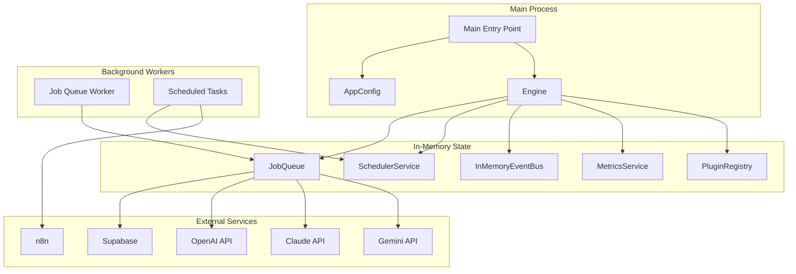
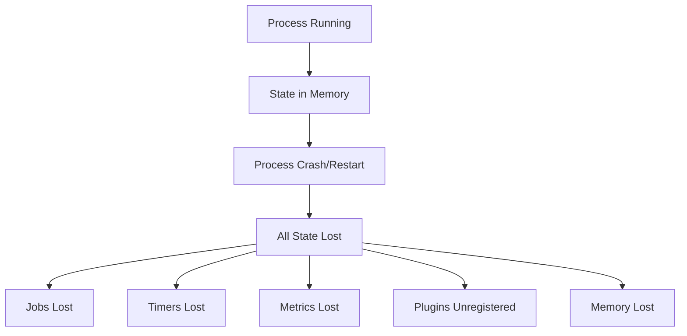
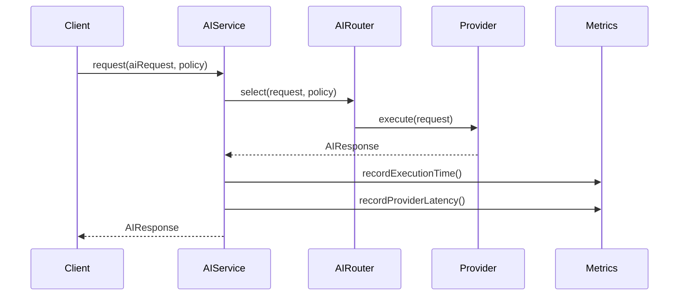
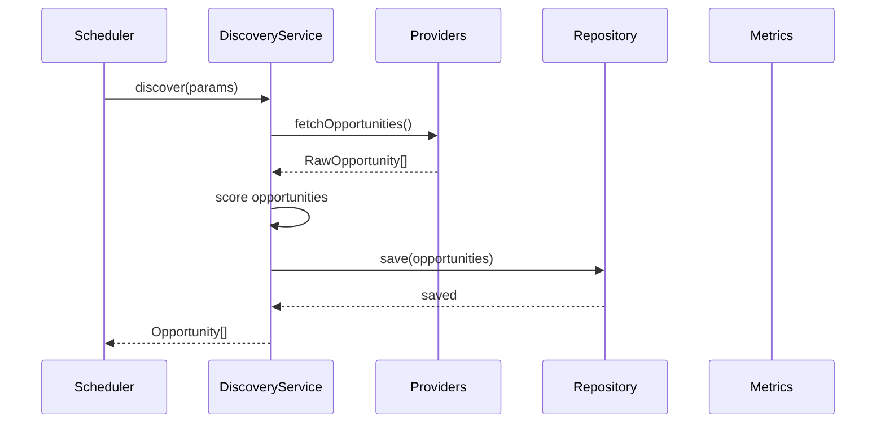
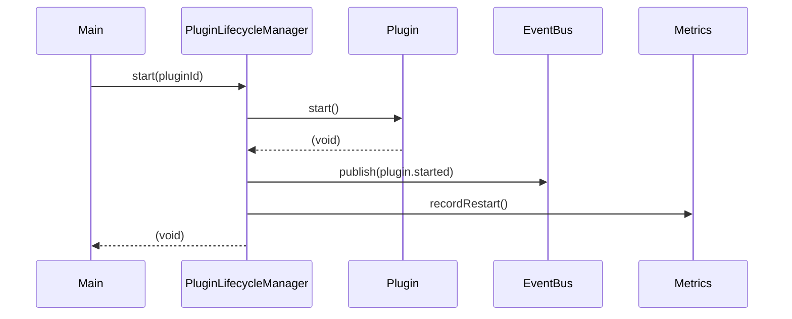
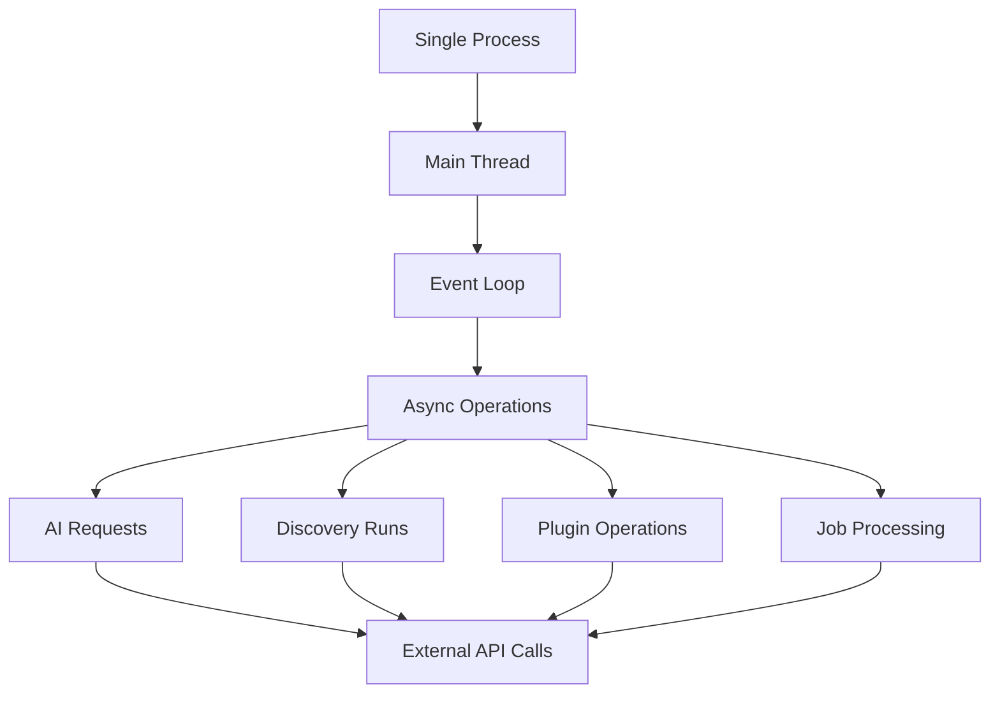

# Runtime

## Overview

**Important Note**: The Eunoia Media OS TypeScript library currently has no runtime application. It is a library without a main entry point, CLI, or web server. This document describes the intended runtime behavior based on the available components.

## Intended Runtime Architecture



## Runtime Components

### Main Entry Point (Not Implemented)

**Intended Location**: `src/main.ts`

**Intended Behavior**:
```typescript
import { AppConfig } from './core/config/AppConfig';
import { Engine } from './core/engine/Engine';
import { pino } from 'pino';

async function main() {
  // Load configuration
  const config = AppConfig.load();
  
  // Initialize logger
  const logger = pino({ level: config.logLevel });
  
  // Create engine
  const engine = new Engine(config, logger);
  
  // Register components
  // ... register storage providers, queues, schedulers, etc.
  
  // Start engine
  await engine.start();
  
  // Start workers
  // ... start job queue worker
  
  // Handle shutdown
  process.on('SIGTERM', async () => {
    await engine.stop();
    process.exit(0);
  });
}

main().catch(error => {
  console.error('Fatal error:', error);
  process.exit(1);
});
```

### Job Queue Worker (Not Implemented)

**Intended Behavior**:
```typescript
async function workerLoop(jobQueue: JobQueue) {
  while (true) {
    const job = jobQueue.dequeue();
    if (job) {
      try {
        await processJob(job);
        jobQueue.acknowledge(job.id);
      } catch (error) {
        jobQueue.fail(job.id, String(error));
      }
    } else {
      await sleep(100);
    }
  }
}
```

**Job Processing**:
- AI requests via AIService
- Discovery runs via DiscoveryService
- Plugin operations via PluginLifecycleManager
- Custom job handlers

### Scheduled Tasks (Not Implemented)

**Intended Tasks**:
- Periodic discovery runs (every 6 hours)
- Health checks (every 5 minutes)
- Metrics aggregation (every minute)
- Plugin health monitoring (every hour)

**Example**:
```typescript
scheduler.schedule(
  'discovery-run',
  '0 */6 * * *',
  'cron',
  async () => {
    await discoveryService.discover({ keywords: ['video', 'content'] });
  }
);
```

## Runtime State

### In-Memory State

All state is currently in-memory and lost on process restart:

| Component | State | Persistence |
|-----------|-------|-------------|
| JobQueue | Job map, dead letter queue | None |
| SchedulerService | Task entries, timers | None |
| InMemoryEventBus | Handler subscriptions | None |
| MetricsService | Metrics counters | None |
| PluginRegistry | Plugin metadata, instances | None |
| ConversationMemory | Conversation history | None |
| AgentMemory | Agent observations | None |

### State Loss on Restart



**Implication**: The system cannot survive process restarts without persistence.

## Runtime Behavior

### AI Request Runtime



**Runtime Characteristics**:
- Synchronous request-response
- No queuing (unless explicitly using JobQueue)
- Retry logic built-in
- Metrics recorded in-memory

### Discovery Runtime



**Runtime Characteristics**:
- Typically triggered by scheduler
- Synchronous provider fetching
- No streaming (all results in memory)
- Repository persistence (if table exists)

### Plugin Runtime



**Runtime Characteristics**:
- Plugins run in same process
- No sandboxing
- No resource limits
- Direct method calls

## Concurrency Model

### Single-Process Design

The library is designed for single-process execution:



**Implications**:
- No multi-threading (Node.js single-threaded)
- Async/await for concurrent I/O
- No shared memory across processes
- No distributed coordination

### Timer Behavior

All timers use `unref()` to not block process exit:

```typescript
timer.unref();
```

**Implication**: Process can exit even if timers are active.

## Error Handling

### Runtime Error Handling

**AI Service**:
- Routing errors: Thrown immediately (no retry)
- Provider errors: Retry with linear backoff
- Max retries exceeded: Throw to caller

**Discovery Service**:
- Provider failures: Logged and skipped
- Repository failures: Propagate to caller

**Plugin Lifecycle**:
- Lifecycle errors: Set status to Failed, emit event
- Handler errors: Logged, don't stop other handlers

**Job Queue**:
- Job failures: Retry with exponential backoff
- Max attempts exceeded: Move to dead letter queue

**Scheduler**:
- Task execution errors: Logged, task continues to schedule

## Resource Management

### Memory Management

**No Explicit Limits**:
- No memory limits on job queue
- No memory limits on event history
- No memory limits on metrics
- No memory limits on plugin instances

**Potential Issues**:
- Unbounded growth of job queue
- Unbounded growth of metrics
- Unbounded growth of conversation memory
- Memory leaks in long-running processes

### Connection Management

**AI Providers**:
- HTTP connections per request
- No connection pooling
- No keep-alive

**Supabase**:
- Supabase client manages connections
- Connection pooling handled by Supabase

**n8n**:
- HTTP API calls
- No persistent connections

## Monitoring

### Runtime Metrics

**Metrics Collected**:
- Jobs executed/failed count
- Average execution time
- Queue length
- Provider latency
- Plugin load time/failures/restarts

**Metrics Access**:
```typescript
const snapshot = metricsService.getSnapshot();
```

**Limitation**: Metrics are in-memory and lost on restart.

### Health Checks

**Health Check Components**:
- Database connectivity
- Storage provider health
- Queue length
- Scheduler task count
- AI provider availability

**Health Check Access**:
```typescript
const health = await engine.getHealth();
```

## Current Limitations

1. **No Main Entry Point**: No runtime application exists
2. **No Worker Process**: No job queue worker
3. **No Scheduled Tasks**: No tasks registered at startup
4. **No Persistence**: All state lost on restart
5. **No Graceful Shutdown**: No shutdown handling
6. **No Process Management**: No PM2 or systemd integration
7. **No Resource Limits**: No memory/CPU limits
8. **No Connection Pooling**: No HTTP connection pooling
9. **No Circuit Breaker**: No automatic failure handling
10. **No Distributed Coordination**: No multi-process support

## Future Runtime Enhancements

### Persistence
- Database-backed job queue
- Redis-based event bus
- Persistent metrics storage
- Plugin state persistence

### Process Management
- PM2 configuration
- Systemd service files
- Docker containers
- Kubernetes deployments

### Resource Limits
- Memory limits per component
- CPU limits per worker
- Connection pooling
- Rate limiting

### Distributed Runtime
- Multi-process workers
- Leader election
- Distributed locking
- Shared state via Redis

### Graceful Shutdown
- SIGTERM/SIGINT handling
- In-flight job completion
- Plugin shutdown sequence
- Resource cleanup

### Observability
- Prometheus metrics export
- OpenTelemetry tracing
- Structured logging to external service
- Real-time dashboards

## Cross-References

- [Startup Flow](STARTUP_FLOW.md) - Intended startup sequence
- [Queue System](QUEUE_SYSTEM.md) - Job queue runtime behavior
- [Scheduler](SCHEDULER.md) - Scheduled task runtime
- [Deployment](DEPLOYMENT.md) - Deployment procedures
