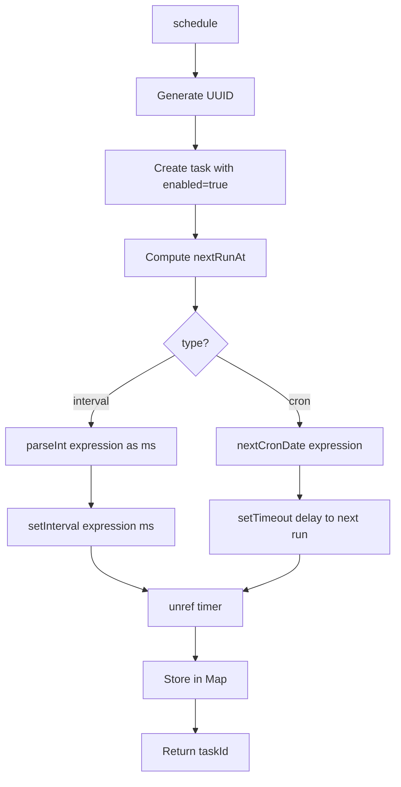
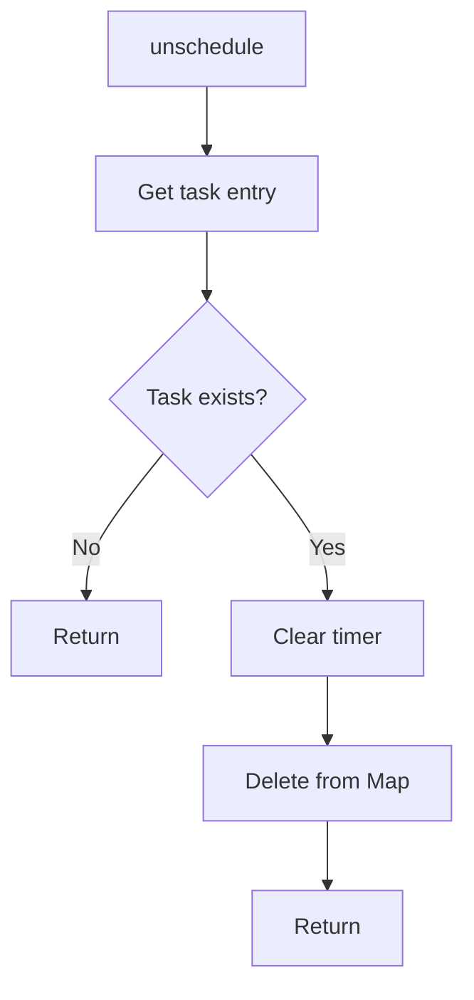
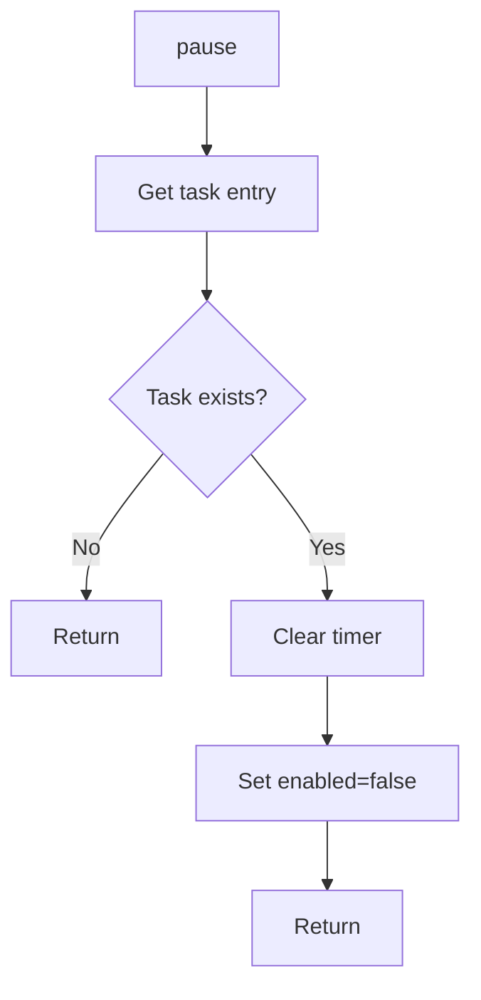
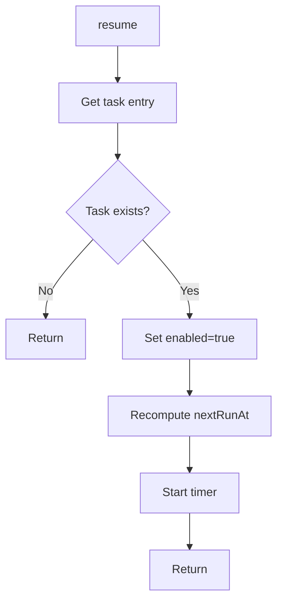
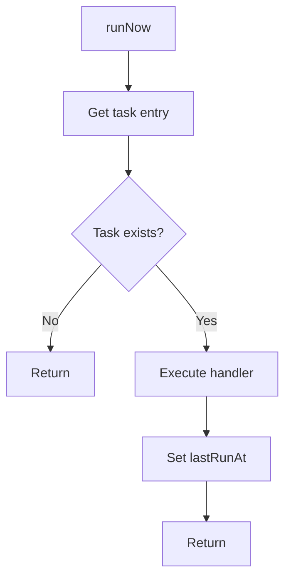
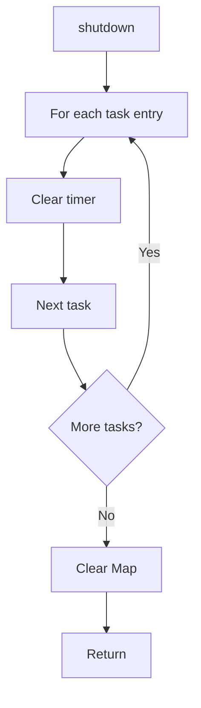
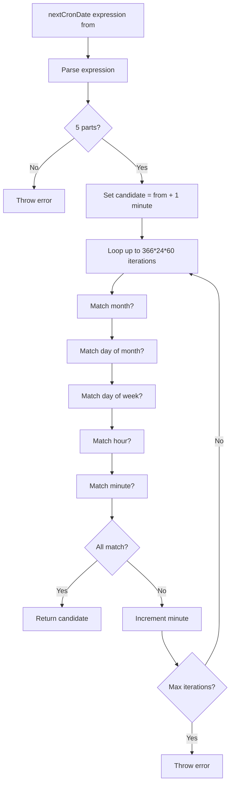
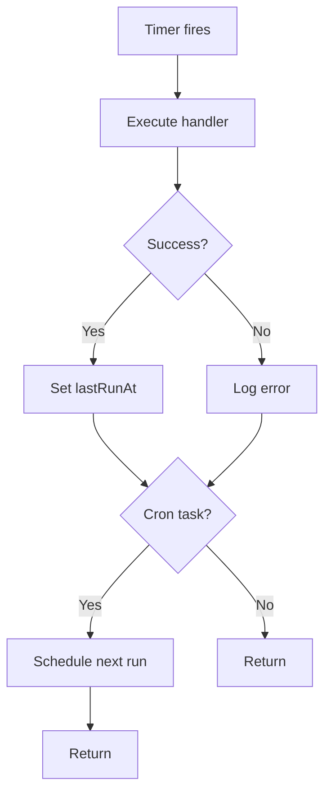

# Scheduler

## Overview

The scheduler provides recurring task execution with support for cron expressions and interval-based scheduling. Tasks can be paused, resumed, and executed immediately. The scheduler uses a custom cron implementation and is designed for single-process applications.

## Architecture

```mermaid
flowchart TB
    subgraph "SchedulerService"
        SchedulerService[SchedulerService]
        TaskMap[Task Map]
    end
    
    subgraph "Task Types"
        Cron[Cron Tasks]
        Interval[Interval Tasks]
    end
    
    subgraph "Timers"
        SetInterval[setInterval]
        SetTimeout[setTimeout]
    end
    
    SchedulerService --> TaskMap
    TaskMap --> Cron
    TaskMap --> Interval
    Cron --> SetTimeout
    Interval --> SetInterval
```

## Task Structure

### ScheduledTask Interface

```typescript
interface ScheduledTask {
  id: string;
  name: string;
  type: 'cron' | 'interval';
  expression: string;
  enabled: boolean;
  lastRunAt: Date | null;
  nextRunAt: Date | null;
}
```

### Task Types

**Cron**: Unix-style cron expression (5 fields: minute hour day-of-month month day-of-week)
**Interval**: Millisecond interval between executions

## Operations

### Schedule

```typescript
scheduler.schedule(
  name: string,
  expression: string,
  type: 'cron' | 'interval',
  handler: () => Promise<void> | void
): string
```

**Flow**:


**Cron Example**:
```typescript
const taskId = scheduler.schedule(
  'daily-report',
  '0 9 * * *', // 9 AM daily
  'cron',
  async () => {
    await generateDailyReport();
  }
);
```

**Interval Example**:
```typescript
const taskId = scheduler.schedule(
  'health-check',
  '300000', // 5 minutes
  'interval',
  async () => {
    await checkHealth();
  }
);
```

### Unschedule

```typescript
scheduler.unschedule(taskId: string): void
```

**Flow**:


### Pause

```typescript
scheduler.pause(taskId: string): void
```

**Flow**:


**Effect**: Task stops executing but remains in scheduler

### Resume

```typescript
scheduler.resume(taskId: string): void
```

**Flow**:


**Effect**: Task resumes from paused state

### Run Now

```typescript
scheduler.runNow(taskId: string): Promise<void>
```

**Flow**:


**Effect**: Executes task immediately without affecting schedule

### Shutdown

```typescript
scheduler.shutdown(): Promise<void>
```

**Flow**:


**Effect**: Stops all tasks and clears scheduler state

## Cron Implementation

### Custom Cron Parser

The scheduler uses a custom cron implementation rather than a library like `node-cron`.

### Expression Format

```
minute hour day-of-month month day-of-week
```

**Fields**:
- minute: 0-59
- hour: 0-23
- day-of-month: 1-31
- month: 1-12
- day-of-week: 0-6 (Sunday = 0)

### Supported Patterns

**Wildcard** (`*`): Matches any value
```
* * * * *  # Every minute
```

**Single Value**: Matches specific value
```
0 9 * * *  # 9:00 AM daily
```

**Limitations**:
- No ranges (e.g., `1-5`)
- No lists (e.g., `1,3,5`)
- No step values (e.g., `*/5`)
- No special characters (L, W, #)

### Next Run Calculation



**Algorithm**:
1. Start at `from` + 1 minute
2. Iterate minute by minute
3. Check if current time matches all cron fields
4. Return first match
5. Throw error if no match within 366 days

**Performance**: Linear scan with up to 366*24*60 = 527,040 iterations worst case

**Limitation**: Inefficient for complex expressions or distant future dates

## Timer Management

### Timer Unref

All timers are `unref()`'d to not block process exit:

```typescript
timer.unref();
```

**Effect**: Node.js can exit even if timers are active

### Interval Timers

For interval tasks:
```typescript
const timer = setInterval(() => void this.executeTask(task), ms);
timer.unref();
```

### Cron Timers

For cron tasks:
```typescript
const delay = next.getTime() - Date.now();
const timer = setTimeout(() => {
  void this.executeTask(task).then(() => {
    if (task.enabled) {
      this.scheduleCronTick(entry);
    }
  });
}, Math.max(0, delay));
timer.unref();
```

**Recursive Scheduling**: After execution, next run is scheduled recursively

## Task Execution

### Execution Flow



**Error Handling**:
- Errors are logged but do not stop the scheduler
- Failed tasks continue to be scheduled
- No automatic retry or circuit breaker

## Query Methods

### Get Tasks

```typescript
scheduler.getTasks(): ReadonlyArray<ScheduledTask>
```

**Purpose**: Retrieve all scheduled tasks

## Current Limitations

1. **Custom Cron Implementation**: Inefficient linear scan algorithm
2. **Limited Cron Support**: No ranges, lists, or step values
3. **No Timezone Support**: All times in UTC
4. **No Task Dependencies**: No support for dependent tasks
5. **No Task History**: No tracking of past executions
6. **No Task Results**: No mechanism to store task results
7. **No Error Recovery**: Failed tasks continue to execute
8. **No Concurrency Control**: No limit on concurrent task executions
9. **No Task Priorities**: All tasks have equal priority
10. **No Distributed Support**: Cannot be used across multiple processes

## Future Enhancements

### Improved Cron Parser
- Use established library (node-cron, cron-schedule)
- Support for ranges, lists, step values
- Support for special characters (L, W, #)
- Timezone support

### Task Dependencies
- Parent-child task relationships
- Sequential task execution
- Conditional task execution

### Task History
- Execution history tracking
- Success/failure statistics
- Execution time metrics

### Error Recovery
- Automatic retry on failure
- Circuit breaker for failing tasks
- Alerting on repeated failures

### Concurrency Control
- Max concurrent task limit
- Task queuing
- Resource pooling

### Task Priorities
- Priority-based execution
- Priority inheritance
- Preemption support

### Distributed Scheduler
- Redis-based distributed locking
- Multi-process coordination
- Leader election

### Task Results
- Result storage mechanism
- Result retrieval API
- Result expiration

## Cross-References

- [Components](COMPONENTS.md) - SchedulerService component details
- [Data Flow](DATA_FLOW.md) - Scheduler data flow
- [Request Flow](REQUEST_FLOW.md) - Detailed scheduler request flow
- [Startup Flow](STARTUP_FLOW.md) - Scheduler initialization
