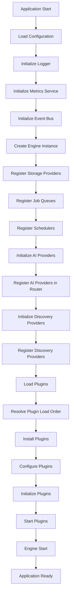
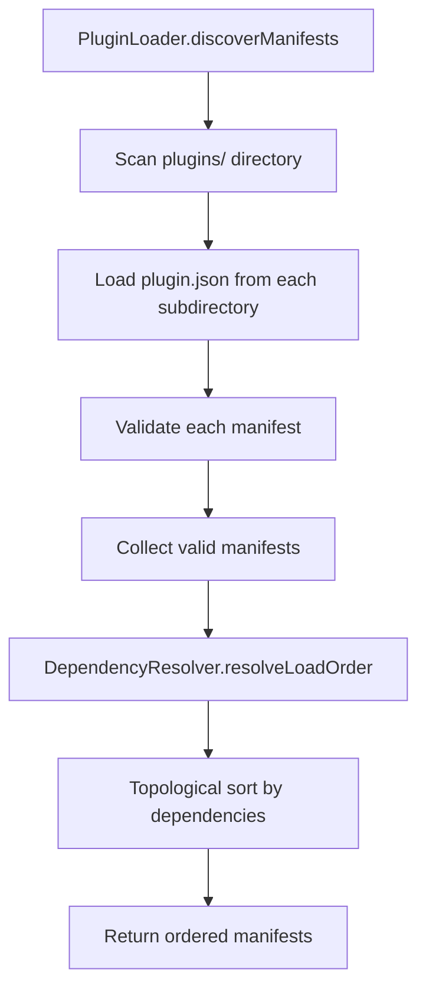
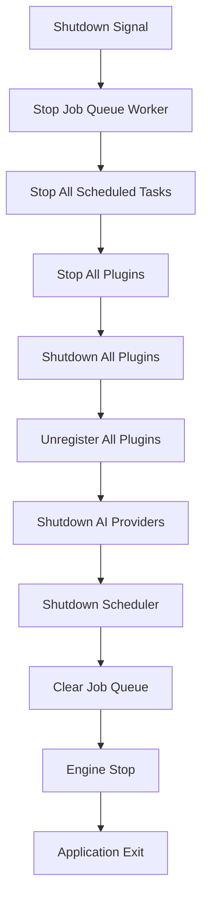

# Startup Flow

## Important Note

**The Eunoia Media OS TypeScript library currently has no main entry point or runtime application.** The `Engine` class exists but is never instantiated in the codebase. This document describes the intended startup flow based on the available components.

## Intended Startup Sequence



## Detailed Startup Steps

### 1. Configuration Loading

```typescript
const config = AppConfig.load();
```

**Environment Variables Required**:
- `SUPABASE_URL` - Supabase project URL
- `SUPABASE_ANON_KEY` - Supabase anonymous key
- `SUPABASE_SERVICE_ROLE_KEY` - Supabase service role key
- `OPENAI_API_KEY` - OpenAI API key (optional but recommended)
- `GOOGLE_DRIVE_FOLDER` - Google Drive folder ID (optional)
- `N8N_BASE_URL` - n8n instance URL (optional)
- `N8N_API_KEY` - n8n API key (optional)
- `LOG_LEVEL` - Logging level (debug, info, warn, error)
- `NODE_ENV` - Environment (development, production, test)

**Validation**: Zod schema validates all required fields. Throws `ConfigurationError` on validation failure.

### 2. Logger Initialization

```typescript
const logger = pino({
  level: config.logLevel,
  // Additional pino configuration
});
```

**Logger Implementation**: Uses `pino` for structured logging. The `ILogger` interface is used throughout the codebase for dependency injection.

### 3. Core Infrastructure Initialization

```typescript
const metricsService = new MetricsService();
const eventBus = new InMemoryEventBus(logger);
```

**Components Initialized**:
- `MetricsService`: In-memory metrics aggregation
- `InMemoryEventBus`: Single-process event bus

### 4. Engine Creation

```typescript
const engine = new Engine(config, logger);
```

**Engine Responsibilities**:
- Orchestrate application lifecycle
- Manage component registration
- Provide health check endpoint

### 5. Storage Provider Registration

```typescript
const localStorageProvider = new LocalStorageProvider(config.storagePath);
engine.registerStorageProvider(localStorageProvider);

if (config.googleDriveFolder) {
  const googleDriveProvider = new GoogleDriveProvider(config.googleDriveFolder);
  engine.registerStorageProvider(googleDriveProvider);
}
```

**Available Providers**:
- `LocalStorageProvider`: Filesystem-based storage
- `GoogleDriveProvider`: Google Drive integration (skeleton - not implemented)

### 6. Job Queue Registration

```typescript
const jobQueue = new JobQueue(
  { defaultRetryPolicy: { maxAttempts: 3, backoffMs: 1000 } },
  logger
);
engine.registerQueue(jobQueue);
```

**Queue Configuration**:
- Default retry policy: 3 attempts, 1000ms backoff
- In-memory storage (jobs lost on restart)

### 7. Scheduler Registration

```typescript
const scheduler = new SchedulerService(logger);
engine.registerScheduler(scheduler);
```

**Scheduler Capabilities**:
- Cron-based scheduling
- Interval-based scheduling
- Task pause/resume/unschedule

### 8. AI Provider Initialization

```typescript
const aiRouter = new AIRouter(logger);

// OpenAI
if (config.openAiApiKey) {
  const openaiProvider = new OpenAIProvider(logger);
  await openaiProvider.initialize({ OPENAI_API_KEY: config.openAiApiKey });
  aiRouter.register(openaiProvider);
}

// Claude (when implemented)
if (config.claudeApiKey) {
  const claudeProvider = new ClaudeProvider(logger);
  await claudeProvider.initialize({ ANTHROPIC_API_KEY: config.claudeApiKey });
  aiRouter.register(claudeProvider);
}

// Gemini (when implemented)
if (config.geminiApiKey) {
  const geminiProvider = new GeminiProvider(logger);
  await geminiProvider.initialize({ GOOGLE_API_KEY: config.geminiApiKey });
  aiRouter.register(geminiProvider);
}
```

**Initialization Steps per Provider**:
1. Create provider instance
2. Call `initialize(config)` with API key
3. Register in `AIRouter`

**Current Status**:
- OpenAIProvider: Fully implemented
- ClaudeProvider: Skeleton (execute throws error)
- GeminiProvider: Skeleton (execute throws error)

### 9. AI Service Creation

```typescript
const aiService = new AIService(aiRouter, metricsService, logger);
```

**AI Service Responsibilities**:
- Route AI requests to appropriate providers
- Execute with retry logic
- Record metrics and traces

### 10. Discovery Provider Initialization

```typescript
const providerRegistry = new ProviderRegistry();

// RSS Provider
const rssProvider = new RssProvider({ feedUrl: config.rssFeedUrl });
providerRegistry.register(rssProvider);

// Other providers (when implemented)
// Reddit, YouTube, GoogleTrends, Whop
```

**Current Status**:
- RssProvider: Fully implemented
- RedditProvider: Skeleton (returns empty array)
- YouTubeProvider: Skeleton (returns empty array)
- GoogleTrendsProvider: Skeleton (returns empty array, isConfigured always false)
- WhopProvider: Skeleton (returns empty array)

### 11. Discovery Service Creation

```typescript
const opportunityScoringService = new OpportunityScoringService();
const opportunityRepository = new SupabaseOpportunityRepository(
  supabaseClient,
  logger
);
const discoveryService = new DiscoveryService(
  providerRegistry,
  opportunityRepository,
  opportunityScoringService,
  logger
);
```

**Note**: `SupabaseOpportunityRepository` assumes an `opportunities` table exists, which is not in the current schema.

### 12. Plugin System Initialization



**Plugin Discovery Steps**:
1. `PluginLoader` scans `plugins/` directory
2. Loads `plugin.json` from each subdirectory
3. Validates manifest structure and fields
4. Collects valid manifests
5. Resolves load order based on dependencies
6. Returns ordered list for installation

### 13. Plugin Installation

```typescript
const pluginRegistry = new PluginRegistry();
const pluginMetrics = new PluginMetrics();
const pluginLifecycleManager = new PluginLifecycleManager(
  pluginRegistry,
  eventBus,
  pluginMetrics,
  logger
);

const pluginLoader = new PluginLoader(config.pluginsDir, logger);
const manifests = await pluginLoader.discoverManifests();
const orderedManifests = pluginLoader.resolveLoadOrder(manifests);

for (const { manifest, directory } of orderedManifests) {
  const plugin = pluginLoader.createPluginFromFactory(
    createPluginFactory(manifest),
    manifest
  );
  const context: PluginContext = {
    pluginId: manifest.id,
    logger: logger.child({ pluginId: manifest.id }),
    eventBus,
    config: {},
    permissions: manifest.permissions
  };
  await pluginLifecycleManager.install(plugin, context, directory);
  await pluginLifecycleManager.configure(manifest.id, {});
  await pluginLifecycleManager.initialize(manifest.id);
}
```

**Plugin Lifecycle per Plugin**:
1. Create plugin instance from factory
2. Create `PluginContext` with dependencies
3. Install plugin
4. Configure plugin with defaults
5. Initialize plugin
6. (Later) Start plugin

### 14. Plugin Startup

```typescript
await pluginLifecycleManager.startAll();
```

**Bulk Start**:
- Starts all plugins in Initialized or Configured status
- Emits `plugin.started` events
- Sets status to Running
- Errors are logged but do not stop other plugins

### 15. Engine Start

```typescript
await engine.start();
```

**Engine Start Actions**:
- Sets `started` flag to true
- Logs engine start
- (Currently does nothing else - no actual startup logic)

### 16. Scheduled Task Registration

```typescript
// Example: Schedule discovery runs
scheduler.schedule(
  'discovery-run',
  '0 */6 * * *', // Every 6 hours
  'cron',
  async () => {
    await discoveryService.discover({ keywords: ['video', 'content'] });
  }
);

// Example: Schedule health checks
scheduler.schedule(
  'health-check',
  '*/5 * * * *', // Every 5 minutes
  'cron',
  async () => {
    const health = await engine.getHealth();
    logger.info({ health }, 'Health check completed');
  }
);
```

**Scheduled Tasks** (examples - not currently implemented):
- Periodic discovery runs
- Health check monitoring
- Metrics aggregation
- Plugin health monitoring

### 17. Job Queue Worker Startup

```typescript
async function workerLoop() {
  while (engine.isRunning()) {
    const job = jobQueue.dequeue();
    if (job) {
      try {
        await processJob(job);
        jobQueue.acknowledge(job.id);
      } catch (error) {
        jobQueue.fail(job.id, String(error));
      }
    } else {
      await sleep(100); // Wait before polling again
    }
  }
}

workerLoop();
```

**Worker Loop**:
- Continuously polls queue for jobs
- Processes jobs when available
- Acknowledges success or fails with retry
- Sleeps when queue is empty

## Shutdown Sequence



### Detailed Shutdown Steps

1. **Stop Job Queue Worker**: Exit worker loop
2. **Stop Scheduled Tasks**: Call `scheduler.shutdown()`
3. **Stop Plugins**: Call `pluginLifecycleManager.stopAll()`
4. **Shutdown Plugins**: Call `pluginLifecycleManager.shutdown()` for each plugin
5. **Unregister Plugins**: Clear plugin registry
6. **Shutdown AI Providers**: Call `shutdown()` on each provider
7. **Clear Job Queue**: Clear in-memory job map
8. **Engine Stop**: Call `engine.stop()`

## Current Limitations

1. **No Main Entry Point**: No file instantiates the Engine or runs startup sequence
2. **No Worker Implementation**: Job queue has no worker to process jobs
3. **No Scheduled Tasks**: No tasks are registered during startup
4. **No Plugin Directory**: No plugins exist to load
5. **No Database Connection**: Supabase client not initialized
6. **No HTTP Server**: No REST API or web interface

## Assumptions

This startup flow assumes:
- A main entry point will be created (e.g., `src/main.ts`)
- Configuration is loaded from environment variables
- Plugins are discovered from a `plugins/` directory
- A worker process will consume jobs from the queue
- Scheduled tasks will be registered based on configuration
- The application runs as a long-running daemon process
