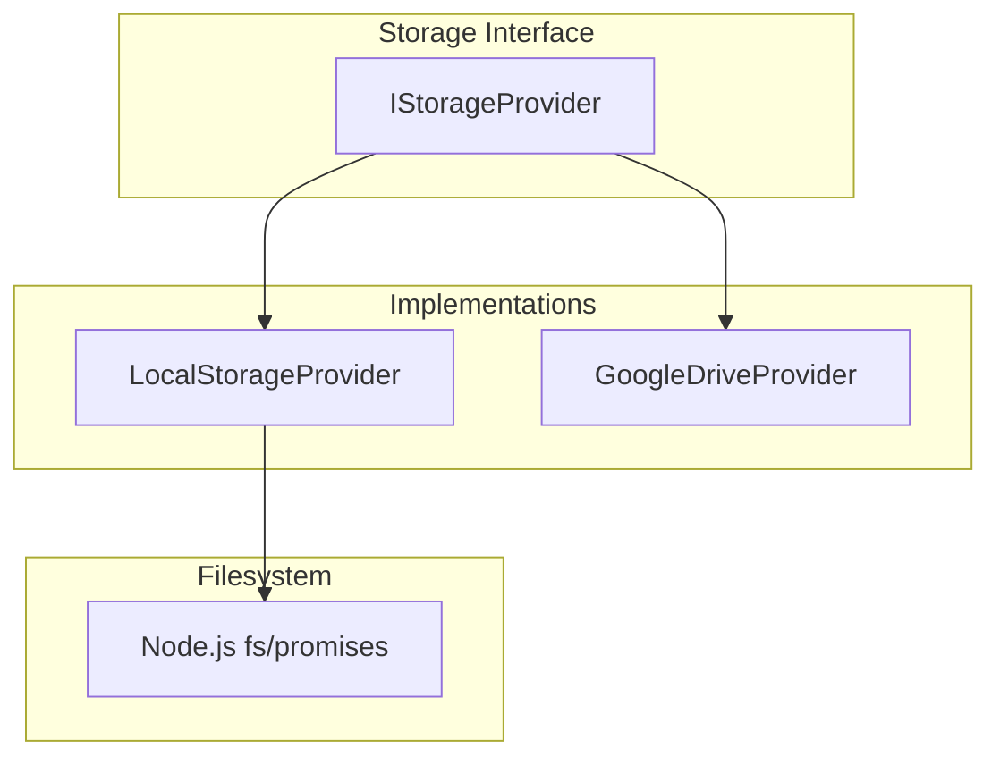
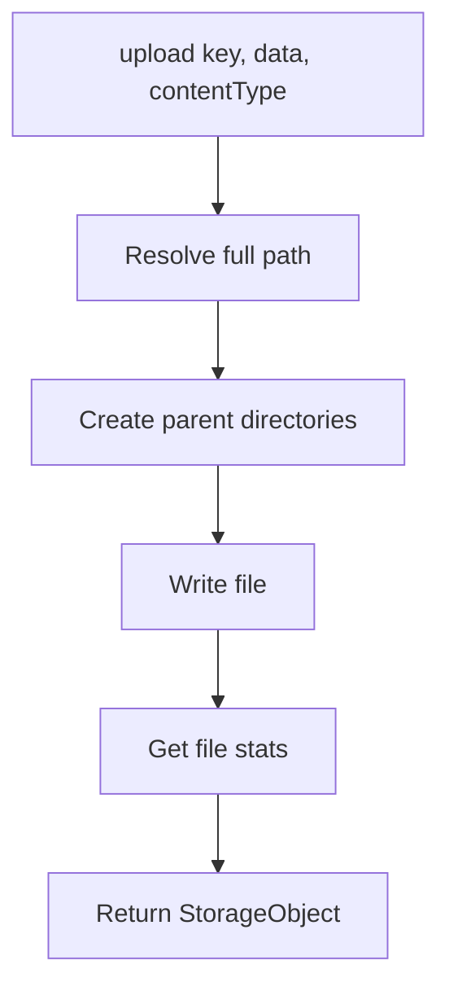
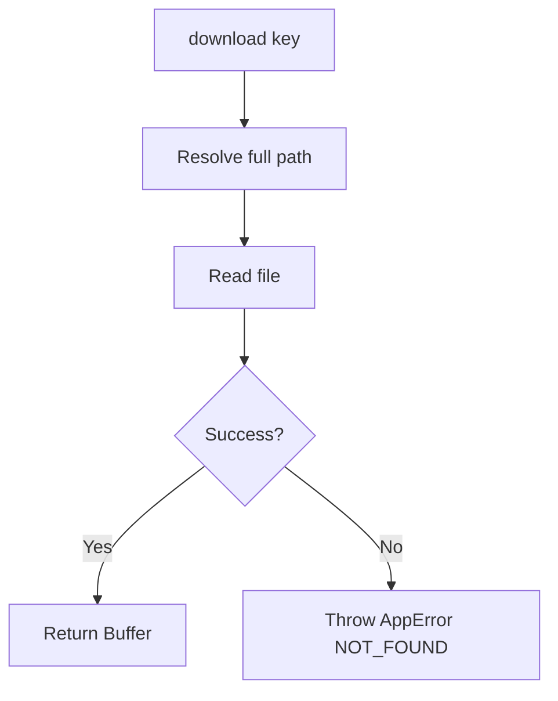
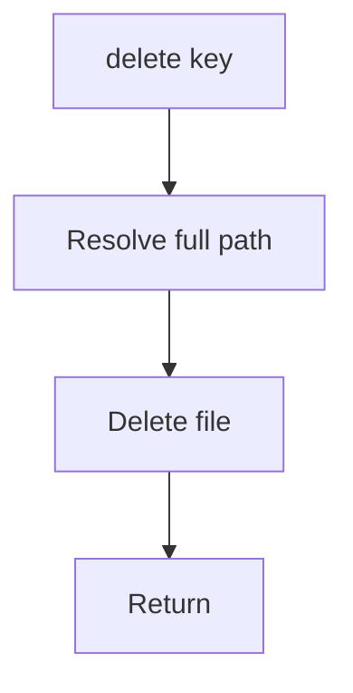
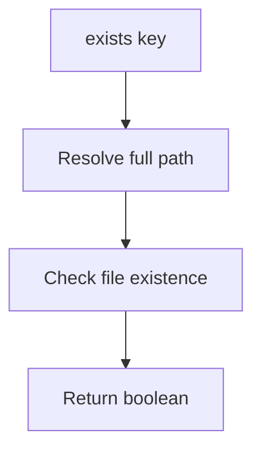
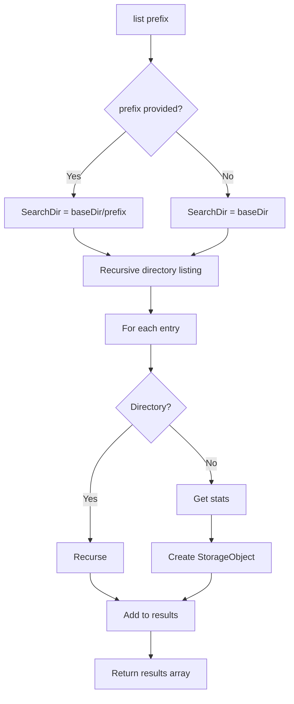
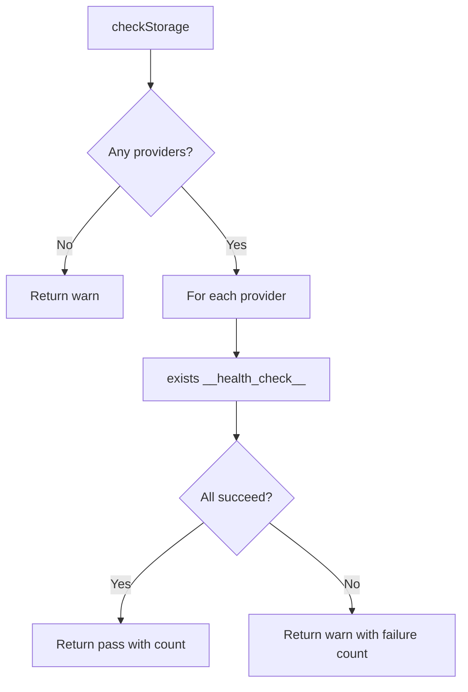

# Storage

## Overview

The storage system provides an abstraction layer for file storage operations through the `IStorageProvider` interface. Currently, only a filesystem-based implementation (`LocalStorageProvider`) exists, with a Google Drive provider skeleton. The system supports upload, download, delete, existence checks, and listing operations.

## Architecture



## Storage Interface

### IStorageProvider

```typescript
interface IStorageProvider {
  readonly name: string;
  upload(key: string, data: Buffer, contentType: string): Promise<StorageObject>;
  download(key: string): Promise<Buffer>;
  delete(key: string): Promise<void>;
  exists(key: string): Promise<boolean>;
  list(prefix?: string): Promise<StorageObject[]>;
}
```

### StorageObject

```typescript
interface StorageObject {
  key: string;
  size: number;
  lastModified: Date;
  contentType: string;
}
```

## Implementations

### LocalStorageProvider

**Status**: Fully Implemented

**Purpose**: Filesystem-based storage using Node.js `fs/promises`

**Configuration**:
```typescript
interface LocalStorageProviderConfig {
  baseDirectory: string;
}
```

**Implementation Details**:

#### Upload



**Steps**:
1. Resolve full path from base directory and key
2. Create parent directories if they don't exist
3. Write file data
4. Get file stats (size, modification time)
5. Return `StorageObject` metadata

**Example**:
```typescript
const provider = new LocalStorageProvider({ baseDirectory: './storage' });
const object = await provider.upload(
  'videos/intro.mp4',
  buffer,
  'video/mp4'
);
```

#### Download



**Steps**:
1. Resolve full path from base directory and key
2. Read file contents
3. Return buffer

**Error Handling**: Throws `AppError` with code `NOT_FOUND` if file doesn't exist

#### Delete



**Steps**:
1. Resolve full path
2. Delete file

#### Exists



**Steps**:
1. Resolve full path
2. Check if file exists
3. Return boolean

#### List



**Steps**:
1. Determine search directory (base or with prefix)
2. Recursively traverse directory tree
3. For each file: get stats, create `StorageObject`
4. Return array of objects

**Prefix Filtering**:
- If prefix provided, only list files under that directory
- Prefix is relative to base directory

**Example**:
```typescript
const allFiles = await provider.list();
const videos = await provider.list('videos/');
```

### GoogleDriveProvider

**Status**: Skeleton (not implemented)

**Purpose**: Google Drive-based storage

**Configuration** (intended):
```typescript
interface GoogleDriveProviderConfig {
  folderId: string;
  credentials: GoogleCredentials;
}
```

**Current Behavior**: Methods throw errors indicating not implemented

**Intended Behavior**:
- Upload files to Google Drive
- Download files from Google Drive
- Delete files from Google Drive
- Check file existence
- List files with prefix filtering

## Engine Integration

### Registration

```typescript
engine.registerStorageProvider(provider);
```

**Purpose**: Register storage provider with the engine for health checks

### Health Check



**Health Check Method**:
- Calls `exists('__health_check__')` on each provider
- Returns pass if all succeed
- Returns warn if any fail

## Current Limitations

1. **Single Implementation**: Only LocalStorageProvider is implemented
2. **No Cloud Storage**: No S3, Azure Blob, or other cloud storage providers
3. **No Streaming**: All operations load entire file into memory
4. **No Multipart Upload**: No support for large file uploads
5. **No Versioning**: No file versioning or history
6. **No Encryption**: No at-rest encryption
7. **No Compression**: No automatic compression
8. **No Caching**: No caching layer
9. **No Access Control**: No permission system
10. **No Metadata**: No custom metadata support beyond basic fields

## Future Enhancements

### Cloud Storage Providers
- AWS S3 provider
- Azure Blob Storage provider
- Google Cloud Storage provider
- Supabase Storage provider

### Streaming Support
- Stream upload/download for large files
- Chunked transfer
- Progress tracking

### Multipart Upload
- Large file support
- Parallel upload
- Resumable uploads

### Versioning
- File version history
- Version rollback
- Version comparison

### Encryption
- Client-side encryption
- Server-side encryption
- Key management

### Compression
- Automatic compression on upload
- Decompression on download
- Configurable compression algorithms

### Caching
- In-memory cache for frequently accessed files
- Cache invalidation
- Cache statistics

### Access Control
- Per-file permissions
- Signed URLs
- Temporary access tokens

### Metadata
- Custom metadata fields
- Metadata search
- Metadata indexing

## Cross-References

- [Components](COMPONENTS.md) - Storage provider component details
- [Data Flow](DATA_FLOW.md) - Storage data flow
- [Request Flow](REQUEST_FLOW.md) - Detailed storage request flow
- [Startup Flow](STARTUP_FLOW.md) - Storage provider initialization
